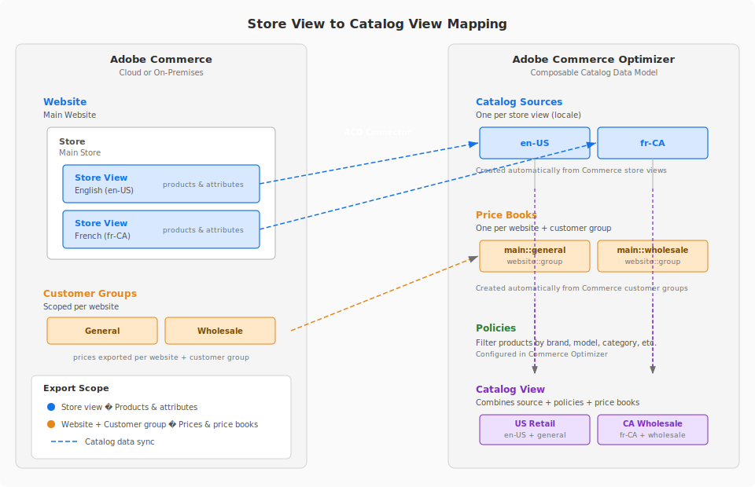

# Adobe Commerce Optimizer Connector

Adobe Commerce Optimizer Connector är integreringsbryggan som synkroniserar katalog- och prisdata mellan en Adobe Commerce i en molninfrastruktur eller lokal distribution och [!DNL Adobe Commerce Optimizer]. Synkronisering av data med Adobe Commerce Optimizer möjliggör funktioner som dynamisk AI-sökning, rekommendationer, snabba headless-butiker, inklusive Adobe Commerce storefront på Edge Delivery Services, samt prestandaanalys i realtid.

## Arkitektur och upplevelse

Adobe Commerce Optimizer Connector arbetar genom att mappa Commerce webbplatser och lagra vyer till ett Commerce Optimizer-projekt, vilket visas i följande bild:

{width="600" zoomable="yes"}

När data exporteras från Commerce till Commerce Optimizer:

* Vyer för Commerce Store mappas till katalogkällor
* Webbplatser är mappade till prisböcker

Den associerade katalogen och prisinformationen exporteras och används senare för att skapa katalogvyer och eventuellt definiera en policy för att filtrera katalogen och prisdata för specifika affärssituationer.

I stället för att konfigurera och hantera Commerce Services (Live Search och Product Recommendations) från Commerce Admin använder du [[!DNL Adobe Commerce Optimizer] marknadsföringsverktygen](../optimizer/merchandising/overview.md) för att hantera konfigurationen av produktidentifieringsregler (Live Search) och rekommendationer (produktrekommendationer). Adobe Commerce-instansen blir datakälla för katalog- och prisdata. När data uppdateras i Commerce synkroniseras uppdateringarna med instansen [!DNL Adobe Commerce Optimizer].

## Arbetsflöden

Kopplingen möjliggör flera viktiga arbetsflöden:

* **Exportera Commerce-katalogdata till[!DNL Adobe Commerce Optimizer]** - pris- och prisboksdata exporteras på webbplats- och kundgruppsnivå. Produkt- och produktattributdata exporteras på `store view`-nivå. Som standard är synkronisering av katalogdata aktiverat för alla Commerce-scope (webbplatser och butiksvyer).

  Om du vill aktivera det här arbetsflödet installerar du PHP-tillägget `adobe-commerce/commerce-data-export-aco-adapter`, granskar exportörens konfiguration och aktiverar sedan integrationen mellan Commerce och Commerce Optimizer från Commerce Admin. Mer information finns i [Kom igång](#get-started).

* **Mappa Commerce webbplats och lagra vydata som ska exporteras till[!DNL Adobe Commerce Optimizer]**

  Om du vill kan du anpassa exportinställningarna så att data bara synkroniseras för specifika webbplatser eller butiksvyer. Du kan t.ex. välja att exportera katalogdata för endast en butiksvy som ska användas för ett visst användningsfall, t.ex. optimering av söknings- och identifieringsupplevelsen för en viss marknad eller region.

* **Konfiguration och hantering av marknadsföringsregler**

  När Connector är aktiverat definieras och hanteras försäljningsregler för produktidentifiering och rekommendationer från användargränssnittet i [!DNL Adobe Commerce Optimizer], inte från sidorna [!UICONTROL Live Search] och [!UICONTROL Product Recommendations] i Commerce Admin.

* **Distribuera din Commerce Storefront på Edge Delivery Services**

  När du har konfigurerat integreringen med [!DNL Adobe Commerce Optimizer] kan du konfigurera och distribuera en Commerce Storefront på Edge Delivery Services för att leverera ultrasnabba prestanda, skalbarhet, sömlös innehållsutveckling, integrerad personalisering och minskade driftskostnader med den sammansatta API-drivna arkitekturen och modulära komponenter som finns i [!DNL Adobe Commerce Optimizer].

Mer information om hur du konfigurerar integreringen och aktiverar de här arbetsflödena finns i [Kom igång](get-started.md).
