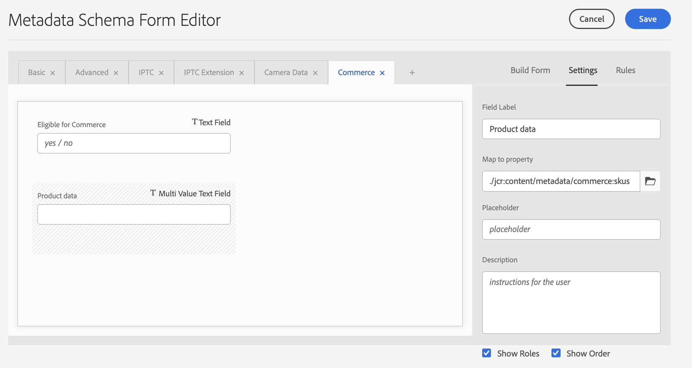
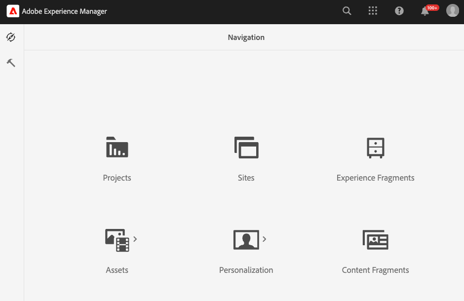

# Konfigurera AEM Assets-projektet som stöder Commerce-metadata

När du använder AEM Assets som ett DAM-system (Digital Asset Management) för Commerce kan du med installationen av paketet `assets-commerce` hantera bilder och videor för Commerce-produkter från AEM utvecklingsmiljö.

Följ de här stegen för att konfigurera AEM Assets-projektet med den paketkod och de metadata som krävs för att hantera Commerce-resurser från AEM redigeringsmiljö:

1. [Läs mer om &#x200B;](#aem-commerce-assets-commerce-package-contents)

1. [Slutför installationsstegen för att konfigurera AEM Assets-projektet så att det stöder Commerce-metadata](#step-1-install-the-assets-commerce-package)

## AEM Commerce-paketets innehåll för mediefiler/e-handel

Adobe tillhandahåller paketkoden `assets-commerce` för AEM Commerce för att lägga till resurserna Commerce-namnområde och Metadata Schema i Experience Manager Assets as a Cloud Service-miljökonfigurationen.

Den här paketkoden lägger till följande resurser i AEM Assets redigeringsmiljö:

* Ett [anpassat namnområde](https://github.com/ankumalh/assets-commerce/blob/main/ui.config/jcr_root/apps/commerce/config/org.apache.sling.jcr.repoinit.RepositoryInitializer~commerce-namespaces.cfg.json), `Commerce` som identifierar Commerce-relaterade egenskaper.

   * En anpassad metadatatyp `commerce:isCommerce` med etiketten `Eligible for Commerce` som taggar Commerce-resurser som är associerade med ett Adobe Commerce-projekt.

   * En anpassad metadatatyp `commerce:skus` och en motsvarande UI-komponent som lägger till en **[!UICONTROL Product Data]**-egenskap. Produktdata innehåller metadataegenskaper som associerar en Commerce-resurs med produkt-SKU:er.

     {width="600" zoomable="yes"}

   * En anpassad metadatatyp `commerce:roles` och `commerce:positions` för att visa hur resursen visualiseras i Commerce.

* Ett metadatamatchemaformulär med en Commerce-flik som innehåller fälten `Eligible for Commerce` och `Product Data` för taggning av Commerce-resurser. Formuläret innehåller även alternativ för att visa eller dölja fälten `roles` och `position` från AEM Assets användargränssnitt.

  {width="600" zoomable="yes"}

* Ett [exempel på taggad och godkänd Commerce-resurs](https://github.com/ankumalh/assets-commerce/blob/main/ui.content/src/main/content/jcr_root/content/dam/wknd/en/activities/hiking/equipment_6.jpg/.content.xml) `equipment_6.jpg` som har stöd för inledande resurssynkronisering. Endast godkända Commerce-resurser kan synkroniseras från AEM Assets till Adobe Commerce.

>[!NOTE]
>
> På sidan [Viktigt](https://github.com/ankumalh/assets-commerce) finns mer information om paketkoden för **AEM Commerce**.

## Förutsättningar

Du behöver följande resurser och behörigheter för att distribuera paketkoden `assets-commerce` till AEM Assets as a Cloud Service AEM-miljön:

* [Åtkomst till AEM Assets Cloud Manager program och miljöer](https://experienceleague.adobe.com/en/docs/experience-manager-cloud-service/content/onboarding/journey/cloud-manager#access-sysadmin-bo) med rollerna Program och Distributionshanteraren.

* En [lokal AEM-utvecklingsmiljö](https://experienceleague.adobe.com/en/docs/experience-manager-learn/cloud-service/local-development-environment-set-up/overview) som är bekant med AEM lokala utvecklingsprocess.

* Förstå [AEM projektstruktur](https://experienceleague.adobe.com/en/docs/experience-manager-cloud-service/content/implementing/developing/aem-project-content-package-structure) och hur du distribuerar anpassade innehållspaket med Cloud Manager.

* **IMS-organisations-ID** för din Commerce-instans. Både din Commerce-instans och AEM Assets redigeringsmiljö måste finnas i samma IMS-organisation.

* Så här aktiverar du [Dynamiska media med OpenAPI-funktioner](https://experienceleague.adobe.com/en/docs/experience-manager-cloud-service/content/assets/dynamicmedia/dynamic-media-open-apis/dynamic-media-open-apis-overview#enable-dynamic-media-open-apis):

>[!BEGINTABS]

>[!TAB Produktbilder]

[!BADGE Endast SaaS]{type=Positive url="https://experienceleague.adobe.com/en/docs/commerce/user-guides/product-solutions" tooltip="Gäller endast Adobe Commerce as a Cloud Service- och Adobe Commerce Optimizer-projekt (SaaS-infrastruktur som hanteras av Adobe)."} Dynamic Media med OpenAPI-funktioner är självbetjäning för produktvisningar som drivs av AEM Assets.

1. Gå till din Cloud Manager.

1. Välj önskad miljö.

1. Aktivera **Dynamiska media med OpenAPI-funktioner**.

   Om knappen **Dynamic Media med OpenAPI-funktioner** inte är aktiv öppnar du en supportanmälan.

>[!TAB AEM Assets]

[!BADGE PaaS endast]{type=Informative tooltip="Gäller endast Adobe Commerce i molnprojekt (Adobe-hanterad PaaS-infrastruktur)."} På AEM as a Cloud Service skickar du en Adobe-supportanmälan med följande information:

* Title: Enable Dynamic Media OpenAPI to fully integration Adobe Commerce with AEM Assets

   * Innehåll i supportanmälan:

      * **[!UICONTROL AEM Program ID]**
      * **[!UICONTROL Adobe Commerce URL]**
      * **[!UICONTROL AEM Environment ID]**
      * **[!UICONTROL IMS Org ID]**

När du har skickat in supportanmälan aktiverar Adobe Dynamic Media med OpenAPI-funktioner i molntjänstmiljön och delar information, till exempel IMS-klient-ID, så att du kan fortsätta med integreringen.

>[!ENDTABS]

## Steg 1: Installera paketet assets-commerce

1. Navigera till AEM Cloud Manager, välj ett program och [skapa produktions- och mellanlagringsmiljöer](https://experienceleague.adobe.com/en/docs/experience-manager-cloud-service/content/onboarding/journey/create-environments#creating-environments) som du vill integrera med Adobe Commerce.

1. Konfigurera en [distributionspipeline](https://experienceleague.adobe.com/en/docs/experience-manager-cloud-service/content/sites/administering/site-creation/quick-site/pipeline-setup#create-front-end-pipeline) eller verifiera att pipelinen kan distribuera ändringar till den valda miljön.

1. [Klona Adobe hanterade Git-databas](https://experienceleague.adobe.com/en/docs/experience-manager-cloud-service/content/sites/administering/site-creation/quick-site/retrieve-access#repo-access) för det valda programmet.

1. Hämta paketkoden från [AEM Assets Commerce-databasen](https://github.com/ankumalh/assets-commerce) från GitHub.

1. Kopiera manuellt den hämtade koden från din [lokala AEM-utvecklingsmiljö](https://experienceleague.adobe.com/en/docs/experience-manager-learn/cloud-service/local-development-environment-set-up/overview) till den befintliga Adobe-hanterade databasen.

1. Ersätt alla förekomster av `filter.xml` med ditt programnamn i alla `pom.xml files` och `<my-app>` för ditt projekt.

>[!NOTE]
>
> Du kan också installera den anpassade koden i din AEM Assets-projektkonfiguration som ett **Maven** -paket.

1. Genomför ändringarna och skicka din lokala utvecklingsgren till Cloud Manager Git-databasen.

1. Från AEM Cloud Manager [uppdaterar du AEM-miljön med pipelinen för att distribuera koden](https://experienceleague.dobe.com/en/docs/experience-manager-cloud-service/content/implementing/using-cloud-manager/deploy-code#deploying-code-with-cloud-manager).

1. Gå till en resurs och redigera dess egenskaper för att validera ändringarna:

   * Standardmetadataschemat innehåller fliken **Commerce**.

   * Produkt-SKU:er och fälten `Eligible for Commerce` visas.

### Fliken Commerce visas inte i egenskaper

Om fliken **Commerce** inte visas i egenskaper måste du skapa en manuellt i metadataramedigeraren.

1. Navigera till metadatarammet.

1. Klicka på **Redigera** om du vill ändra standardformuläret för metadataram.

1. Skapa en **Commerce**-flik och markera den.

1. Dra och släpp **Product**-komponenten till fliken **Commerce** och mappa den till egenskapen `commerce:skus`.

1. Markera kryssrutan för **visa roller** och **visa ordning**.

1. Dra och släpp en **kryssruta**-komponent på fliken **Commerce** och mappa den till egenskapen `commerce:isCommerce`. Ange **Ja** och **Nej** som alternativ.

Om du stöter på några andra problem skapar du en [supportanmälan](https://experienceleague.adobe.com/docs/commerce-knowledge-base/kb/help-center-guide/magento-help-center-user-guide.html#submit-ticket) eller kontaktar din AEM Assets Integration-säljare för att få hjälp.

## Steg 2: Valfritt. Konfigurera en metadataprofil

I AEM Assets redigeringsmiljö anger du standardvärden för Commerce-objektmetadata genom att skapa en metadataprofil. Använd sedan den nya profilen i AEM Resursmappar för att automatiskt använda dessa standardvärden. Den här konfigurationen effektiviserar tillgångsbearbetning genom att minska antalet manuella steg.

När du konfigurerar metadataprofilen behöver du bara konfigurera följande komponenter:

* Lägg till en Commerce-flik. På den här fliken aktiveras Commerce-specifika konfigurationsinställningar som läggs till av mallen.

* Lägg till fältet `Eligible for Commerce` på fliken Commerce.

Gränssnittskomponenten för produktdata läggs till automatiskt baserat på mallen.

### Definiera metadataprofilen

1. Logga in i Adobe Experience Manager redigeringsmiljö.

1. Gå till arbetsytan för innehållsadministration för AEM Assets på Adobe Experience Manager-arbetsytan genom att klicka på ikonen Adobe Experience Manager.

   {width="600" zoomable="yes"}

1. Öppna administratörsverktygen genom att välja hammikonen.

   {width="600" zoomable="yes"}

1. Öppna profilkonfigurationssidan genom att klicka på **[!UICONTROL Metadata Profiles]**.

1. **[!UICONTROL Create]** en metadataprofil för Commerce-integreringen.

   {width="600" zoomable="yes"}

1. Lägg till en flik för Commerce-metadata.

   1. Klicka på **[!UICONTROL Settings]** till vänster.

   1. Klicka på **[!UICONTROL +]** i flikavsnittet och ange sedan **[!UICONTROL Tab Name]**, `Commerce`.

1. Lägg till fältet `Eligible for Commerce` i formuläret.

   {width="600" zoomable="yes"}

   * Klicka på **[!UICONTROL Build form]**.

   * Dra fältet `Single Line text` till formuläret.

   * Lägg till texten `Eligible for Commerce` för etiketten genom att klicka på **[!UICONTROL Field Label]**.

   * Lägg till etikettexten i **Fältetikett** på fliken Inställningar.

   * Ange platshållartexten till `yes`.

   * Kopiera och klistra in följande värde i fältet **[!UICONTROL Map to Property]**

     ```terminal
     ./jcr:content/metadata/commerce:isCommerce
     ```

1. Valfritt. Om du automatiskt vill synkronisera godkända Commerce-resurser när de överförs till AEM Assets-miljön anger du standardvärdet för fältet _[!UICONTROL Review Status]_&#x200B;på fliken `Basic` till `approved`.

1. Spara uppdateringen.

### Använda metadataprofilen i Commerce resurskällmapp

1. På sidan [!UICONTROL &#x200B; Metadata Profiles] väljer du Commerce integreringsprofil.

1. Välj **[!UICONTROL Apply Metadata Profiles to Folders]** på åtgärdsmenyn.

1. Markera den mapp som innehåller Commerce-resurser.

   Skapa en Commerce-mapp om den inte finns.

1. Klicka på **[!UICONTROL Apply]**.

## Nästa steg

* [!BADGE Endast skrivbordspaket]{type=Informative tooltip="Gäller endast Adobe Commerce i molnprojekt (Adobe-hanterad PaaS-infrastruktur)."} [Installera Adobe Commerce-paket](configure-commerce.md).

* [!BADGE Endast SaaS]{type=Positive url="https://experienceleague.adobe.com/en/docs/commerce/user-guides/product-solutions" tooltip="Gäller endast Adobe Commerce as a Cloud Service- och Adobe Commerce Optimizer-projekt (SaaS-infrastruktur som hanteras av Adobe)."} [Konfigurera integreringen från Commerce Admin](setup-synchronization.md).
