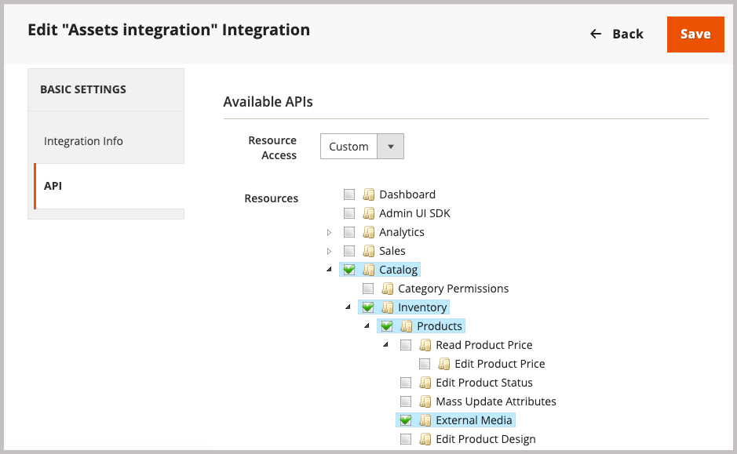

# Installera Adobe Commerce-paket

Integreringen för Commerce möjliggör synkronisering av resurser mellan Adobe Commerce och Adobe Experience Manager Assets (AEM Assets). Tillägget innehåller en uppsättning verktyg och tjänster för att hantera produktbilder, video och andra medieresurser på båda plattformarna.

Lägg till det här tillägget i Commerce-miljön genom att installera PHP-tillägget `aem-assets-integration`. Du måste också aktivera Adobe I/O Events för Commerce och generera de inloggningsuppgifter som krävs för kommunikation och arbetsflöden mellan Adobe Commerce och Adobe Experience Manager Assets.

**Åtkomstkrav**

Du behöver följande roller och behörigheter för att kunna integrera Commerce med AEM Assets.

- [Commerce molnprojektadministratör](https://experienceleague.adobe.com/sv/docs/commerce-cloud-service/user-guide/project/user-access) - Installera nödvändiga tillägg och konfigurera Commerce-programservern från Admin eller kommandoraden.

   - Åtkomst till [repo.magento.com](https://repo.magento.com/admin/dashboard) för att installera tillägget.

     Om du vill ha nyckelgenerering och de nödvändiga rättigheterna kan du läsa [Hämta dina autentiseringsnycklar](https://experienceleague.adobe.com/sv/docs/commerce-operations/installation-guide/prerequisites/authentication-keys). Information om molninstallationer finns i [Commerce on Cloud Infrastructure Guide](https://experienceleague.adobe.com/sv/docs/commerce-cloud-service/user-guide/develop/authentication-keys)

- [Commerce Admin](https://experienceleague.adobe.com/sv/docs/commerce-admin/start/guide-overview) - Uppdatera butikskonfigurationen och hantera Commerce-användarkonton.

>[!TIP]
>
> Adobe Commerce kan konfigureras att använda [Adobe IMS-autentisering](https://experienceleague.adobe.com/sv/docs/commerce-admin/start/admin/ims/adobe-ims-config).

## Arbetsflöde för installation och konfiguration

Installera Adobe Commerce-paketet och förbered Commerce-miljön genom att utföra följande uppgifter:

1. [Installera AEM Assets Integration för Commerce-tillägget (`aem-assets-integration`)](#install-the-aem-assets-integration-extension).

1. [Konfigurera Commerce Services Connector](#configure-the-commerce-services-connector) för att ansluta din Adobe Commerce-instans och med de tjänster som gör att data kan överföras mellan Adobe Commerce och AEM Assets.

1. [Konfigurera Adobe I/O Events för Commerce](#configure-adobe-io-events-for-commerce)

1. [Hämta autentiseringsuppgifter för API-åtkomst](#get-authentication-credentials-for-api-access)

## Installera AEM Assets Integration-tillägget

Installera den senaste versionen av AEM Assets Integration-tillägget (`aem-assets-integration`) på en Adobe Commerce-instans med version Adobe Commerce 2.4.5+. Tillägget levereras som ett kompositmetapaket från databasen [repo.magento.com](https://repo.magento.com/admin/dashboard).

>[!BEGINTABS]

>[!TAB Molninfrastruktur]

Använd den här metoden om du vill installera tillägget [!DNL AEM Assets Integration] på en Commerce Cloud-instans.

1. På din lokala arbetsstation byter du till projektkatalogen för ditt Adobe Commerce i molninfrastrukturprojekt.

   >[!NOTE]
   >
   >Mer information om att hantera Commerce projektmiljöer lokalt finns i [Hantera grenar med CLI](https://experienceleague.adobe.com/sv/docs/commerce-cloud-service/user-guide/develop/cli-branches) i _Adobe Commerce on Cloud Infrastructure User Guide_.

1. Kolla in miljögrenen för att uppdatera med hjälp av Adobe Commerce Cloud CLI.

   ```shell
   magento-cloud environment:checkout <environment-id>
   ```

1. Lägg till tillägget AEM Assets Integration for Commerce.

   ```shell
   composer require "magento/aem-assets-integration" "<version-tbd>" --no-update
   ```

1. Uppdatera paketberoenden.

   ```shell
   composer update "magento/aem-assets-integration"
   ```

1. Genomför och push-kodsändringar för filerna `composer.json` och `composer.lock`.

1. Lägg till, implementera och skicka kodändringarna för `composer.json`- och `composer.lock`-filerna till molnmiljön.

   ```shell
   git add -A
   git commit -m "Install AEM Assets Integration extension for Adobe Commerce"
   git push origin <branch-name>
   ```

   När uppdateringarna skickas initieras [Commerce molndistributionsprocess](https://experienceleague.adobe.com/sv/docs/commerce-cloud-service/user-guide/develop/deploy/process) för att ändringarna ska börja gälla. Kontrollera distributionsstatusen från [distributionsloggen](https://experienceleague.adobe.com/sv/docs/commerce-cloud-service/user-guide/develop/test/log-locations#deploy-log).

>[!TAB Lokal]

Använd den här metoden för att installera tillägget [!DNL AEM Assets Integration] för en lokal instans.

1. Använd Composer för att lägga till tillägget AEM Assets Integration for Commerce i ditt projekt:

   ```shell
   composer require "magento/aem-assets-integration" --no-update
   ```

1. Uppdatera beroenden och installera tillägget:

   ```shell
   composer update  "magento/aem-assets-integration"
   ```

1. Uppgradera Adobe Commerce:

   ```shell
   bin/magento setup:upgrade
   ```

1. Rensa cachen:

   ```shell
   bin/magento cache:clean
   ```

>[!TIP]
>
>När du distribuerar till produktion bör du inte rensa kompilerad kod för att spara tid. Säkerhetskopiera alltid systemet innan du gör några ändringar.

>[!ENDTABS]

## Konfigurera Commerce Services Connector

>[!NOTE]
>
>Installationen av Commerce Services Connector är en engångsprocess som krävs för att använda [Adobe Commerce SaaS-tjänster](https://experienceleague.adobe.com/sv/docs/commerce/user-guides/integration-services/saas#availableservices). Om du redan har konfigurerat anslutningen för en annan tjänst kan du visa den befintliga konfigurationen från Commerce Admin genom att välja **[!UICONTROL Systems]** > [!UICONTROL Services] > **[!UICONTROL Commerce Services Connector]**.

Konfigurera Commerce Services Connector från administratören (**[!UICONTROL System]** > [!UICONTROL Services] > **[!UICONTROL Commerce Services Connector]**) om du vill överföra data mellan din Adobe Commerce-instans och de tjänster som aktiverar AEM Assets-integreringen.

{width="600" zoomable="yes"}

Ange följande värden i konfigurationen

- API-nycklar för produktion och sandlåda för autentisering
- Namn på dataområde (SaaS-identifierare) för säker molnlagring
- ID för IMS-organisation där dina Commerce- och AEM Assets-miljöer etableras

Mer information finns i [konfigurationsvideon för Commerce Services Connector](https://experienceleague.adobe.com/sv/docs/commerce-learn/tutorials/admin/adobe-commerce-services/configure-adobe-commerce-services-connector#configuration-faqs) i dokumentationen för [Commerce Services Connector](../../landing/saas.md#organizationid).

När du sparar konfigurationen genererar systemet SaaS-projekt- och databas-ID:n för din miljö. Dessa värden krävs för att aktivera resurssynkronisering mellan Adobe Commerce och AEM Assets.

## Konfigurera Adobe I/O Events för Commerce

AEM Assets Integration använder Adobe I/O Events-tjänsten för att skicka anpassade händelsedata mellan Commerce-instansen och Experience Cloud. Händelsedata används för att koordinera arbetsflöden för AEM Assets-integrering.

Innan du konfigurerar Adobe I/O Events bör du kontrollera konfigurationen av RabbitMQ och cron-jobbet för ditt Commerce-projekt:

- Kontrollera att RabbitMQ är aktiverat och lyssnar efter händelser.
   - [Installationsprogram för RabbitMQ för Adobe Commerce lokalt](https://experienceleague.adobe.com/sv/docs/commerce-cloud-service/user-guide/configure/service/rabbitmq)
   - [RabbitMQ-inställningar för Adobe Commerce i molninfrastruktur](https://experienceleague.adobe.com/sv/docs/commerce-cloud-service/user-guide/configure/service/rabbitmq)
   - Kontrollera att [cron-jobb är aktiverade](https://developer.adobe.com/commerce/extensibility/events/configure-commerce/#check-cron-and-message-queue-configuration). Kronjobb krävs för kommunikation och arbetsflöden för AEM Assets-integrering.

>[!NOTE]
>
> För projekt i Commerce version 2.4.5 måste du [installera Adobe I/O-modulerna](https://developer.adobe.com/commerce/extensibility/events/installation/#install-adobe-io-modules-on-commerce). I Commerce version 2.4.6+ läses dessa moduler in automatiskt. För AEM Assets-integrering för Commerce behöver du bara installera modulerna. App Builder-installation krävs inte.


### Aktivera Commerce Eventing-ramverket

Aktivera händelseramverket från Commerce Admin.

>[!NOTE]
>
>App Builder-konfiguration krävs bara om du tänker använda en anpassad matchningsstrategi för att synkronisera resurser mellan Commerce och AEM Assets.

1. Gå till **[!UICONTROL Stores]** > [!UICONTROL Settings] > **[!UICONTROL Configuration]** > **[!UICONTROL Adobe Services]** > **Adobe I/O Events** i Admin.

1. Expandera **[!UICONTROL Commerce events]**.

1. Ange **[!UICONTROL Enabled]** till `Yes`.

   {width="600" zoomable="yes"}

1. Ange handlarens företagsnamn i **[!UICONTROL Merchant ID]** och miljönamnet i fälten **[!UICONTROL Environment ID]**. Använd endast alfanumeriska tecken och understreck när du anger dessa värden.

>[!BEGINSHADEBOX]

**Konfigurera anpassad VCL för blockeringsbegäranden**

Om du använder ett anpassat VCL-fragment för att blockera okända inkommande begäranden, kan du behöva inkludera HTTP-huvudet `X-Ims-Org-Idheader` för att tillåta inkommande anslutningar från tjänsten AEM Assets Integration for Commerce.

>[!TIP]
>
> Du kan använda modulen Snabbt CDN för att skapa en Edge ACL med en lista över IP-adresser som du vill blockera.

I följande anpassade VCL-kodfragment (JSON-format) visas ett exempel med ett `X-Ims-Org-Id`-begärandehuvud.

```json
{
  "name": "blockbyuseragent",
  "dynamic": "0",
  "type": "recv",
  "priority": "5",
  "content": "if ( req.http.X-ims-org ~ \"<YOUR-IMS-ORG>\" ) {error 405 \"Not allowed\";}"
}
```

Innan du skapar ett fragment baserat på det här exemplet ska du granska värdena för att avgöra om du behöver göra några ändringar:

- `name`: VCL-fragmentets namn. I det här exemplet används namnet `blockbyuseragent`.

- `dynamic`: Anger fragmentversionen. I det här exemplet används `0`. Mer information om datamodellen finns i [Snabbt VCL-kodfragment](https://www.fastly.com/documentation/reference/api/vcl-services/snippet/).

- `type`: Anger typen av VCL-fragment, som bestämmer fragmentets plats i den genererade VCL-koden. I det här exemplet används `recv`. I [Snabbt VCL-fragmentreferens](https://www.fastly.com/documentation/reference/api/#api-section-snippet) finns en lista med fragmenttyper.

- `priority`: Avgör när VCL-fragmentet körs. I det här exemplet används prioriteten `5` för att köras omedelbart och kontrollera om en administratörsbegäran kommer från en tillåten IP-adress.

- `content`: Det VCL-kodfragment som ska köras, som kontrollerar klientens IP-adress. Om IP-adressen finns i Edge ACL blockeras den från åtkomst med ett `405 Not allowed`-fel för hela webbplatsen. Alla andra IP-adresser för klienter har åtkomst.

Mer information om hur du använder VCL-fragment för att blockera inkommande begäranden finns i [Anpassad VCL för blockeringsbegäranden](https://experienceleague.adobe.com/sv/docs/commerce-cloud-service/user-guide/cdn/custom-vcl-snippets/fastly-vcl-blocking) i _Commerce on Cloud Infrastructure Guide_.

>[!ENDSHADEBOX]

## Hämta autentiseringsuppgifter för API-åtkomst

AEM Assets Integration för Commerce kräver OAuth-autentiseringsuppgifter för att tillåta API-åtkomst till Commerce-instansen. Dessa autentiseringsuppgifter krävs för att autentisera API-begäranden när resurser hanteras med AEM Assets-integrering.

Du genererar autentiseringsuppgifterna genom att lägga till integreringen i Commerce-instansen och aktivera den.

### Lägg till integreringen i Commerce-miljön

1. Gå till **System** > Tillägg > **Integrationer** i Admin och klicka sedan på **Lägg till ny integrering**.

1. Ange information om integreringen.

   I avsnittet **Allmänt** anger du bara integreringen **Namn** och **E-post**. Använd e-postmeddelandet för ett Adobe IMS-konto med tillgång till den organisation där Commerce och Experience Manager Assets är driftsatta.

   {width="600" zoomable="yes"}

1. Bekräfta din identitet genom att klicka på **Bekräfta identitet**.

   Systemet verifierar din identitet genom att autentisera till Experience Cloud med ditt Adobe ID.

1. Konfigurera API-resurser.

   1. Klicka på **[!UICONTROL API]** i den vänstra panelen.

   1. Välj den externa mediaresursen **[!UICONTROL Catalog > Inventory > Products > External Media]**.

      {width="600" zoomable="yes"}

1. Klicka på **[!UICONTROL Save]**.

### Generera OAuth-autentiseringsuppgifter

Generera autentiseringsuppgifterna för OAuth på integreringssidan genom att klicka på **Aktivera** för Assets-integreringen. Du behöver dessa autentiseringsuppgifter för att registrera Commerce-projektet med tjänsten Assets Rule Engine och för att skicka API-begäranden för att hantera resurser mellan Adobe Commerce och AEM Assets.

1. Generera autentiseringsuppgifterna från sidan Integreringar genom att klicka på **[!UICONTROL Activate]**.

   {width="600" zoomable="yes"}

1. Om du tänker använda API:t sparar du autentiseringsuppgifterna för konsumentnyckeln och åtkomsttoken för att konfigurera autentiseringen i API-klienten.

   {width="600" zoomable="yes"}

1. Klicka på **[!UICONTROL Done]**.

>[!NOTE]
>
>Du kan också generera autentiseringsuppgifter med Adobe Commerce API:er. Mer information om den här processen och OAuth-baserad autentisering för Adobe Commerce finns i [OAuth-baserad autentisering](https://developer.adobe.com/commerce/webapi/get-started/authentication/gs-authentication-oauth/) i Adobe Developer-dokumentationen.

## Nästa steg

- [Konfigurera integreringen från Commerce Admin](setup-synchronization.md)
