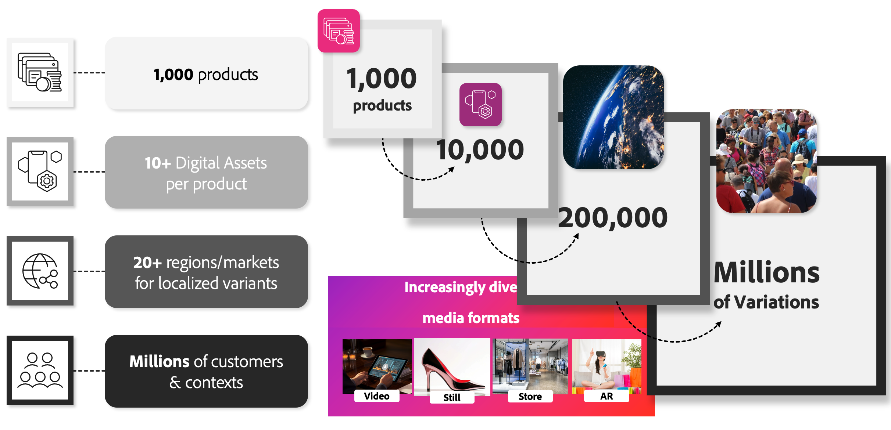

# AEM Assets Integration för Commerce

Efterfrågan på personaliserat innehåll ökar snabbt samtidigt som marknadsföringsbudgeten pressas. Återförsäljare och varumärken kämpar med att hålla jämna steg med det växande behovet av variationer i produktbilder, som styrs av regionala, säsongsrelaterade och segmentspecifika krav.

Överväg en återförsäljare med 1 000 produkter. Även före factoring i attributvariationer ökar antalet nödvändiga digitala resurser avsevärt när man överväger olika regioner, kundsegment och personaliseringssatsningar. Detta kan leda till ett oändligt antal resursvariationer, som sträcker sig in i de miljontals.

{width="700" zoomable="yes"}

AEM Assets Integration löser detta problem genom att automatisera arbetsflöden för resurshantering. Integreringen säkerställer att digitala resurser, som produktbilder och marknadsföringsmaterial, dynamiskt länkas till lämpliga försäljningsenheter, inklusive produkter och kategorier i Adobe Commerce, baserat på SKU eller andra nyckelattribut. Den här processen effektiviserar verksamheten och effektiviserar arbetet genom att aktivera:

* **Smidig installation och konfiguration** - Marknadsföringsteam och utvecklare kan snabbt konfigurera integreringen med välbekanta Adobe-verktyg och arbetsflöden.

* **Dynamiska resursuppdateringar** - Bilder och marknadsföringsresurser speglar automatiskt de senaste förändringarna i AEM Assets, vilket ger korrekta och relevanta butiker.

* **Effektiv kataloghantering**-Automatiserar uppdatering och rensning av resurser, vilket minimerar den manuella ansträngningen och säkerställer en konsekvent och väl underhållen produktkatalog.

## Krav för att använda integreringen

För att kunna utnyttja den här integreringen med [produktbilder eller AEM Assets](https://experienceleague.adobe.com/sv/docs/commerce/cloud-service/overview#product-visuals-powered-by-aem-assets) måste företagen uppfylla följande krav:

>[!BEGINTABS]

>[!TAB Produktbilder]

[!BADGE SaaS-licenser endast]{type=Positive url="https://experienceleague.adobe.com/sv/docs/commerce/user-guides/product-solutions" tooltip="Gäller endast Adobe Commerce as a Cloud Service- och Adobe Commerce Optimizer-projekt (SaaS-infrastruktur som hanteras av Adobe)."} Aktiva licenser för Adobe Commerce, produktvisningar som drivs av AEM Assets och [AEM Dynamic Media](https://experienceleague.adobe.com/sv/docs/experience-manager-65/content/assets/dynamic/administering-dynamic-media) (dessa licenser finns medföljande [!DNL Adobe Commerce as a Cloud Service] och [!DNL Adobe Commerce Optimizer]).

>[!TAB AEM Assets]

[!BADGE Endast SaaS]{type=Positive url="https://experienceleague.adobe.com/sv/docs/commerce/user-guides/product-solutions" tooltip="Gäller endast Adobe Commerce as a Cloud Service- och Adobe Commerce Optimizer-projekt (SaaS-infrastruktur som hanteras av Adobe)."} Aktiva licenser för Adobe Commerce, Adobe Experience Manager Assets och [AEM Dynamic Media](https://experienceleague.adobe.com/sv/docs/experience-manager-65/content/assets/dynamic/administering-dynamic-media).

[!BADGE Endast PaaS]{type=Informative tooltip="Gäller endast Adobe Commerce i molnprojekt (Adobe-hanterad PaaS-infrastruktur)."} Adobe Commerce 2.4.5+

* PHP 8.1, 8.2, 8.3 och 8.4

* Disposition 2.x

[!BADGE Endast SaaS]{type=Positive url="https://experienceleague.adobe.com/sv/docs/commerce/user-guides/product-solutions" tooltip="Gäller endast Adobe Commerce as a Cloud Service- och Adobe Commerce Optimizer-projekt (SaaS-infrastruktur som hanteras av Adobe)."} Adobe Experience Manager etableras med [Adobe Experience Manager Assets as a Cloud Service](https://experienceleague.adobe.com/sv/docs/experience-manager-cloud-service/content/assets/overview)

>[!ENDTABS]

Den Adobe Commerce-användare som konfigurerar integreringen måste ha tillgång till den [IMS-organisation](https://experienceleague.adobe.com/sv/docs/core-services/interface/administration/organizations#concept_EA8AEE5B02CF46ACBDAD6A8508646255) där AEM Assets-projektet etableras.

>[!BEGINSHADEBOX]

## Viktiga affärsfördelar

 **Ingen ytterligare kostnad**-Den här integreringen tillhandahålls kostnadsfritt för handlare som uppfyller licensieringskraven.

 **den officiella Adobe-lösningen** - utvecklad, underhållen och stöds fullt ut av Adobe, vilket garanterar stabilitet och anpassning till framtida plattformsförbättringar.

 **Adobe Managed Support Model** - Hjälp och felsökning hanteras direkt av Adobe, vilket ger sinnesfrid och smidig problemlösning.

 **Adobe Storefront Builder-funktioner**-Med DAM-lösningen (Digital Asset Management) kan du använda resurser som bilder, videor och andra media i [Storefront Builder](https://experienceleague.adobe.com/developer/commerce/storefront/merchants/storefront-builder/?lang=sv-SE#userlabs-commerce-genai-product-visuals).

>[!ENDSHADEBOX]

I den här videon lär du dig hur Adobe Commerce och AEM Assets samarbetar för att effektivisera arbetsflödena:

>[!VIDEO](https://video.tv.adobe.com/v/3447837)

## Nästa steg

Att möjliggöra Commerce-integrering med Experience Manager Assets är en trestegsprocess:

1. [Konfigurera ditt AEM Assets-projekt så att det stöder Commerce-metadata](get-started/configure-aem.md).

1. [!BADGE Endast skrivbordspaket]{type=Informative tooltip="Gäller endast Adobe Commerce i molnprojekt (Adobe-hanterad PaaS-infrastruktur)."} [Installera Adobe Commerce-paket](get-started/configure-commerce.md).

1. [Konfigurera integreringen](get-started/setup-synchronization.md).

## Support

Om du behöver information eller har frågor som inte ingår i den här guiden kontaktar du din AEM Assets Integration-säljare eller skapar en [supportanmälan](https://experienceleague.adobe.com/docs/commerce-knowledge-base/kb/help-center-guide/magento-help-center-user-guide.html?lang=sv-SE#submit-ticket) för att få ytterligare hjälp.
