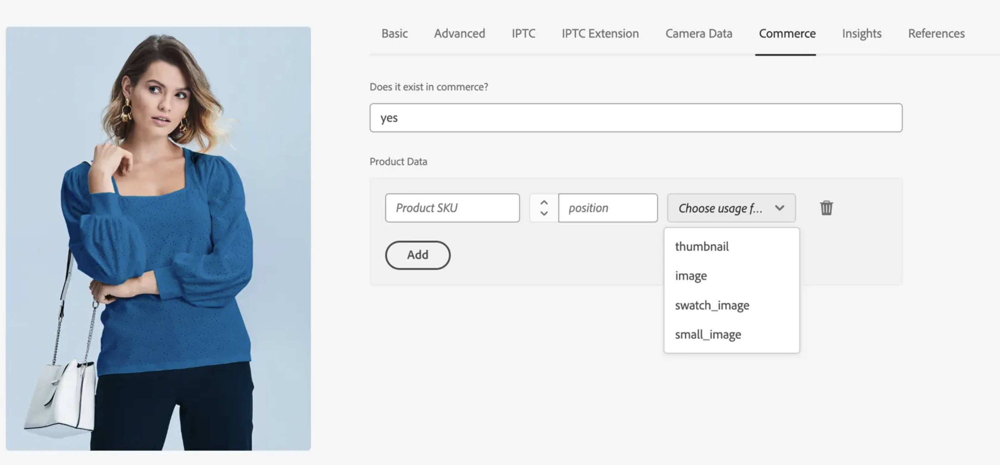

# Automatisk standardmatchning

AEM Assets-integreringen för Commerce har en automatisk matchningsmekanism (**[!UICONTROL Match by product SKU]**) som är standard baserat på metadatakonfigurationen för **AEM Assets**. Den här regeln möjliggör smidig synkronisering mellan **Adobe Commerce** och **AEM Assets**, vilket säkerställer att resurser automatiskt länkas till rätt försäljningsenheter.

## Konfigurera den automatiska matchningsmekanismen

1. Gå till **[!UICONTROL Store]** > Konfiguration > **[!UICONTROL ADOBE SERVICES]** > **[!UICONTROL AEM Assets Integration]** i Commerce Admin.

1. Ange **[!UICONTROL Match by SKU]** som matchande regel.

   {width="600" zoomable="yes"}

1. Ange det metadatafältnamn som används för att identifiera objekt i AEM Assets.

   >[!NOTE]
   >
   > Om standardstartprocessen följdes bör det här värdet anges till `commerce:skus`.

## Så här fungerar den automatiska matchningsmekanismen

När matchningsregeln **[!UICONTROL Match by product SKU]** har konfigurerats i Commerce Admin synkroniseras Commerce resursfiler automatiskt från AEM Assets till ditt Commerce-projekt baserat på de metadata för resursen som har konfigurerats för varje fil. Du konfigurerar metadata från fliken AEM **Commerce** i **AEM Assets-redigeringsmiljön** :

{width="600" zoomable="yes"}

1. Uppdatera bildmetadata i AEM Assets för att lägga till Adobe Commerce-associationen, `Commerce=yes`.

1. Konfigurera de metadata ([!UICONTROL SKU], [!UICONTROL position] och [!UICONTROL role]) som länkar resursen till associerad produkt-SKU.

   >[!NOTE]
   >
   > Om en resurs används för flera produkter konfigurerar du metadata för varje associerad SKU.

Detta säkerställer att digitala resurser länkas och visas på rätt sätt i Adobe Commerce. Det ger också handlare och marknadsförare möjlighet att hantera roller och tillgångspositionering direkt i AEM Assets, vilket ger en enhetlig och centraliserad mekanism för att välja och beställa bilder i alla engagemangskanaler.
