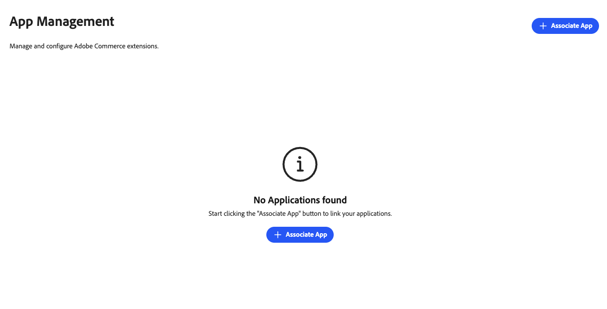
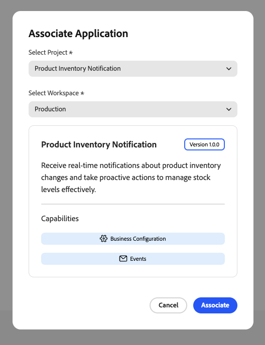
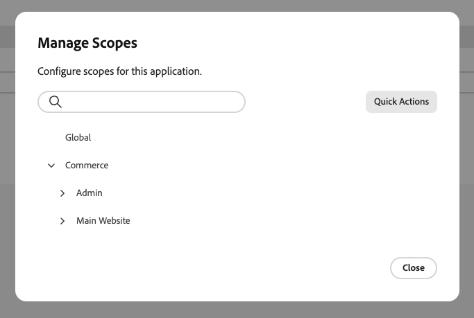

# Hantera din app

En App Manager associerar ett App Builder-program med deras Commerce-instans. Konfigurationsformulär återges dynamiskt baserat på programmets schema, så ingen anpassad utveckling av administratörsgränssnitt krävs. Apphanteraren konfigurerar inställningar via formulär som Commerce genererar automatiskt.

{width="500" zoomable="yes"}

## Förutsättningar

Innan du kopplar ett program måste du ha följande:

| Krav | Beskrivning |
|-------------|-------------|
| **Administratörsåtkomst** | Commerce Admin med [!DNL App Management] behörigheter |
| **Distribuerad app** | App Builder-program som distribuerats till din organisation och som är redo att anslutas |
| **Organisationsåtkomst** | Tillgång till den Adobe-organisation där appen är installerad |

## Självstudiekurs

I den här videon får du lära dig hur du associerar ett program med en Commerce-instans och konfigurerar inställningar.

>[!VIDEO](https://video.tv.adobe.com/v/3478959?captions=swe)

## Associera en app

Associeringsprocessen importerar webbplatser, lagrar och lagrar vyer från Commerce och skapar länken mellan appen och din Commerce-instans.

Så här länkar du ditt App Builder-program till en Commerce-instans:

1. Navigera till **[!UICONTROL Apps]** > **[!UICONTROL App Management]**.

1. Klicka på **[!UICONTROL Associate App]**.

   {width="500" zoomable="yes"}

1. Välj en **[!UICONTROL Project]** i listan.

1. Välj **[!UICONTROL Workspace]**.

1. Klicka på **[!UICONTROL Associate]**.

   {width="500" zoomable="yes"}

>[!WARNING]
>
>Om scopesynkroniseringen misslyckas, slutförs fortfarande associationen. Du kan synkronisera scopen manuellt senare från vyn **[!UICONTROL Manage Scopes]** i konfigurationen för den associerade appen.

## Konfigurera inställningar

När du har associerat en app i vyn [!DNL App Management] konfigurerar du dess inställningar via formuläret:

1. Klicka på **[!UICONTROL Configure]** i den associerade appen.

1. Formuläret visar programmets konfigurerbara inställningar.

1. Ändra värden efter behov.

1. Klicka på **[!UICONTROL Save]**.

### Omfångsspecifik konfiguration

Använd omfattningsspecifik konfiguration när olika webbplatser, butiker eller butiksvyer behöver unika inställningar. Du kan t.ex. aktivera en funktion endast för en viss region eller butiksvy, eller använda olika inställningar per varumärke. Inställningarna i ett lägre omfång åsidosätter inställningarna i högre omfång.

Så här åsidosätter du globala värden på en viss omfångsnivå:

1. Klicka på **[!UICONTROL Change Scope]**.

1. Välj ett scope i listan.

1. Ändra värden för det här omfånget.

1. Klicka på **[!UICONTROL Save]**.

## Hantera omfattningar

Åtkomst till **[!UICONTROL Manage Scopes]** från skärmen med appinformation för att hantera omfångshierarkin för din app.

{width="500" zoomable="yes"}

| Åtgärd | Beskrivning |
|--------|-------------|
| **[!UICONTROL Add root scope]** | Lägg till ett omfång som bara gäller för programmet. |
| **[!UICONTROL Sync Commerce scopes]** | Uppdatera listan med webbplatser, butiker och butiksvyer från Commerce när du har lagt till eller ändrat dem. |
| **[!UICONTROL Import scopes]** | Importera omfång i grupp från en fil. |

## Avassociera ett program

Avassociera ett program när du inte längre behöver det anslutet till din Commerce-instans. Du kan till exempel behöva dra tillbaka en integrering, växla till en annan arbetsyta eller rensa testkonfigurationer.

>[!WARNING]
>
> Om du avassocierar tas alla konfigurationsvärden bort för den här instansen. Det här kan inte ångras.

Så här tar du bort ett program från en Commerce-instans:

1. Navigera till **[!UICONTROL Apps]** > **[!UICONTROL App Management]**.

1. Klicka på **[!UICONTROL Unassociate]** i appen.

1. Bekräfta åtgärden.

## Relaterad dokumentation

* [Felsökning [!DNL App Management]](troubleshooting.md) - Åtgärda vanliga problem med appassociation och konfiguration.
