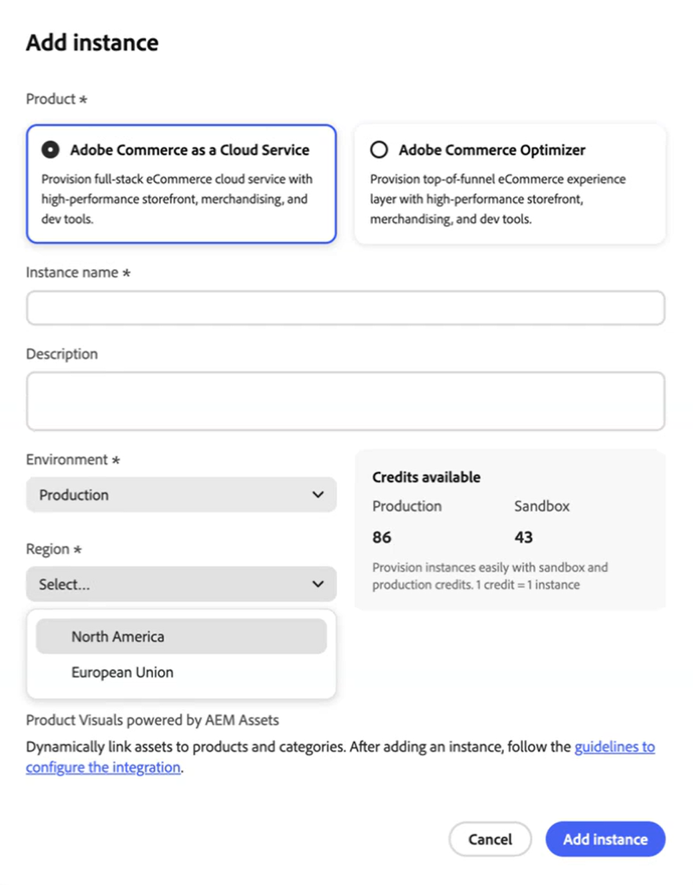

# Versionsinformation

Följande versionsinformation innehåller uppdateringar för [!DNL Adobe Commerce as a Cloud Service]. Versionsinformation om andra produkter finns i [Adobe Commerce Optimizer](../optimizer/release-notes.md) eller [Adobe Commerce lokalt och Adobe Commerce i molnet](https://experienceleague.adobe.com/en/docs/commerce-operations/release/notes/overview).

## Augusti 2025

**Releasedatum**: 28 augusti 2025

>[!BEGINSHADEBOX]

### Nu finns EU-regionen

Nu finns stöd för EU-regioner (eu1) för IMS-kundorganisationer. Du kan nu välja **Europeiska unionen** som en **region** när du [lägger till en Commerce SaaS-instans](./getting-started.md#create-an-instance) i Cloud Manager. EU-regionen är endast tillgänglig för produktionsmiljöer.

Bas-URL:erna för produktion i EU-regionen är:

* Administratör: `https://eu1.admin.commerce.adobe.com`
* REST och GraphQL: `https://eu1.api.commerce.adobe.com`

{width="600" align="center" zoomable="yes"}

>[!ENDSHADEBOX]
