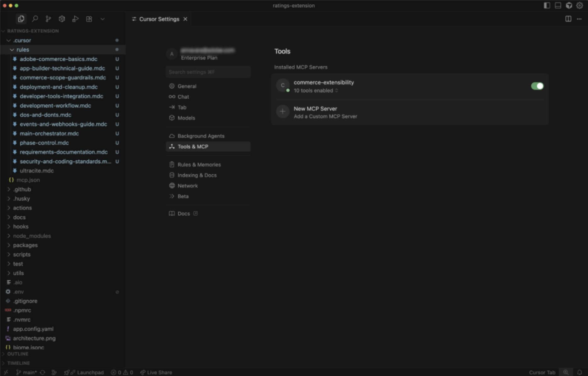
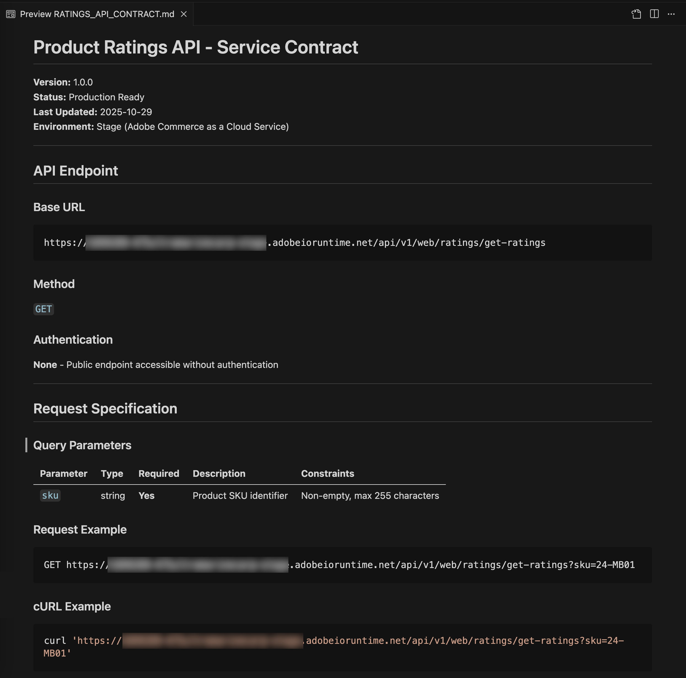
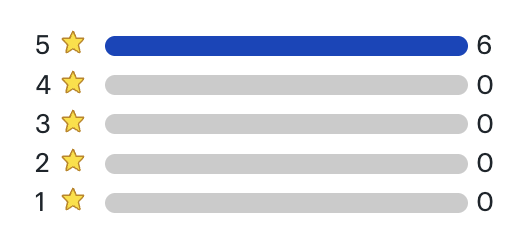

# Självstudiekurs om klassificeringstillägg

Den här självstudiekursen vägleder dig genom att skapa ett produktklassificeringstillägg för [!DNL Adobe Commerce as a Cloud Service] med [!DNL Adobe App Builder] och AI-stödda utvecklingsverktyg.

Innan du börjar slutför du [förutsättningarna](./tutorial-prerequisites.md).

## Verifiera krav

Kontrollera att följande krav är installerade:

```bash
# Check Node.js version (should be 22.x.x)
node --version

# Check npm version (should be 9.0.0 or higher)
npm --version

# Check Git installation
git --version

# Check Bash shell installation
bash --version
```

Om något av de föregående kommandona inte returnerar det förväntade resultatet kan du få hjälp i [kravavsnitten](./tutorial-prerequisites.md).

## Tilläggsutveckling

I det här avsnittet får du hjälp med att utveckla ett klassificeringstillägg för Adobe Commerce as a Cloud Service med hjälp av AI-stödda utvecklingsverktyg.

1. Navigera till **[!UICONTROL Cursor]** > **[!UICONTROL Settings]** > **[!UICONTROL Cursor Settings]** > **[!UICONTROL Tools & MCP]** och kontrollera att `commerce-extensibility`-verktygsuppsättningen är aktiverad utan fel. Om du ser fel kan du slå av och på verktygslådan.

   {width="600" zoomable="yes"}

   >[!NOTE]
   >
   >När du arbetar med AI-stödda utvecklingsverktyg kan du förvänta dig naturliga variationer i koden och svaren som genereras av agenten.
   >Om du stöter på problem med koden kan du alltid be agenten att hjälpa dig felsöka den.

1. Om du har lagt till någon dokumentation i markörens kontext inaktiverar du den:

   - Navigera till [!UICONTROL **Markören**] > [!UICONTROL **Inställningar**] > [!UICONTROL **Markörinställningar**] > [!UICONTROL **Indexering och dokument**] och ta bort all dokumentation som visas.

   {width="600" zoomable="yes"}

1. Generera kod för ett produktklassificeringstillägg:
   - Välj [!UICONTROL **agentläge**] i pekarens chattfönster.
   - Ange följande uppmaning:

   ```shell-session
   Implement an Adobe Commerce as a Cloud Service extension to handle Product Ratings.
   
   Implement a REST API to handle GET ratings requests.
   
   GET requests will have to support the following query parameters:
   
   sku -> product SKU
   ```

   >[!NOTE]
   >
   >Om agenten begär att få söka i dokumentationen, tillåt det.

1. Svara på agentens frågor så att den kan generera den bästa koden.

   {width="600" zoomable="yes"}

   {width="600" zoomable="yes"}

1. Använd följande exempeltext för att besvara agentens frågor för att ställa in slumpmässiga klassificeringsdata:

   ```shell-session
   Yes, this headless extension is for Adobe Commerce as a Cloud Service storefront,
   but we do not need any authentication for the GET API because guest users should be able to use it on the storefront.
   
   This extension is called directly from the storefront, no async invocation, such as events or webhooks, is required.
   
   Start with just the GET API for now, we will implement other CRUD operations at a later time.
   
   We do not need a DB or storage mechanism right now, just return random ratings data between 1 and 5 and a ratings count between 1 and 1000.
   
   The API should only return the average rating for the product and the total number of ratings.
   We do not need to add tests right now.
   ```

   Agenten skapar en `requirements.md`-fil som fungerar som källa för sanningen för implementeringen.

   {width="600" zoomable="yes"}

1. Granska filen `requirements.md` och verifiera planen.

   Om allt ser korrekt ut instruerar du agenten att gå till **Fas 2 - Arkitekturplanering**.
1. Se arkitekturplanen.
1. Instruera agenten att fortsätta med kodgenerering.

   Agenten genererar den nödvändiga koden och ger en detaljerad sammanfattning med nästa steg.

   {width="600" zoomable="yes"}

   {width="600" zoomable="yes"}

   {width="600" zoomable="yes"}

### Lokal testning

1. Be agenten att hjälpa dig att testa koden lokalt.

   ```shell-session
   Test the ratings API locally on a dev server using cURL.
   ```

1. Följ agentens instruktioner och bekräfta att API:t fungerar lokalt.

   {width="600" zoomable="yes"}

   {width="600" zoomable="yes"}

### Distribuera tillägget

1. När du har verifierat den genererade koden distribuerar du tillägget med följande uppmaning:

   ```shell-session
   Deploy the ratings API.
   ```

   Agenten utför en bedömning av beredskapen inför driftsättningen innan den distribueras.

   {width="600" zoomable="yes"}

1. När du är säker på utvärderingsresultaten instruerar du agenten att fortsätta med distributionen.

   Agenten använder MCP-verktygen för att verifiera, bygga och driftsätta automatiskt.

   {width="600" zoomable="yes"}

### Efter distribution

Du kan testa API:t innan du integrerar det i butiken. Agenten bör tillhandahålla platsen för den nya åtgärden och en testningsstrategi.

{width="600" zoomable="yes"}

Du kan också testa API:t manuellt med cURL i en terminal:

```bash
curl -s "https://<your-site>.adobeioruntime.net/api/v1/web/ratings/ratings?sku=TEST-SKU-123"
```

{width="600" zoomable="yes"}

### Integrera med Edge Delivery Services

Om du vill integrera klassificerings-API:t med en [!DNL Adobe Commerce]-butik som drivs av [!DNL Edge Delivery Services] ber du agenten att skapa ett tjänstkontrakt med krav för klassificerings-API:

```shell-session
Create a service contract for the ratings api that I can pass on to the storefront agent. Name it RATINGS_API_CONTRACT.md
```

{width="600" zoomable="yes"}

{width="600" zoomable="yes"}
<!-- 
Return to the terminal and run the following command in the `extension` folder to copy the file to the `storefront` folder:

```bash
cp RATINGS_API_CONTRACT.md ../storefront
``` -->

### Nästa steg

Nu när du har ett avtal för betygs-API kan du börja bygga delen av betygstillägget för butiken (frontend).

<!-- 
## Connect to the storefront

This section teaches you how to implement real storefront features and communicate effectively with AI agents when working with [!DNL Adobe Commerce] dropins and [!DNL Edge Delivery Services].

>[!NOTE]
>
>The prompts provided are starting points. Although you can use them without modification, consider having a natural conversation with the agent.
>
>When working with AI-assisted development tools, there are always natural variations in the code and responses generated by the agent.
>
>If you encounter any issues with your code, ask the agent to help you debug it.

### Ratings stars and review count implementation

1. Navigate to the `storefront` folder:

   ```bash
   cd storefront
   ```

1. Open the storefront folder in a new Cursor window.

    Alternatively, if you have the [Cursor CLI](https://cursor.com/docs/configuration/shell#installing-cli-commands) installed, open the window by using the following command in your terminal:

   ```bash
   cursor .
   ```

1. Start the local development server:

   ```bash
   npm run start
   ```

1. In a browser, navigate to the Apparel page:

   ```shell-session
   http://localhost:3000/apparel
   ```

1. Observe the boilerplate storefront UI layout and note the lack of visual product ratings.

1. Use the following prompt with your agent:

   ```shell-session
   Implement product ratings in the storefront.

   Add a 5-star rating display with a review count underneath each product name on the product list page, product details page, and product recommendations.

   Use the dropin slot system where available.

   Use @RATINGS_API_CONTRACT.md to understand how to use the ratings API.
   ```

1. Observe the changes in the codebase, and watch the Apparel page for updates.

   You should see the following changes in your development environment and browser:

   * A product rating "component" is automatically created.
   * The component is integrated into product-details, product-list-page, and product-recommendations blocks using [dropin slots](https://experienceleague.adobe.com/developer/commerce/storefront/dropins/customize/slots).
   * Stars display with proper fill proportions based on mock rating values.

{width="600" zoomable="yes"}

## Tutorial recap

Here is a summary of the topics covered in this tutorial:

* **Feature implementation**: How to describe new functionality to an AI agent.
* **Iterative changes**: Making quick modifications to existing code.
* **Complex UI components**: Building interactive features with visual references.
* **Dropin integration**: Working with [!DNL Adobe Commerce] dropin containers and slots.
* **Component reusability**: Creating shared components used across multiple blocks.

## Next steps

For further experimentation with this tutorial, use the following suggestions to further customize your ratings extension, or create your own modifications:

### Change the star colors

Use the following prompt to your agent:

```shell-session
Change the star fill color to red.
```

**Expected outcome:**

The stars are changed to red.

{width="600" zoomable="yes"}

### Add rating distribution modal

The following steps show how the agent handles complex UI features with visual references.

1. **Before starting:** Save the following mock image and paste it into the chat with your storefront agent.

   {width="600" zoomable="yes"}

1. Follow these steps to create the ratings distribution modal using the reference image as a guide:

   * Update the API to return additional data representing the ratings distribution.
   * Update the API Contract.
   * Update the contact in the storefront codebase.
   * Ask the storefront agent to use the reference image and updated API Contract to add the ratings distribution to the PDP page.

1. Observe the following changes in the codebase, and watch the Apparel page for updates:

   * How the agent interprets the visual mockup
   * Whether it uses appropriate HTML structure for accessibility
   * How it handles the positioning and interaction states

#### Troubleshooting

* If the modal does not appear, check the browser console for errors.
* If positioning is off, ask the agent to fix it using the following format:

   ```shell-session
   adjust the modal position to be...
   ```

{width="600" zoomable="yes"}
 -->
