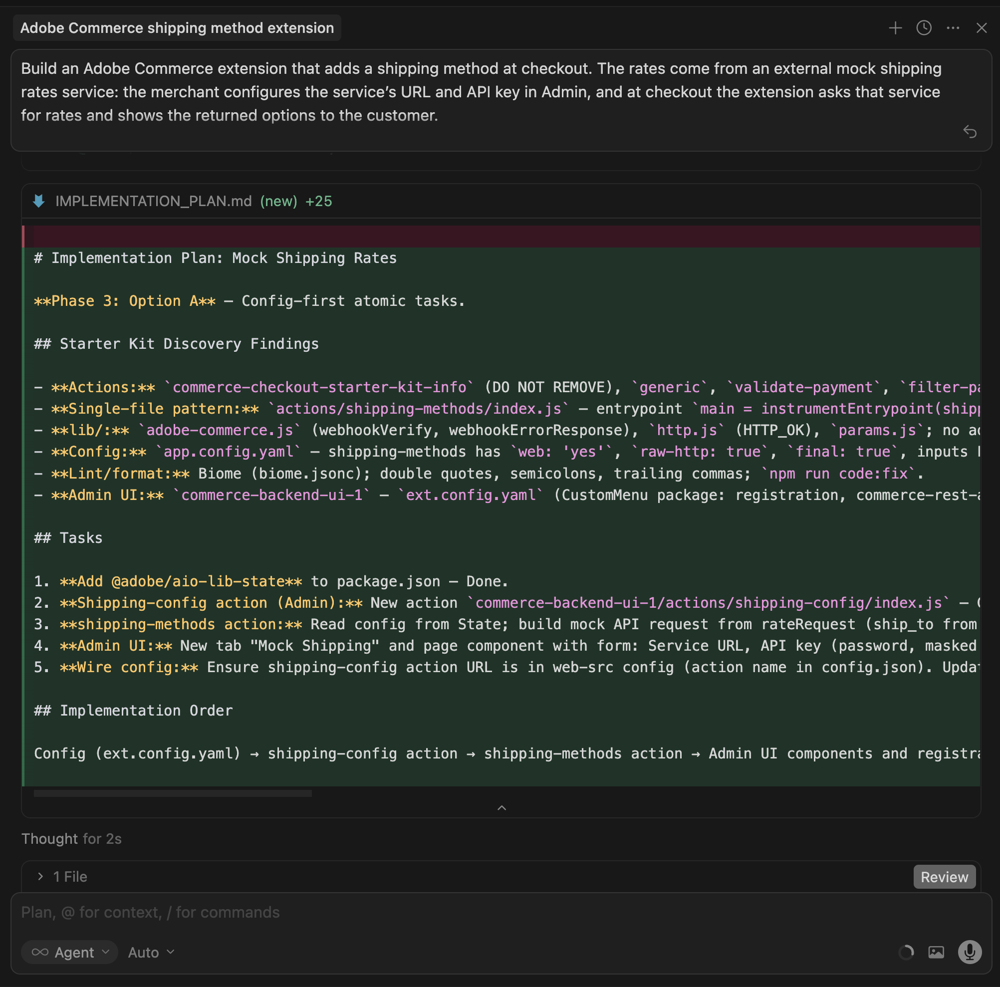
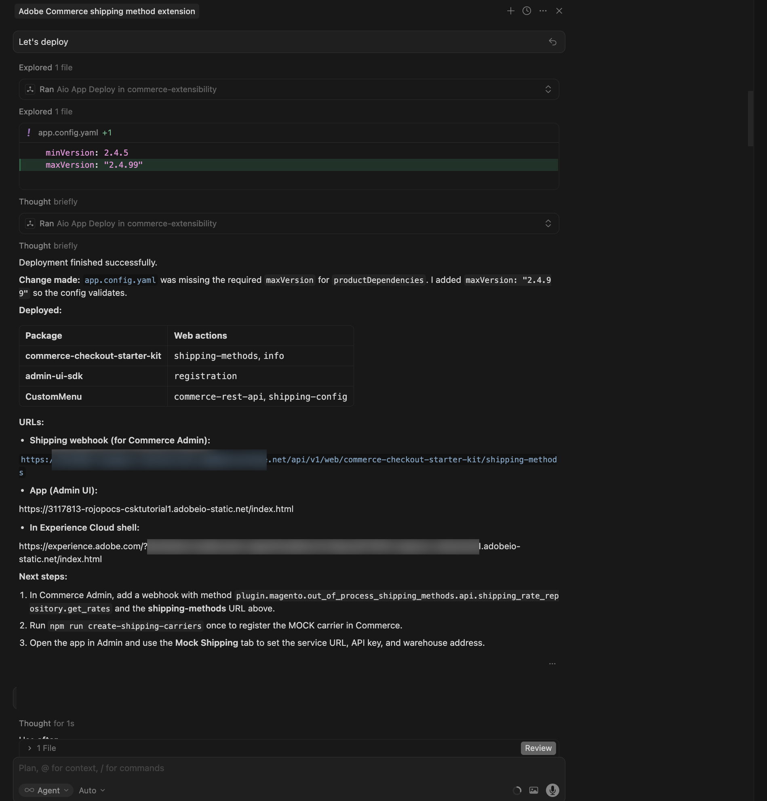

# Tilläggssjälvstudiekurs för leveransmetod

I den här självstudiekursen får du hjälp med att skapa ett leveransmetodtillägg för [!DNL Adobe Commerce as a Cloud Service] med hjälp av [!DNL Adobe App Builder], [startsatsen för utcheckning](https://developer.adobe.com/commerce/extensibility/starter-kit/checkout/){target="_blank"} och AI-stödda utvecklingsverktyg.

Tillägget lägger till en konfigurerbar leveransmetod i kassan där taxorna kommer från en extern tjänst för fraktavgifter. Merchants konfigurerar service-URL:en, API-nyckeln och lagerställeadressen (ship-from) i Admin-gränssnittet, och vid utcheckning av antalet förfrågningar från den tjänsten och visar returnerade alternativ för kunden.

Innan du börjar slutför du [förutsättningarna](./tutorial-prerequisites.md).

## Verifiera krav {#tutorial-verify-prerequisites}

Kontrollera att följande krav är installerade:

```bash
# Check Node.js version (should be 22.x.x)
node --version

# Check npm version (should be 9.0.0 or higher)
npm --version

# Check Git installation
git --version

# Check Bash shell installation
bash --version
```

Om något av de föregående kommandona inte returnerar det förväntade resultatet kan du få hjälp i [kravavsnitten](./tutorial-prerequisites.md).

## Skapa API:t för modellfraktsatser

När du är klar med [kravuppfyllelserna](./tutorial-prerequisites.md) skapar du API:t för modellleveranshastigheter, så att du har service-URL:en och API-nyckeln redo när du konfigurerar tillägget i [!DNL Commerce Admin]. Tillägget anropar en extern API för fraktsatser. I den här självstudiekursen använder du en modell-API som gör att du kan köra flödet utan ett riktigt transportföretagskonto. Du skapar dummy-API:t med [Pipetream](https://pipedream.com) (kostnadsfritt konto krävs). Mock API använder ett begäran-/svarsavtal som liknar de vanliga API:erna för reala fraktpriser, så det bör vara enkelt att ansluta det här tillägget till en riktig leverantör senare.

Om du vill skapa API:t för modellering hämtar du specifikationsfilen [för API:t för modellering](../assets/mock-rates-api-spec.zip), öppnar den och lägger till filen `.md` i projektet (till exempel `docs/mock-rates-api-spec.md`).

**Tid:** Det bör ta cirka **5-10 minuter** att skapa API:t för modeller.

### Skapa ett arbetsflöde och en HTTP-utlösare

1. Gå till [pipedream.com](https://pipedream.com) och registrera dig eller logga in.
1. Klicka på **Nytt arbetsflöde** (eller **Lägg till arbetsflöde**).
1. Välj **HTTP/Webkrok** för utlösaren.
1. I utlösarkonfigurationen anger du **HTTP-svar** till **Returnera ett anpassat svar från ditt arbetsflöde**. Detta gör att kodsteget kan skicka ett JSON-svar av typen.
1. Pipetream visar en unik **HTTP-slutpunkts-URL**, till exempel `https://123456.m.pipedream.net`.
1. **Kopiera den här URL:en** och använd den som **tjänst-URL** när du konfigurerar tillägget i Commerce Admin.

   {width="600" zoomable="yes"}

Du behöver inte konfigurera **auktorisering** för utlösaren. Mock-API:t validerar rubriken `API-Key` i kodsteget.

### Lägg till kodsteget

1. Klicka på ikonen **+** för att lägga till ett steg.
1. Välj **Kör Node.js-kod** (kodsteg).
1. **Ersätt** standardkoden med följande JavaScript.

   ```javascript
   export default defineComponent({
   async run({ steps, $ }) {
      const event = steps.trigger.event;
      const body = event.body ?? {};
      const headers = event.headers ?? {};
      const apiKey = headers["api-key"] ?? body.api_key ?? "";
   
      if (!apiKey || String(apiKey).trim() === "") {
         await $.respond({
         immediate: true,
         status: 401,
         headers: { "Content-Type": "application/json" },
         body: { error: "Missing or invalid API-Key header" },
         });
         return;
      }
   
      const shipment = body.shipment;
      if (!shipment || typeof shipment !== "object") {
         await $.respond({
         immediate: true,
         status: 400,
         headers: { "Content-Type": "application/json" },
         body: { error: "Missing or invalid shipment" },
         });
         return;
      }
   
      const rates = [
         {
         service_code: "mock_standard",
         service_name: "Mock Standard",
         carrier_friendly_name: "Mock Carrier",
         shipping_amount: { amount: 5.99 },
         shipment_cost: 5.99,
         cost: 5.99,
         },
         {
         service_code: "mock_express",
         service_name: "Mock Express",
         carrier_friendly_name: "Mock Carrier",
         shipping_amount: { amount: 12.99 },
         shipment_cost: 12.99,
         cost: 12.99,
         },
      ];
   
      await $.respond({
         immediate: true,
         status: 200,
         headers: { "Content-Type": "application/json" },
         body: { rates },
      });
   },
   });
   ```

1. Klicka på **Distribuera**.

   {width="600" zoomable="yes"}

Mock returnerar två hastighetsalternativ (Mock Standard och Mock Express) för alla giltiga begäranden som innehåller ett icke-tomt `API-Key`-huvud och ett `shipment`-objekt. Du konfigurerar API-nyckeln i [!DNL Commerce Admin] senare i den här självstudien. Du anger också arbetsflödes-URL:en för Pipetream på samma konfigurationsskärm, så observera det.

## Tilläggsutveckling

I det här avsnittet får du hjälp med att utveckla ett leveransmetodtillägg för [!DNL Adobe Commerce as a Cloud Service] med hjälp av [startpaketet för utcheckning](https://developer.adobe.com/commerce/extensibility/starter-kit/checkout/){target="_blank"} och AI-stödda utvecklingsverktyg.

1. Navigera till MCP-inställningarna i kodningsagenten. Gå till exempel till **[!UICONTROL Cursor]** > **[!UICONTROL Settings]** > **[!UICONTROL Cursor Settings]** > **[!UICONTROL Tools & MCP]** i Markören. Kontrollera att verktygsuppsättningen `commerce-extensibility` är aktiverad utan fel. Om du ser fel kan du slå av och på verktygslådan.

   {width="600" zoomable="yes"}

   >[!NOTE]
   >
   >När du arbetar med AI-stödda utvecklingsverktyg kan du förvänta dig naturliga variationer i koden och svaren som genereras av agenten.
   >
   >Om du stöter på problem med koden kan du alltid be agenten att hjälpa dig felsöka den.

1. Om du har lagt till någon dokumentation i markörens kontext inaktiverar du den. Navigera till [!UICONTROL **Markören**] > [!UICONTROL **Inställningar**] > [!UICONTROL **Markörinställningar**] > [!UICONTROL **Indexering och dokument**] och ta bort all dokumentation som visas.

   {width="600" zoomable="yes"}

1. Ge agenten åtkomst till API-specifikationen för modellfrekvenser, så att den kan implementera klienten korrekt. Om du inte redan har gjort det hämtar du [API-specifikationsfilen för modellfrekvenser](../assets/mock-rates-api-spec.zip), öppnar den och lägger till filen `.md` i projektet (till exempel `docs/mock-rates-api-spec.md`) och refererar sedan till filen i uppmaningen.

1. Generera leveransmetodtillägg:

   - Välj **Planera**-läge, om det är tillgängligt, i agentens chattfönster. Detta förhindrar agenten från att fortsätta utan någon plan.
   - Ange följande uppmaning:

   ```shell-session
   Build an Adobe Commerce extension that adds a shipping method at checkout. The rates come from an external mock shipping rates service: the merchant configures the service's URL and API key in Admin, and at checkout the extension asks that service for rates and shows the returned options to the customer.
   
   External service (mock shipping rates API):
   - The service endpoint URL is configurable by the merchant (for example https://123456.m.pipedream.net).
   - The API is specified in ./docs/mock-rates-api-spec.md.
   
   The merchant must be able to configure the following in the Adobe Commerce Admin UI. Use the Adobe Commerce Admin UI SDK (or equivalent App Builder extensibility options for the Admin) to add a configuration screen where the merchant can set:
   - The service URL (where the extension sends rate requests).
   - An API key the service expects (any non-empty value for the mock). The API key is sensitive data: it must be stored securely and must never appear in logs, error messages, or in the UI in full (e.g. mask in the UI).
   - The warehouse (ship-from) address: name, phone, street, city, state, postal code, country. This is the origin used when requesting rates.
   ```

   >[!NOTE]
   >
   >Om agenten begär att få söka i dokumentationen, tillåt det.

   {width="600" zoomable="yes"}

1. Svara på agentens frågor så att den kan generera den bästa koden. Om agenten frågar vilket kit eller vilken mall som ska användas dirigerar du det till startpaketet [för utcheckning](https://developer.adobe.com/commerce/extensibility/starter-kit/checkout/){target="_blank"} med leveransdomänen och SDK-tillägget för administratörsgränssnittet så att både leveranswebbhoten och konfigurationsskärmen för handlare implementeras.

   Agenten kan skapa en `requirements.md`-fil (eller motsvarande) som fungerar som källa för sanningen för implementeringen.

1. Granska filen `requirements.md` (eller motsvarande) och verifiera planen. Om allt ser korrekt ut instruerar du agenten att gå till arkitekturplanering (eller **fas 2**). Bekräfta att:

   - En **åtgärd för leveransmetoder** (eller motsvarande) hanterar Commerce webkrok och anropar API:t för externa tariffer.
   - En **shipping-config**-åtgärd (eller motsvarande) stöder GET (läskonfiguration, API-nyckelmaskerad) och SET (spara tjänst-URL, API-nyckel, lageradress) med config säkert lagrad, t.ex. i körningstillstånd.
   - Administratörsgränssnittet innehåller en **Mock Shipping**-flik (eller liknande) med fält för Service URL, API-nyckel (lösenord/masked) och lageradress.

   {width="600" zoomable="yes"}

1. Granska arkitekturplanen när agenten tillhandahåller den.

   {width="600" zoomable="yes"}

1. Instruera agenten att fortsätta med kodgenerering. Agenten bör lägga till en **modellbärare** i transportföretagskonfigurationen så att Commerce kan acceptera de returnerade metoderna och använda webkrockmetoden `plugin.magento.out_of_process_shipping_methods.api.shipping_rate_repository.get_rates` (webkrotyp **efter**, som krävs **Valfritt**).

   Agenten genererar den nödvändiga koden och ger en detaljerad sammanfattning med dina nästa steg (inklusive installation av beroenden, registrering av modellagringsoperatören, konfigurering av Commerce webkrok och driftsättning).

   {width="600" zoomable="yes"}

   {width="600" zoomable="yes"}

### Rensa före distribution

Ta bort kod som inte behövs innan du distribuerar programmet. Startpaketet för kassan kan innehålla oanvända domäner (till exempel betalning, moms eller händelser) och ställningar. Låt agenten ta bort dem och behålla endast frakt och [!DNL Admin UI] delar genom att använda en uppmaning som:

```shell-session
Proceed with Phase 5 cleanup.
```

Agenten skapar en rensningsrapport, tar bort oanvända åtgärder, konfiguration och skript samt uppdaterar projektet. Slutför det här steget innan du distribuerar.

{width="600" zoomable="yes"}

### Distribuera tillägget

1. När du har verifierat den genererade koden distribuerar du tillägget med följande uppmaning:

   ```shell-session
   Deploy the app.
   ```

   Agenten utför en beredskapsbedömning före distributionen (till exempel kontroll av `.env` för `COMMERCE_WEBHOOKS_PUBLIC_KEY`, `COMMERCE_BASE_URL` och OAuth/IMS-variabler om Admin-gränssnittet eller Commerce API används).

   {width="600" zoomable="yes"}

1. När du är säker på utvärderingsresultaten instruerar du agenten att fortsätta med distributionen. Agenten använder MCP-verktygen för att verifiera, bygga och driftsätta automatiskt.

   {width="600" zoomable="yes"}

### Efter distribution

Efter distributionen utför du följande steg för att registrera modelloperatören, konfigurera webkroken och [!DNL Admin UI] och verifiera tillägget vid utcheckning.

1. **Registrera modellföretaget i Commerce** (kör en gång efter distributionen):

   ```bash
   npm run create-shipping-carriers
   ```

   Kontrollera att `.env` har `COMMERCE_BASE_URL` och en giltig OAuth/IMS-autentiseringsuppgift, så att skriptet kan registrera transportören.

1. **Konfigurera leveranswebbkroken i [!DNL Commerce Admin]:**

   - Gå till **Lager** > Inställningar > **Konfiguration** > **Adobe-tjänster** > **Commerce-webbböcker**.
   - Lägg till en webkrok:
      - **Webkrok-metod:** `plugin.magento.out_of_process_shipping_methods.api.shipping_rate_repository.get_rates`
      - **Webkrotyp:** **efter**
      - **URL:** den distribuerade webbåtgärds-URL:en **shipping-methods** (från distributionsutdata eller [!DNL Adobe Developer Console]).
      - **Obligatoriskt:** **Valfritt** - Det gör att utcheckning fortfarande fungerar om det externa API:t inte returnerar några frekvenser.

   {width="600" zoomable="yes"}

1. **Konfigurera [!DNL Admin UI SDK]-tillägget:**

   - I [!DNL Commerce Admin] går du till **Store** > Inställningar > **Konfiguration**.
   - Öppna **Adobe-tjänster** > **Admin UI SDK**.
   - Ange **Aktivera administratörsgränssnittet för SDK** till **Ja** och klicka på **Spara konfiguration** om det inte redan är aktiverat.
   - Klicka på **Konfigurera tillägg**, välj den arbetsyta som appen är distribuerad till och klicka sedan på **Använd**. Du kan också välja alternativet **Egen** och ange namnet på arbetsytan.
   - Välj din [!DNL App Builder]-app i listan och spara den. Om appen inte visas klickar du på **Uppdatera registreringar** och försöker igen.

   {width="600" zoomable="yes"}

1. **Konfigurera Mock Shipping-metoden i Adobe Commerce Admin-gränssnittet:**
   - Öppna **Appar** och välj din app.
   - Öppna fliken **Mock Shipping** (eller motsvarande).
   - Ange följande information:
      - **Tjänst-URL:** den Pipetream-arbetsflödes-URL som du kopierade (till exempel `https://123456.m.pipedream.net`).
      - **API-nyckel:** ett icke-tomt värde för modellen, till exempel `tutorial-key`.
      - **Lagerställe (leveransadress):** namn, telefon, gata, ort, postnummer, land.
   - Klicka på **Spara**. Konfigurationen lagras i körningstillstånd och används av åtgärden för leveransmetoder.

   {width="600" zoomable="yes"}

1. **Verifiera vid utcheckning:** Lägg till en produkt i kundvagnen, gå till utcheckningen och ange en leveransadress. Du bör se alternativen för leverans av modeller, till exempel **Mock Standard** och **Mock Express**.

   {width="600" zoomable="yes"}

### Felsökning

- **Konfigurationen sparas inte i administratörsgränssnittet:** Om svaret inte är giltigt message/http, eller värden som inte uppdateras efter att ha sparats, söker du efter konfigurationsåtgärden i aktiveringsloggarna för körningen med ett kommando som liknar följande:

  ```bash
  aio app logs --action CustomMenu/shipping-config --limit 20
  ```

  Vanliga orsaker är bland annat att gatewayen förväntar sig ett visst svarsformat (till exempel en strängbrödtext och `Content-Type: application/json`) eller det tillståndsbibliotek som kräver strängvärden. Kontrollera att åtgärden lagrar config som en sträng och tolkar den när den läses, och att åtgärden för leveransmetoder använder samma parsning. Granska agentens chatt eller loggar för att hitta orsaken och åtgärda problemet.

- **&quot;Svaret måste innehålla minst en åtgärd&quot;** (i webkrockloggar): Commerce kräver att den levererande webkroken returnerar minst en åtgärd. Be agenten att se till att åtgärden för leveransmetoder aldrig returnerar en tom operationsmatris (till exempel genom att returnera en reservfrekvens när det externa API:t returnerar ingen ränta).

- **Inga fraktsatser vid utcheckning:** Bekräfta att webkroks-URL:en och -metoden är korrekta, att modellbäraren är registrerad (`npm run create-shipping-carriers`) och att Mock Shipping-konfigurationen är inställd i [!DNL Admin UI]. Kontrollera om körningsloggarna innehåller åtgärder för leveransmetoder för API- eller valideringsfel. Kontrollera att åtgärden returnerar minst en åtgärd så att [!DNL Commerce] inte visar &quot;Svaret måste innehålla minst en åtgärd&quot;.

### Självstudiekurs

Här följer en sammanfattning av ämnen som ingår i kursen:

- **Förutsättningar och konfiguration:** Verifierar verktyg och skapar API:t för modellens frakt.
- **Agentdriven utveckling:** Använda verktygsuppsättningen för utökningsmöjligheter för e-handel för att generera krav, en implementeringsplan och kod för den levererande webbokroken och administratörsgränssnittet.
- **Fas 5-rensning:** Tar bort oanvända startpaketdomäner och ställningar för utcheckning före distributionen.
- **Distribution:** Utvärdering före distribution och distribution av MCP-verktygspaket.
- **Konfiguration efter distribution:** Registrerar modelltransportören, konfigurerar webkroken [!DNL Commerce], aktiverar tillägget [!DNL Admin UI SDK] och anger Mock Shipping (tjänst-URL, API-nyckel, lagerställe) i [!DNL Admin UI].
- **Verifiering:** Bekräftande leveransalternativ för dummy visas i kassan.

### Nästa steg

Om du vill experimentera med den här självstudiekursen kan du göra följande:

- Automatisera installationen efter distributionen med en krok som registrerar modelltransportföretaget i [!DNL Commerce] och konfigurerar leveranswebbkroken efter varje distribution.
- Peka på tillägget med ett reellt API för fraktsatser genom att ändra Service URL och API-nyckeln i [!DNL Admin UI].
- Utöka [!DNL Admin UI] för att visa transportföretagets status eller testa anslutningen till tarifftjänsten.
