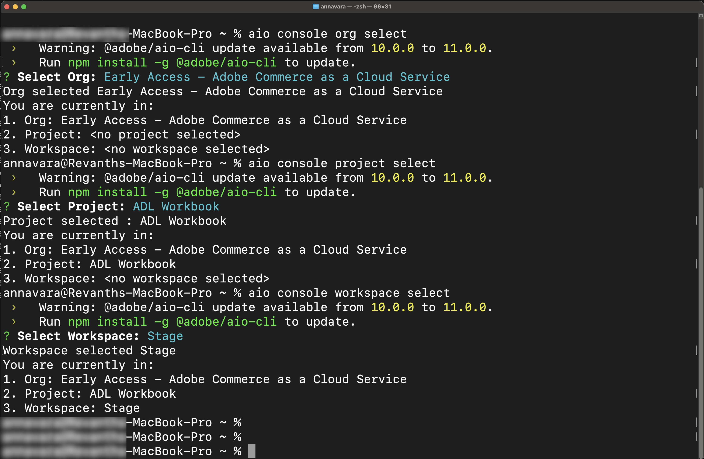

# Förutsättningar

På den här sidan visas förutsättningarna och konfigurationsstegen för [!DNL Adobe Commerce as a Cloud Service]-självstudiekurser, t.ex. [självstudiekursen för klassificeringstillägg](./ratings-extension.md) och [självstudiekursen för leveransmetodtillägg](./shipping-method-extension.md).

## Allmänna krav

Följande verktyg krävs för både tillägg och butiksutveckling i den här självstudiekursen.

* [!DNL Node.js] (version `22.x.x`) och npm (`9.0.0` eller senare): Verifiera installationen med följande kommando:

  ```bash
  node --version
  npm --version
  ```

* Installera [Git](https://git-scm.com) - Verifiera installationen:

  ```bash
  git --version
  ```

* Bash-skal
   * macOS/Linux: Ingen installation krävs
   * Windows: Använd [Git Bash](https://git-scm.com/install) eller [Windows Subsystem för Linux (WSL)](https://learn.microsoft.com/en-us/windows/wsl/install)

* Hämta en AI-assisterad IDE, till exempel [Markör](https://cursor.com/download) (rekommenderas). Även andra utvecklingsmiljöer, som Claude Code, Gemini CLI och Copilot, stöds, men kan kräva ändringar av instruktioner och andra steg i självstudiekursen.

## Krav för [!DNL Adobe Commerce as a Cloud Service]

* Installera [!DNL Adobe I/O CLI]

  ```bash
  npm install -g @adobe/aio-cli
  ```

* Installera plugin-programmen [Adobe I/O CLI Commerce](https://github.com/adobe-commerce/aio-cli-plugin-commerce), [ Adobe I/O CLI Runtime](https://github.com/adobe/aio-cli-plugin-runtime) och [App Builder CLI](https://github.com/adobe/aio-cli-plugin-app-dev):

  ```bash
  aio plugins:install https://github.com/adobe-commerce/aio-cli-plugin-commerce @adobe/aio-cli-plugin-app-dev @adobe/aio-cli-plugin-runtime
  ```

### Krav för Adobe Developer Console

Konfigurera ett projekt i Adobe Developer Console med de nödvändiga API:erna och autentiseringsuppgifterna.

1. Gå till [Adobe Developer Console](https://developer.adobe.com/console){target="_blank"}.
1. Logga in med din e-postadress och ditt lösenord.

#### Skapa ett nytt projekt

Skapa ett App Builder-projekt i Adobe Developer Console som värd för ditt tillägg.

1. Navigera till [Adobe Developer Console](https://developer.adobe.com/).
1. Klicka på **[!UICONTROL Create project from a template]**.
1. Välj mallen **[!UICONTROL App Builder]**.
1. Ange **[!UICONTROL Project Title]** och **[!UICONTROL App Name]**.
1. Kontrollera att kryssrutan **[!UICONTROL Include Runtime]** är markerad.

   {width="600" zoomable="yes"}

1. Klicka på **[!UICONTROL Save]**.

#### Lägg till API:er på arbetsytan

Lägg till nödvändiga API:er på scenarbetsytan för händelsehantering och integrering med Commerce.

1. Klicka på arbetsytan **[!UICONTROL Stage]** och upprepa sedan följande steg för varje API.

   {width="600" zoomable="yes"}

1. Klicka på **[!UICONTROL Add Service]** och välj **[!UICONTROL API]**.

1. Välj någon av följande API:er. Upprepa den här processen för varje API som visas nedan:

   * **[!UICONTROL Adobe Services]**-filter:
      * **[!UICONTROL I/O Management API]**
      * API för **[!UICONTROL I/O Events]**
   * **[!UICONTROL Experience Cloud]**-filter:
      * API för **[!UICONTROL Adobe I/O Events for Adobe Commerce]**

1. Klicka på **[!UICONTROL Next]**.

1. Klicka på **[!UICONTROL Save configured API]**.

1. Upprepa föregående steg tills du lägger till alla API:er på arbetsytan.

   {width="600" zoomable="yes"}

### Konfigurera Adobe I/O CLI

Anslut [!DNL Adobe I/O CLI] till din organisation, ditt projekt och din arbetsyta.

1. Rensa befintlig konfiguration:

   ```bash
   aio config clear
   ```

1. Logga in med [!DNL Adobe I/O CLI]:

   ```bash
   aio auth login -f
   ```

1. Välj organisation, projekt och arbetsyta med hjälp av följande kommandon:

   ```bash
   aio console org select
   ```

   ```bash
   aio console project select
   ```

   ```bash
   aio console workspace select
   ```

   {width="600" zoomable="yes"}

### Klona startkit

Klona en av följande Commerce startkit-databaser för det tillägg du håller på att bygga och förbereda ditt projekt:

Startpaket för integrering:

```bash
git clone https://github.com/adobe/commerce-integration-starter-kit.git extension
cd extension
```

Startpaket för kassan:

```bash
git clone https://github.com/adobe/commerce-checkout-starter-kit.git extension
cd extension
```

>[!BEGINTABS]

>[!TAB Startpaket för integrering]

### Skapa en .env-fil

Skapa din miljökonfigurationsfil:

```bash
cp env.dist .env
```

Öppna filen `.env` i en textredigerare och lägg till följande OAuth-autentiseringsuppgifter:

```bash
OAUTH_CLIENT_ID=
OAUTH_CLIENT_SECRET=
OAUTH_TECHNICAL_ACCOUNT_ID=
OAUTH_TECHNICAL_ACCOUNT_EMAIL=
OAUTH_ORG_ID=
```

Kopiera dessa värden från sidan **[!UICONTROL Credential details]** i [Developer Console](https://developer.adobe.com/) genom att klicka på fliken **[!UICONTROL OAuth Server-to-Server]** på arbetsytan.

{width="600" zoomable="yes"}

#### Lägg till Commerce-konfigurationen

Lägg till följande Commerce-instansinformation i din `.env`-fil:

```bash
COMMERCE_BASE_URL=
COMMERCE_GRAPHQL_ENDPOINT=
```

Så här hittar du dessa värden:

1. Navigera till [Commerce Cloud Service-instanser](https://experience.adobe.com/#/@commerce/commerce/cloud-service/instances).
1. Klicka på informationsikonen bredvid instansen.
1. Kopiera REST-slutpunkten som `COMMERCE_BASE_URL`.
1. Kopiera GraphQL-slutpunkten som `COMMERCE_GRAPHQL_ENDPOINT`.

#### Ange händelseprefix

Ange ett tillfälligt värde för händelseprefixet:

```bash
EVENT_PREFIX=test
```

### Hämta arbetsytans konfiguration

Kör följande kommando för att hämta arbetsytans konfigurationsfil:

```bash
aio console workspace download workspace.json
```

Kopiera arbetsytans konfigurationsfil till katalogen `scripts`:

```bash
cp workspace.json scripts/
```

### Ansluta den lokala arbetsytan till fjärrarbetsytan

Länka ditt lokala projekt till den fjärranslutna arbetsytan:

```bash
aio app use workspace.json -m
```

{width="600" zoomable="yes"}

>[!TAB Startpaket för utcheckning]

### Ansluta den lokala arbetsytan till fjärrarbetsytan

Länka det lokala projektet till fjärrarbetsytan. Kör från projektets rot (mappen `extension`):

```bash
aio app use --merge
```

När du uppmanas till det väljer du det alternativ som använder den organisation, det projekt och den arbetsyta du valde när du konfigurerade Adobe I/O CLI. Detta skriver arbetsytans konfiguration i programmet så att den arbetsytan används vid distributionen och den lokala utvecklingen.

{width="600" zoomable="yes"}

>[!ENDTABS]

### Installera AI-verktygen för utökningsbarhet

Den här processen skapar MCP-konfigurationen (`.<agent>/mcp.json`), kompetenskatalogen (`.<agent>/skills/`) och lägger till `AGENTS.md` i projektets rot. Du uppmanas att välja ett startpaket, en kodningsagent och en pakethanterare.


1. Konfigurera AI-stödda utvecklingsverktyg i mappen `extension` med följande kommandon:

   ```bash
   cd extension
   ```

   ```bash
   aio commerce extensibility tools-setup
   ```

   {width="600" zoomable="yes"}

1. När installationen är klar startar du om kodningsagenten så att den kan läsa in de nya MCP-verktygen och -kunskaperna. Commerce App Builder-verktygen finns nu i din miljö.

   >[!NOTE]
   >
   >Om du ser ett varningsmeddelande om att inga kunskaper hittades för startpaketet gick något fel. Det beror ofta på att konfigurationen kördes i en annan mapp än där startsatsen klonades. Kör `aio commerce extensibility tools-setup` från mappen `extension` (startkit-projektroten) och välj rätt startkit när du uppmanas till detta.

   {width="600" zoomable="yes"}

## Krav för Storefront

Följande objekt krävs för att slutföra avsnittet [storefront](./ratings-extension.md#connect-to-the-storefront) i självstudiekursen [Ratings extension](./ratings-extension.md) och visa produktbetyg i din butik.

* [Google Chrome](https://www.google.com/chrome/) - krävs för att testa butiken

* Ett butiksprojekt som är anslutet till din [!DNL Commerce]-instans. Om du inte har något storefront-projekt följer du stegen i [Skapa en storefront](https://experienceleague.adobe.com/developer/commerce/storefront/get-started/create-storefront/){target="_blank"}, inklusive avsnittet [Länka repo till handelsdata](https://experienceleague.adobe.com/developer/commerce/storefront/get-started/create-storefront/#link-repo-to-commerce-data){target="_blank"}.

### Klona butiksarkivet

Öppna terminalen och klona databasen:

```bash
git clone --branch agentic-dev https://github.com/hlxsites/aem-boilerplate-commerce.git storefront
cd storefront
```

### Installera beroenden

Installera projektberoenden:

```bash
npm install
```

### Installera storefront AI-verktygen

Konfigurera AI-stödda utvecklingsverktyg i mappen `storefront`. Kör följande kommando från roten i mallprojektet:

```bash
aio commerce extensibility tools-setup
```

Kommandot visar två instruktioner:

1. **Välj ett startpaket** - Välj **AEM-standardpaket för Commerce**.

1. **Välj din kodningsagent** - Välj din agent i listan med agenter som stöds.

Kommandot installerar `@adobe-commerce/commerce-extensibility-tools`-paketet som ett dev-beroende, kopierar kunskapsfilerna till din agentes kunskapsregister och konfigurerar MCP (Model Context Protocol) så att din agent får tillgång till sökverktygen i Commerce-dokumentationen.