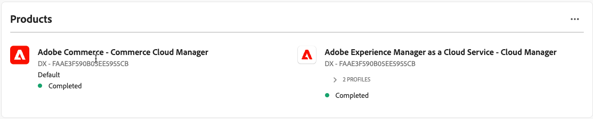

# Användarhantering

Om du vill att användare ska få åtkomst till Admin i [!DNL Adobe Commerce as a Cloud Service] måste du lägga till dem som användare i din organisation och se till att de har åtkomst till Cloud Service-produkten i [Adobe Admin Console](https://adminconsole.adobe.com){target="_blank"}.

Den här processen kräver en IMS-organisation med åtkomst till [!DNL Adobe Commerce as a Cloud Service]. Dessa processer kan endast utföras av systemadministratören eller produktadministratören för organisationen.

>[!TIP]
>
>Om du vill lägga till flera användare samtidigt kan du utföra en [massöverföring av en CSV](https://helpx.adobe.com/enterprise/using/bulk-upload-users.html){target="_blank"}.
> 
> Du kan också lägga till flera användare till en roll genom att skapa en [användargrupp](https://helpx.adobe.com/enterprise/using/user-groups.html){target="_blank"}. Sedan kan du lägga till [!UICONTROL **Adobe Commerce - Commerce Cloud Manager**]-produkten i användargruppen.

## Förstå roller

Följande roller är tillgängliga för [!DNL Adobe Commerce as a Cloud Service]. Om du vill visa eller redigera de här rollerna går du till **System** > **Behörigheter** > **Användarroller** i Commerce Admin.

* **Användare** - Användare har administratörsåtkomst till Commerce Admin, men kan inte hantera åtkomst på produktnivå i Admin Console. Användare kan också använda krediter för att [skapa instanser](./getting-started.md#create-an-instance) i [!DNL Commerce Cloud Manager].

* [**Utvecklare**](https://helpx.adobe.com/enterprise/using/manage-developers.html#Adddevelopers){target="_blank"} Utvecklare har användarbehörigheter och läggs till i Commerce-instansen som utvecklaranvändare. Det innebär att de kan använda användargränssnittet [Admin SDK](https://developer.adobe.com/commerce/extensibility/admin-ui-sdk/){target="_blank"}, [konfigurera händelser](https://developer.adobe.com/commerce/extensibility/events/){target="_blank"} och [skapa webbböcker](https://developer.adobe.com/commerce/extensibility/webhooks/){target="_blank"}.

* Administratörer - Det finns tre olika typer av administratörer:
   * [Systemadministratörer](https://helpx.adobe.com/enterprise/using/admin-roles.html){target="_blank"} - Systemadministratören har åtkomst till alla produkter och produktprofiler i organisationen via Admin Console.
   * [Produktadministratörer](#add-a-product-admin) - Produktadministratörer kan [hantera användare, roller och behörigheter för produkten](#add-users-and-admins) i [!DNL Adobe Admin Console] och [hantera användare i Commerce Admin](https://experienceleague.adobe.com/en/docs/commerce-admin/systems/user-accounts/permissions-users-all#create-a-user){target="_blank"}.
   * [Administratörer för produktprofiler](#add-users-developers-and-product-profile-admins) - Administratörer för produktprofiler har inte tillgång till Adobe Commerce Admin, men kan hantera användare för produkten i [!DNL Adobe Admin Console].

Mer information om behörigheter för varje roll i Adobe Commerce finns i [användarbehörigheter](#user-permissions).

## Lägg till en produktadministratör

1. Navigera till https://adminconsole.adobe.com och logga in med din Adobe ID.

1. Välj organisation.

1. På fliken [!UICONTROL **Produkter**] väljer du [!UICONTROL **Adobe Commerce - Commerce Cloud Manager**] under [!UICONTROL **Produkter och tjänster**].

   {width="600" zoomable="yes"}

1. Välj fliken [!UICONTROL **Administratörer**].

1. Klicka på [!UICONTROL **Lägg till administratör**].

1. Ange användarnamn eller e-postadress för de användare som du vill lägga till som administratörer och klicka på [!UICONTROL **Spara**].

## Lägga till användare, utvecklare och produktprofiladministratörer

Följande instruktioner innehåller information om hur du lägger till användare och utvecklare i [!DNL Commerce Cloud Manager] och Commerce Admin. Med gränssnittet [!DNL Commerce Cloud Manager] kan du skapa och hantera dina Commerce-instanser.

>[!NOTE]
>
>Endast produktadministratörer och systemadministratörer kan lägga till användare och utvecklare i Adobe Commerce as a Cloud Service.

1. Navigera till https://adminconsole.adobe.com och logga in med din Adobe ID.

1. Välj organisation.

1. På fliken [!UICONTROL **Produkter**] väljer du [!UICONTROL **Adobe Commerce - Commerce Cloud Manager**] under [!UICONTROL **Produkter och tjänster**].

   {width="600" zoomable="yes"}

1. Klicka på produktprofilen [!UICONTROL **Standard - Cloud Manager**].

1. Välj fliken [!UICONTROL **Användare**], [!UICONTROL **Utvecklare**] eller [!UICONTROL **Administratörer**] och klicka på [!UICONTROL **Lägg till användare**] eller [!UICONTROL **Lägg till utvecklare**] eller [!UICONTROL **Lägg till administratörer**].

   >[!NOTE]
   >
   >Administratörer som läggs till från den här skärmen är [produktprofiladministratörer](#understanding-roles) och har inte åtkomst till Commerce Admin.

   {width=600 zoomable="yes"}

1. Ange användarnamn eller e-postadress för de användare som du vill lägga till som administratörer och klicka på [!UICONTROL **Spara**].

## Rollresurser

I följande lista beskrivs de resurser som standardroller har behörighet att komma åt inifrån Adobe Commerce Admin. Om du vill redigera standardbehörigheterna för varje roll går du till **System** > **Behörigheter** > **Användarroller** i Commerce Admin.

**Användare**

* Katalog
   * Lager
      * Produkter
         * Läs produktpris

**Utvecklare**

* Katalog
   * Lager
      * Produkter
         * Läs produktpris
* System
   * Dataöverföring
      * Importera historik
* Konfiguration av Adobe IO-händelser
   * Konfigurationskontroll
   * Skapa händelseprovider
   * Konfigurationsuppdatering
   * Synkronisera händelser
   * Hämta händelseproviderlista
* Eventing Framework
   * Händelselista
   * Testa händelseanslutning
   * Prenumerera på en händelse
   * Avbeställ en händelse
   * Händelsestatus
   * API för att hämta händelseprenumerationer
   * Visa användargränssnitt för administratörer för händelseprenumerationer
   * Skapa användargränssnitt för händelseprenumerationer
   * Begär nytt användargränssnitt för händelseadministratör
* Webhooks
   * Webhooks Digital Signature
      * Webhooks-inställningar för digitala signaturer
      * Skapa nycklar för digitala signaturer på webbhooks
   * Hantering av webbhotell
      * Webhooks Grid
      * Redigera webbhotell
      * Testa webbhotell
      * API-prenumeration på webkrok
      * API - avbeställning från webkrok
      * Webhooks-lista
      * Begär ny webbkrok
      * Webhooks-loggar
      * Få en lista över webbhooks

**Administratörer**

Administratörer har åtkomst till alla behörigheter.

## Lägga till en användare i AEM Assets eller produktbilder

Följande konfiguration krävs för [!DNL Adobe Experience Manager Assets]- och [!DNL Product Visuals powered by AEM Assets]-användare.

Om ditt konto har åtkomst till [Adobe Experience Manager as a Cloud Service](https://experienceleague.adobe.com/en/docs/experience-manager-cloud-service) och du vill tillåta en användare att få åtkomst till de avancerade funktionerna i [AEM Assets](https://experienceleague.adobe.com/en/docs/commerce/aem-assets-integration/overview){target="_blank"} tillsammans med [!DNL Adobe Commerce as a Cloud Service], använder du följande process:

>[!NOTE]
>
>Användare utan rätt behörighet för resurser kommer inte att kunna komma åt avancerade funktioner i [!DNL AEM Assets], till exempel [AI-bildgenerering](https://experienceleague.adobe.com/en/docs/experience-manager-cloud-service/content/generative-ai/generative-ai-in-aem){target="_blank"}, [genererade varianter](https://experienceleague.adobe.com/en/docs/experience-manager-cloud-service/content/generative-ai/generate-variations-integrated-editor){target="_blank"} och mer.

>[!TIP]
>
>Om du vill lägga till flera användare samtidigt kan du utföra en [massöverföring av en CSV](https://helpx.adobe.com/enterprise/using/bulk-upload-users.html){target="_blank"}.
>
>Du kan också lägga till flera användare till en roll genom att skapa en [användargrupp](https://helpx.adobe.com/enterprise/using/user-groups.html){target="_blank"}. Sedan kan du lägga till [!UICONTROL **Adobe Experience Manager as a Cloud Service - Cloud Manager**]-produkten i användargruppen.

1. Navigera till https://adminconsole.adobe.com och logga in med din Adobe ID.

1. Välj organisation.

1. På fliken [!UICONTROL **Produkter**], under [!UICONTROL **Produkter och tjänster**], väljer du produkten [!UICONTROL **Adobe Experience Manager as a Cloud Service - Cloud Manager**].

   {width="600" zoomable="yes"}

1. Välj fliken [!UICONTROL **Användare**].

1. Klicka på [!UICONTROL **Lägg till användare**].

1. Ange användarnamn eller e-postadress för de användare som du vill lägga till.

1. Klicka på [!UICONTROL **Lägg till produkt**].

1. Välj följande produktprofiler som behövs för att integrera AEM Assets med Commerce:

   * Företagsägare - krävs för att skapa och hantera program.
   * Distributionshanteraren - Krävs för att distribuera kod från dina databaser till AEM.

   Om du lägger till en utvecklare som inte behöver åtkomst till Cloud Manager- eller Experience Manager-gränssnitten kan du i stället tilldela dem utvecklarrollen.

   >[!NOTE]
   >
   >Mer information om hur dessa behörigheter påverkar din åtkomst till AEM Assets finns i [Cloud Manager produktprofiler](https://experienceleague.adobe.com/en/docs/experience-manager-cloud-service/content/onboarding/concepts/aem-cs-team-product-profiles#cloud-manager-product-profiles){target="_blank"}.

1. Klicka på [!UICONTROL **Använd**].

1. Klicka på [!UICONTROL **Spara**].

Om du vill bekräfta att användaren har åtkomst klickar du på användarens namn för att öppna profilsidan. I avsnittet [!UICONTROL **Produkter**] ska det stå [!UICONTROL **Slutfört**] under produkten [!UICONTROL **Adobe Experience Manager as a Cloud Service - Cloud Manager**]. Det kan ta några sekunder efter att användaren har lagts till att se statusen uppdaterad för sin profil. Uppdatera sidan för att se den uppdaterade statusen.

{width="600" zoomable="yes"}

## Gå till Experience Manager gränssnitt

När en användare har lagts till i AEM Assets kan de komma åt gränssnittet [!DNL Experience Manager] genom att gå till [https://experience.adobe.com/](https://experience.adobe.com/){target="_blank"}.

1. Klicka på [!UICONTROL **Experience Manager**] i avsnittet [!UICONTROL **Snabbåtkomst**] eller klicka på [!UICONTROL **Visa alla**] om du inte ser [!UICONTROL **Experience Manager**]. Klicka sedan på [!UICONTROL **Cloud Manager**] eller navigera direkt till [https://my.cloudmanager.adobe.com](https://my.cloudmanager.adobe.com){target="_blank"}.

1. På sidan [!UICONTROL **Cloud Manager**] klickar du på [!UICONTROL **Lägg till program**] för att komma igång.

1. [Skapa ett nytt program](https://experienceleague.adobe.com/en/docs/experience-manager-cloud-service/content/onboarding/journey/create-program){target="_blank"}.

1. [Skapa en ny miljö](https://experienceleague.adobe.com/en/docs/experience-manager-cloud-service/content/screens-as-cloud-service/onboarding-screens-cloud/creating-an-environment){target="_blank"}.

1. När du har skapat miljön går du tillbaka till [Admin Console](https://adminconsole.adobe.com){target="_blank"} och väljer [!UICONTROL **Adobe Experience Manager as a Cloud Service**].

1. Nu bör du se nya produktprofiler. Markera som innehåller `- author -`. Exempel: `<environment-name> - author - <program-id> - <environment-id>`.

1. [Lägg till användare i produktprofilen](https://experienceleague.adobe.com/en/docs/experience-manager-cloud-manager/content/requirements/users-and-roles){target="_blank"}.

* [Konfigurera AEM Assets för stöd av Commerce-metadata](https://experienceleague.adobe.com/en/docs/commerce/aem-assets-integration/get-started/configure-aem)
* [Integrera AEM Assets med Commerce för resurssynkronisering](https://experienceleague.adobe.com/en/docs/commerce/aem-assets-integration/get-started/setup-synchronization)
