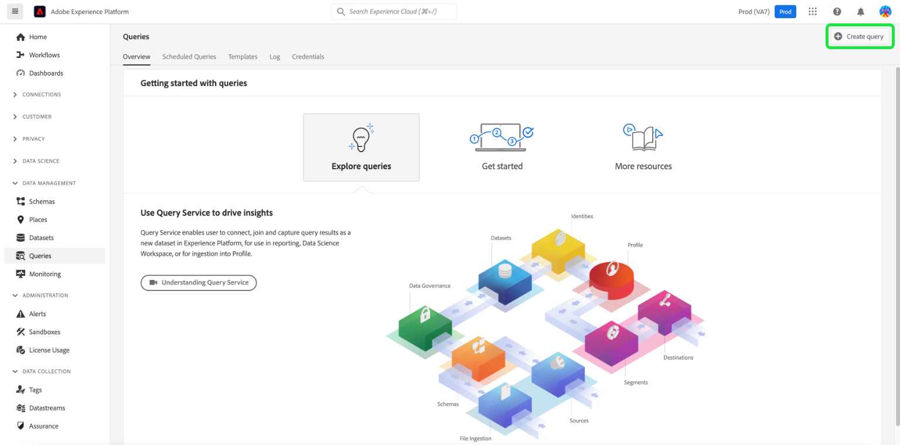

# Koppla Commerce-data till Adobe Experience Platform

När du installerar tillägget [!DNL Data Connection] visas två nya konfigurationssidor på menyn **System** under **Tjänster** i Commerce _Admin_.

- Commerce Services Connector
- [!DNL Data Connection]

Om du vill ansluta din Adobe Commerce-instans till Adobe Experience Platform måste du konfigurera båda anslutningarna, med början med Commerce Services-anslutningen och sedan med tillägget [!DNL Data Connection].

## Konfigurera Commerce Services Connector

Om du tidigare har installerat en Adobe Commerce-tjänst har du förmodligen redan konfigurerat Commerce Services-anslutningen. Annars måste du utföra följande uppgifter på sidan [Commerce Services Connector](../landing/saas.md):

1. Logga in på ditt Commerce-konto för att [hämta dina API-nycklar för produktion och sandlåda](../landing/saas.md#credentials).
1. Välj ett [SaaS-datautrymme](../landing/saas.md#saas-configuration).
1. Logga in på ditt Adobe-konto för att [hämta ditt företags-ID](../landing/saas.md#ims-organization-optional).

När du har konfigurerat Commerce Services Connector konfigurerar du sedan tillägget [!DNL Data Connection].

## Konfigurera tillägget [!DNL Data Connection]

I det här avsnittet får du lära dig att konfigurera tillägget [!DNL Data Connection].

### Lägg till tjänstkonto och autentiseringsuppgifter

Om du planerar att samla in och skicka [historiska orderdata](#send-historical-order-data) eller [kundprofildata](#send-customer-profile-data) måste du lägga till tjänstkonto- och autentiseringsuppgifter. Om du konfigurerar tillägget [Audience Activation](https://experienceleague.adobe.com/docs/commerce-admin/customers/audience-activation.html?lang=sv-SE) måste du slutföra de här stegen.

Om du bara samlar in och skickar data från butiker eller bakgrunder kan du hoppa till avsnittet [allmän](#general).

#### Steg 1: Skapa ett projekt i Adobe Developer Console

Skapa ett projekt i Adobe Developer Console som autentiserar Commerce så att Experience Platform API-anrop kan göras.

Om du vill skapa projektet följer du stegen som beskrivs i självstudiekursen [Autentisera och få tillgång till Experience Platform API:er](https://experienceleague.adobe.com/docs/experience-platform/landing/platform-apis/api-authentication.html?lang=sv-SE).

Se till att ditt projekt har följande när du går igenom självstudiekursen:

- Åtkomst till följande [produktprofiler](https://experienceleague.adobe.com/docs/experience-platform/landing/platform-apis/api-authentication.html?lang=sv-SE#select-product-profiles): **Standardproduktion, all åtkomst** och **AEP, standardåtkomst**.
- Rätt [roller och behörigheter är konfigurerade](https://experienceleague.adobe.com/docs/experience-platform/landing/platform-apis/api-authentication.html?lang=sv-SE#assign-api-to-a-role).
- Om du valde att använda JSON Web Tokens (JWT) som autentiseringsmetod för server-till-server måste du också överföra en privat nyckel.

Resultatet av det här steget skapar en konfigurationsfil som du använder i nästa steg.

#### Steg 2: Hämta konfigurationsfilen

Hämta [arbetsytans konfigurationsfil](https://developer.adobe.com/commerce/extensibility/events/project-setup/#download-the-workspace-configuration-file). Kopiera och klistra in innehållet i den här filen på sidan **Tjänstkonto/Autentiseringsuppgifter** i Commerce Admin.

1. Gå till **Lagrar** > Inställningar > **Konfiguration** > **Tjänster** > **[!DNL Data Connection]** i Commerce Admin.

1. Välj auktoriseringsmetoden server-till-server som du implementerade på menyn **Adobe Developer Authorization Type** . Adobe rekommenderar att du använder OAuth. JWT har tagits bort. [Läs mer](https://developer.adobe.com/developer-console/docs/guides/authentication/ServerToServerAuthentication/migration/).

1. (Endast JWT) Kopiera och klistra in innehållet i din `private.key`-fil i fältet **Klienthemlighet**. Använd följande kommando för att kopiera innehållet.

   ```bash
   cat config/private.key | pbcopy
   ```

   Mer information om filen `private.key` finns i [JWT-autentisering (Service Account)](https://developer.adobe.com/developer-console/docs/guides/authentication/JWT/).

1. Kopiera innehållet i filen `<workspace-name>.json` till fältet **Tjänstkonto/Autentiseringsuppgifter**.

   ![[!DNL Data Connection] Administratörskonfiguration](./assets/epc-admin-config.png){width="700" zoomable="yes"}

1. Klicka på **Spara konfiguration**.

1. Klicka på knappen **[!UICONTROL Test connection]** för att kontrollera att tjänstkontot och autentiseringsuppgifterna du angav är korrekta.

### Allmänt

1. Gå till **System** > Tjänster > **[!DNL Data Connection]** i Admin.

   ![[!DNL Data Connection] Inställningar](./assets/epc-settings.png){width="700" zoomable="yes"}

1. På fliken **Inställningar** under **Allmänt** kontrollerar du det ID som är kopplat till ditt Adobe Experience Platform-konto, enligt konfigurationen i [Commerce Services Connector](../landing/saas.md#organizationid). Organisations-ID:t är globalt. Endast ett organisations-ID kan associeras per Adobe Commerce-instans.

1. I listrutan **Omfång** anger du kontexten till **Webbplats**.

1. (Valfritt) Om du redan har distribuerat en [AEP Web SDK (legering)](https://experienceleague.adobe.com/docs/experience-platform/edge/home.html?lang=sv-SE) till din webbplats aktiverar du kryssrutan och lägger till namnet på din AEP Web SDK. Annars lämnar du fälten tomma och tillägget [!DNL Data Connection] distribuerar ett åt dig.

   >[!NOTE]
   >
   >Om du anger din egen AEP Web SDK använder tillägget [!DNL Data Connection] det datastream-ID som är kopplat till den aktuella SDK och inte det datastream-ID som är angivet på den här sidan (om det finns något).

### Datainsamling

I det här avsnittet anger du vilken typ av data som du vill samla in och skicka till Experience Platform. Det finns tre typer av data:

- **Beteende** (data på klientsidan) är data som hämtas på butiken. Detta inkluderar kundinteraktioner, som `View Page`, `View Product`, `Add to Cart` och [rekvisitionslista](events.md#b2b-events) (för B2B-handlare).

- **Back office** (data på serversidan) är data som samlats in på Commerce-servrarna. Här finns information om status för en order, t.ex. om en order har placerats, annullerats, återbetalats, skickats eller slutförts. Den innehåller även [historiska orderdata](#send-historical-order-data).

- **Profil** är data som är relaterade till kundens profilinformation. Läs [mer](#send-customer-profile-data).

Granska [förutsättningarna](overview.md#prerequisites) för att se till att din Adobe Commerce-instans kan börja datainsamling.

Mer information om [storefront](events.md#storefront-events), [back office](events-backoffice.md) och [profile](events-backoffice.md#customer-profile-events-server-side) -händelser finns i avsnittet om händelser.

>[!NOTE]
>
>Alla fält i avsnittet **Datainsamling** gäller för omfånget **Webbplats** eller senare.

1. Välj **StoreFront-händelser** om du vill skicka beteendedata för butiken.

1. Välj **Back office-händelser** om du vill skicka information om orderstatus, t.ex. om en order har placerats, annullerats, återbetalats eller skickats.

   >[!NOTE]
   >
   >Om du väljer **Back office-händelser** skickas alla backoffice-data till Experience Platform. Om en kund väljer att avanmäla sig från datainsamling måste du uttryckligen ange kundens personuppgiftsinställning i Experience Platform. Detta skiljer sig från butikshändelser där insamlaren redan hanterar samtycke baserat på kundernas önskemål. Lär dig [mer](https://experienceleague.adobe.com/docs/experience-platform/landing/governance-privacy-security/consent/adobe/dataset.html?lang=sv-SE) om hur du ställer in en kunds sekretessinställningar i Experience Platform.

1. (Hoppa över det här steget om du använder din egen AEP Web SDK.) [Skapa](https://experienceleague.adobe.com/docs/experience-platform/datastreams/configure.html?lang=sv-SE#create) en datastam i Adobe Experience Platform eller välj en befintlig datastam som du vill använda för samlingen. Ange detta datastream-ID i fältet **Datastream ID**.

1. Ange det **datauppsättnings-ID** som du vill ska innehålla dina Commerce-data. Så här hittar du datauppsättnings-ID:

   1. Öppna Experience Platform-gränssnittet och välj **Datauppsättningar** i den vänstra navigeringen för att öppna kontrollpanelen **Datauppsättningar**. Kontrollpanelen visar alla tillgängliga datauppsättningar för din organisation. Information visas för varje datamängd som anges, inklusive namn, schema som datauppsättningen följer och status för den senaste importen.
   1. Öppna den datauppsättning som är associerad med din datastream.
   1. Visa information om datauppsättningen i den högra rutan. Kopiera datauppsättnings-ID:t.

1. För att säkerställa att data för händelser på back office uppdateras baserat på ett schema enligt ett [cron](https://experienceleague.adobe.com/docs/commerce-admin/systems/tools/cron.html?lang=sv-SE) -jobb, måste du ändra `Sales Orders Feed`-indexet till `Update by Schedule`.

   1. Gå till **[!UICONTROL System]** > _[!UICONTROL Tools]_>**[!UICONTROL Index Management]**&#x200B;på sidofältet_ Admin _.

   1. Markera kryssrutan för indexeraren `Sales Orders Feed`.

   1. Ange **[!UICONTROL Actions]** till `Update by Schedule`.

   1. Om du aktiverar backoffice-data för första gången kör du följande kommandon för att indexera om och utlösa en omsynkronisering. Efterföljande omsynkroniseringar utförs automatiskt så länge jobbet [cron](https://experienceleague.adobe.com/docs/commerce-admin/systems/tools/cron.html?lang=sv-SE) är korrekt konfigurerat.

      ```bash
      bin/magento index:reindex sales_order_data_exporter_v2
      ```

      ```bash
      bin/magento saas:resync --feed orders
      ```

#### Fältbeskrivningar

| Fält | Beskrivning |
|--- |--- |
| Omfång | Den specifika webbplats där du vill att konfigurationsinställningarna ska gälla. |
| Organisations-ID (globalt) | ID som tillhör organisationen som köpte Adobe DX-produkten. Detta ID länkar din Adobe Commerce-instans till Adobe Experience Platform. |
| Används AEP Web SDK redan på er webbplats? | Markera den här kryssrutan om du har distribuerat din egen AEP Web SDK till din webbplats |
| AEP Web SDK Name (globalt) | Om du redan har en Experience Platform Web SDK installerad på din webbplats anger du namnet på den SDK i det här fältet. Detta gör att händelsesamlingen Storefront och Storefront Event SDK kan använda din Experience Platform Web SDK i stället för den version som distribueras av tillägget [!DNL Data Connection]. Om du inte har distribuerat något Experience Platform Web SDK till din plats lämnar du det här fältet tomt och tillägget [!DNL Data Connection] distribuerar ett åt dig. |
| Storefront-händelser | Är markerat som standard så länge organisations-ID och datastream-ID är giltiga. I butikshändelser samlas anonyma beteendedata in från era kunder när de surfar på er webbplats. |
| Back office-händelser | Om det här alternativet är markerat innehåller händelsenyttolasten anonymiserad orderstatusinformation, t.ex. om en order har placerats, annullerats, återbetalats eller levererats. |
| Dataström-ID (webbplats) | ID som gör att data kan flöda från Adobe Experience Platform till andra Adobe DX-produkter. Detta ID måste kopplas till en specifik webbplats i din specifika Adobe Commerce-instans. Om du anger ett eget Experience Platform Web SDK ska du inte ange något dataström-ID i det här fältet. Tillägget [!DNL Data Connection] använder det datastream-ID som är associerat med det SDK-numret och ignorerar alla data som anges i det här fältet (om det finns något). |
| Datauppsättnings-ID (webbplats) | ID för den datauppsättning som innehåller dina Commerce-data. Det här fältet är obligatoriskt om du inte har avmarkerat kryssrutorna **StoreFront Events** eller **Back office events** . Om du använder din egen Experience Platform Web SDK och därför inte har angett något datauppsättnings-ID, måste du ändå lägga till det datauppsättnings-ID som är kopplat till din dataström. Annars kan du inte spara det här formuläret. |

Efter introduktionen flödar butiksdata till Experience Platform. Det tar cirka fem minuter att få information från det bakre kontoret. Efterföljande uppdateringar visas i kanten baserat på kronschemat.

### Skicka kundprofildata

Det finns två typer av profildata som du kan skicka till Experience Platform: profilposter och händelser för tidsserieprofiler.

En profilpost innehåller data som sparas när en kund skapar en profil i din Commerce-instans, till exempel kundens namn. När ditt schema och din datauppsättning är [korrekt konfigurerade](profile-data.md) skickas en profilpost till Experience Platform och vidarebefordras till Adobe profilhanterings- och segmenteringstjänst: [Real-Time CDP](https://experienceleague.adobe.com/docs/experience-platform/rtcdp/intro/rtcdp-intro/overview.html?lang=sv-SE).

Tidsserieprofilshändelser innehåller data om kundens profilinformation, t.ex. om de skapar, redigerar eller tar bort ett konto på din webbplats. När data för profithändelser skickas till Experience Platform finns de i en datauppsättning där de kan användas av andra DX-produkter.

1. Kontrollera att du har [tillhandahållet](#add-service-account-and-credential-details) tjänstkonto och autentiseringsuppgifter.

1. Se till att du har ett schema och en datauppsättning angiven för [profilpostdatainmatning](profile-data.md) och [tidsseriens händelsedatainmatning](update-xdm.md#time-series-profile-event-data).

1. Markera kryssrutan **Kundprofiler** om du vill skicka profildata till Experience Platform.

1. Ange **profildatauppsättning-ID**.

   Profilpostdata måste använda en annan datauppsättning än den du använder för beteendedata och data för Office-händelser.

1. Om du inte vill direktuppspela profilhändelser via samma dataström-ID som du använder för beteendedata och backoffice-data, tar du bort bockmarkeringen från **Stream-kundprofiler via samma dataström-ID** och anger det dataström-ID som du vill använda i stället.

Det kan ta ca 10 minuter innan en profilpost är tillgänglig i Real-Time CDP. Profilhändelser börjar direktuppspelningen omedelbart.

>[!TIP]
>
>Om du inte ser profildata i Experience Platform kan du läsa [Commerce KnowledgeBase](https://experienceleague.adobe.com/sv/docs/commerce-knowledge-base/kb/troubleshooting/miscellaneous/data-connection-customer-profiles-not-exported) för felsökningsförslag.

#### Fältbeskrivningar

| Fält | Beskrivning |
|--- |--- |
| Kundprofiler | Markera den här kryssrutan om du vill samla in och skicka kundprofilsposter. |
| Profilens datauppsättnings-ID | En profilpost måste använda en annan datauppsättning än den som används för beteendehändelser och back office-händelser. |
| Strömma kundprofiler via samma dataström-ID | Bestäm om du vill använda samma datastream som för närvarande används för dina beteende- och back office-händelser eller inte. |
| Datastream för kundprofiler | Ange den postspecifika dataströmmen för kundprofilen. |

### Skicka historikorderdata

Adobe Commerce samlar in upp till fem år med [historiska orderdata och status](events-backoffice.md#back-office-events). Du kan använda tillägget [!DNL Data Connection] för att skicka historiska data till Experience Platform för att berika dina kundprofiler och personalisera kundupplevelserna baserat på tidigare order. Data lagras i en datauppsättning i Experience Platform.

Commerce samlar redan in historiska orderdata, men det finns flera steg som du måste slutföra för att skicka dessa data till Experience Platform.

I den här videon får du lära dig mer om historiska order. Följ sedan stegen nedan för att implementera den historiska ordersamlingen.

>[!VIDEO](https://video.tv.adobe.com/v/3450231?captions=swe)

#### Konfigurera tjänsten Ordersynkronisering

Tjänsten för ordersynkronisering använder [Message Queue Framework](https://developer.adobe.com/commerce/php/development/components/message-queues/) och RabbitMQ. När du har utfört dessa steg kan orderstatusdata synkroniseras till SaaS, vilket krävs innan det skickas till Experience Platform.

1. Kontrollera att du har [tillhandahållet](#add-service-account-and-credential-details) tjänstkonto och autentiseringsuppgifter.

1. [Aktivera](https://experienceleague.adobe.com/docs/commerce-cloud-service/user-guide/configure/service/rabbitmq.html?lang=sv-SE) RabbitMQ.

   >[!NOTE]
   >
   >RabbitMQ har redan konfigurerats för Commerce version 2.4.7 och senare, men du måste aktivera konsumenterna.

1. Aktivera meddelandekökonsumenter genom cron-jobb i `.magento.env.yaml` med miljövariabeln `CRON_CONSUMERS_RUNNER`.

   ```yaml
      stage:
        deploy:
          CRON_CONSUMERS_RUNNER:
            cron_run: true
   ```

   >[!NOTE]
   >
   >Mer information om alla tillgängliga konfigurationsalternativ finns i [distribuera variabeldokumentation](https://experienceleague.adobe.com/docs/commerce-cloud-service/user-guide/configure/env/stage/variables-deploy.html?lang=sv-SE#cron_consumers_runner).

När tjänsten för ordersynkronisering är aktiverad kan du sedan ange det historiska datumintervallet för order på sidan **[!UICONTROL [!DNL Data Connection]]**.

#### Ange datumintervall för orderhistorik

Ange datumintervallet för de historiska order som du vill skicka till Experience Platform.

1. Gå till **System** > Tjänster > **[!DNL Data Connection]** i Admin.

1. Välj fliken **Orderhistorik**.

   ![[!DNL Data Connection] Orderhistorik ](./assets/epc-order-history.png){width="700" zoomable="yes"}

1. Under **Synkronisering av orderhistorik** är kryssrutan **Kopiera datauppsättnings-ID från inställningar** redan aktiverad. Detta garanterar att du använder samma datauppsättning som anges på fliken **Inställningar**.

1. I fälten **Från** och **Till** anger du datumintervallet för historikorderdata som du vill skicka. Du kan inte välja ett datumintervall som överskrider fem år.

1. Välj **[!UICONTROL Start Sync]** om du vill att synkroniseringen ska börja. Historiska orderdata batchas till data i motsats till butiks- och back office-data som är strömmande data. Det tar ca 45 minuter att få fram gruppdata i Experience Platform.

##### Fältbeskrivningar

| Fält | Beskrivning |
|--- |--- |
| Kopiera datauppsättnings-ID från inställningar | Kopierar det datauppsättnings-ID som du angav på fliken **Inställningar**. |
| Datauppsättnings-ID (webbplats) | ID för den datauppsättning som innehåller dina Commerce-data. Det här fältet är obligatoriskt om du inte har avmarkerat kryssrutorna **StoreFront Events** eller **Back office events** . Om du använder din egen Experience Platform Web SDK och därför inte har angett något datauppsättnings-ID, måste du ändå lägga till det datauppsättnings-ID som är kopplat till din dataström. Annars kan du inte spara det här formuläret. |
| Från | Det datum från vilket du vill börja samla in orderhistorikdata. |
| Till | Det datum från vilket du vill avsluta insamlingen av orderhistorikdata. |
| Starta synkronisering | Påbörjar synkroniseringen av orderhistorikdata till Experience Platform. Den här knappen är inaktiverad om fältet **[!UICONTROL Dataset ID]** är tomt eller om datauppsättnings-ID:t är ogiltigt. |

### Dataanpassning

På fliken **Dataanpassning** kan du visa alla anpassade attribut som konfigurerats i [!DNL Commerce] och skickats till Experience Platform.

![[!DNL Data Connection] Dataanpassning](./assets/epc-data-customization.png){width="700" zoomable="yes"}

>[!IMPORTANT]
>
>Kontrollera att det datastream-ID som du [angav](#data-collection) på fliken **Datainsamling** matchar det ID som är länkat till schemat för inhämtning av anpassade attribut.

När du skapar anpassade attribut för order och skickar dem till Experience Platform, måste attributnamnen i Commerce matcha dem i [!DNL Commerce]-schemat på Experience Platform. Om de inte matchar kan det vara svårt att identifiera skillnaderna. Om du har namn som inte matchar kan du lösa problemet med tabellen **Anpassade ordningsattribut**.

Tabellen **Anpassade orderattribut** ger synlighet i konfigurationen och mappningen av anpassade ordningsattribut mellan [!DNL Commerce]-bakkontoret och [!DNL Commerce]-schemat i Experience Platform. I den här tabellen kan du visa anpassade attribut på ordningsnivå och sortera objektnivå i olika källor, vilket gör det enklare att identifiera saknade eller feljusterade attribut. Här visas också datauppsättnings-ID:n för att hjälpa till att skilja mellan live- och historikdatamängder, eftersom var och en kan ha sina egna anpassade attribut.

Om du inte ser en grön bockmarkering bredvid ett anpassat attributnamn i tabellen, visas en felmatchning mellan attributnamnen i källorna. Korrigera attributnamnet i en källa, så visas en grön bockmarkering som anger att namnen nu matchar.

- Om attributnamnet uppdateras i schemat i Experience Platform, måste du spara konfigurationen på fliken **Dataanpassning** för att utlösa Experience Platform-schemaändringen. Den här ändringen återspeglas i tabellen **Egna ordningsattribut** när du klickar på knappen **[!UICONTROL Refresh]**.
- Om attributnamnet uppdateras i [!DNL Commerce] måste en orderhändelse genereras för att uppdatera namnet i tabellen **Anpassade ordningsattribut**. Ändringen kommer att synas på cirka 60 minuter.

Läs mer om hur du [konfigurerar anpassade attribut](custom-attributes.md).

#### Fältbeskrivningar

| Fält | Beskrivning |
|--- |--- |
| Datauppsättning | Visar de datauppsättningar som innehåller de anpassade attributen. Live- och historiska datauppsättningar kan ha egna anpassade attribut. |
| Adobe Commerce | Visar alla anpassade attribut som har skapats på [!DNL Commerce]. |
| Experience Platform | Visar eventuella anpassade attribut som har angetts i ditt [!DNL Commerce]-schema i Experience Platform. |
| Uppdatera | Hämtar anpassade attributnamn från schemat [!DNL Commerce] i Experience Platform. |

## Bekräfta att händelsedata samlas in

Om du vill bekräfta att data samlas in från din Commerce-butik använder du [Adobe Experience Platform-felsökaren](https://experienceleague.adobe.com/docs/experience-platform/debugger/home.html?lang=sv-SE) för att undersöka din Commerce-webbplats. När du har bekräftat att data samlas in kan du verifiera att data för butiks- och back office-händelser visas i kanten genom att köra en fråga som returnerar data från den [datauppsättning du skapade](overview.md#prerequisites).

1. Välj **Frågor** till vänster i Experience Platform och klicka på [!UICONTROL Create Query].

   

1. När Frågeredigeraren öppnas anger du en fråga som markerar data från datauppsättningen.

   

   Din fråga kan till exempel se ut så här:

   ```sql
   SELECT * from `your_dataset_name` ORDER by TIMESTAMP DESC
   ```

1. När frågan har körts visas resultaten på fliken **Resultat** bredvid fliken **Konsol** . I den här vyn visas frågans tabellutdata.

   

I det här exemplet ser du händelsedata från [`commerce.productListAdds`](events.md#addtocart), [`commerce.productViews`](events.md#productpageview), [`web.webpagedetails.pageViews`](events.md#pageview) och så vidare. I den här vyn kan du verifiera att dina Commerce-data finns i framkanten.

Om resultaten inte är vad du förväntar dig kan du öppna datauppsättningen och leta efter misslyckade batchimporter. Läs mer om [felsökning av batchimport](https://experienceleague.adobe.com/docs/experience-platform/ingestion/batch/troubleshooting.html?lang=sv-SE).

### Verifiera att profildata visas i Experience Platform

Om du inte ser profildata i Experience Platform kan du läsa [Commerce KnowledgeBase](https://experienceleague.adobe.com/sv/docs/commerce-knowledge-base/kb/troubleshooting/miscellaneous/data-connection-customer-profiles-not-exported) för felsökningsförslag.

## Nästa steg

När data från Commerce skickas till Experience Platform kan andra Adobe Experience Cloud-produkter, som Adobe Journey Optimizer, använda dessa data. Du kan till exempel konfigurera Journey Optimizer att lyssna på vissa händelser och utifrån dessa händelsedata utlösa ett e-postmeddelande för en förstagångsanvändare eller om det finns en övergiven kundvagn. Lär dig hur du kan utöka din Commerce-plattform genom att [skapa kundresor](using-ajo.md) i Journey Optimizer.
