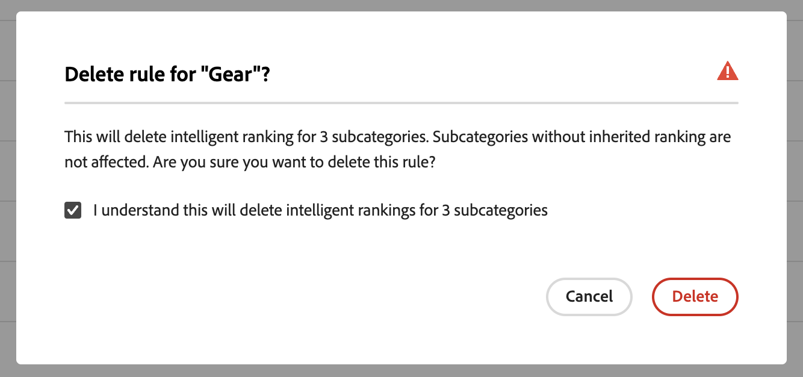

# Kategorimarknadsföring

Med kategorimarknadsföring kan butiksägare tillämpa [!DNL Live Search] Intelligent ranking [rules](rules.md) på produktkategorier och underkategorier.

Den här videon är en introduktion till Category Merchandising.

>[!VIDEO](https://video.tv.adobe.com/v/3424617)

Funktionen finns i Admin på **Marknadsföring** > SEO &amp; Search > **[!DNL Live Search]** > **Kategorimarknadsföring**.

>[!NOTE]
>
>Kategorimarknadsföring är tillgänglig med [!DNL Live Search] [3.0.0 eller senare](release-notes.md). Om arbetsytan Kategorimarknadsföring visas men inte innehåller data uppdaterar du modulen [!DNL Live Search].

Vyn Kategorimarknadsföring visar definierade kategoriregler, med kolumner för:

* Kategori
* Rankningsstrategi
* Ärvd rankning
* Senast uppdaterad
* Åtgärd

Du kan söka efter en kategori eller underkategori i fältet Sök efter kategori.

## Rankningsstrategier

Kategorimarknadsföring använder samma rankningstyper som med [enskilda produkter](rules-workspace.md).
Det finns två sorteringstyper: Intelligent och Manuell.

**Intelligent rankning** använder beteendedataanalys från [Adobe Sensei](https://www.adobe.com/sensei.html) för att sortera alla produkter inom valda kategorier efter en viss algoritm. När man valt en Intelligent rankning förväntas produktordningen förändras över tiden eftersom de underliggande uppgifterna analyseras om kontinuerligt av Adobe Sensei. De ledande trendprodukterna kommer till exempel att ändras automatiskt över tid när kundernas preferenser förändras.
Intelligenta rangordningsmetoder:

* Mest köpta: rankar produkter efter hur ofta de köptes av kunder under de senaste sju dagarna.
* Mest tillagda i varukorgen: rankar produkter efter hur ofta de har lagts i varukorgen av shoppare under de senaste sju dagarna.
* De flesta tittarna ser det här: rankar produkter efter hur ofta de har visats av kunderna under de senaste sju dagarna.
* Rekommenderas för dig: baserat på varje kunds tidigare och nuvarande beteende på plats rangordnar produkter efter hur sannolikt det är att kunden interagerar med var och en av dem.
* Trending: rankar produkter efter de senaste popularitetsökningarna baserat på vyer.
* Ingen: rankar produkter efter deras standardordning.

**Manuell rankning** gör att användare kan åsidosätta den automatiska sorteringsordningen genom att definiera manuella stift-, boost-, bury- och hide-regler.

## Ärvd rankning

Som handlare kanske du vill kunna välja alla kategorier av kvinnor som ska sorteras efter &quot;trending&quot;. Detta omfattar underkategorierna &quot;Kvinnors byxor&quot;, &quot;Kvinnors skjortor&quot; och &quot;Kvinnors tillbehör&quot;. Män bör inte påverkas. Du kan använda ärvda rankningar för att uppnå detta.

När du väljer en smart rankningsmetod för en kategori eller underkategori som har underkategorier kan du aktivera alternativet **Använd intelligent rankning för underkategorier**. Detta tillämpar rangordningsmetoden på alla underkategorier.

Dessa underkategorier ärver nu den regeln från den överordnade kategorin (&quot;Ja&quot; i kolumnen Ärvd rankning). I åtgärdskolumnen är de enda tillgängliga alternativen **Redigera regel** och **Visa detaljer**. Alternativet **Ta bort** är inaktiverat för ärvda regler i underkategorier. Om du vill ta bort underkategoriarv måste du ångra arv från den överordnade kategorin.

Alla kategorier och underkategorier kan endast ha en Intelligent rankning åt gången. De kan få ytterligare manuella rangordningar tillämpade.

Om du använder en smart rankning för en kategori och aktiverar alternativet **Använd smart rankning för underkategorier**, skrivs alla intelligenta rankningar som redan används för underkategorierna över.

{width="700"}

Om du klickar på **Visa alla** öppnas en dialogruta med information om de föreslagna ändringarna.

När du lägger till en Intelligent rankning direkt i en kategori som har en ärvd Intelligent rankning åsidosätts arvet av den nya Intelligent rankningen.

När den intelligenta rankningen tas bort från kategorin återupprättas arvet.
I båda scenarierna upprätthålls alla manuella rangordningar.

Om du tar bort en Intelligent rankning från en kategori och underkategoriarvet är valt, tas endast de ärvda Intelligent rankningarna bort från underkategorierna. Manuella rankningar är inte föremål för arv och kommer att finnas kvar.

En dialogruta visas som förklarar vilka ärvda underkategorier som påverkas av de ändringar du gör i en kategori på en högre nivå.

{width="1200"}

## Skapa en kategoriregel

Så här skapar du en kategoriregel:

1. Klicka på knappen **Lägg till regel** .
1. Klicka igenom kategorierna och underkategorierna i vyn _Välj kategori_.
1. Markera kryssrutan för att välja den kategori som du vill rangordna.
1. Klicka på **Använd**.

   

1. I vyn _Lägg till kategoriregel_ väljer du den intelligenta rangordningsmetod som du vill använda för kategorin.
På sidan Förhandsvisa kategori visas det faktiska resultatet av den valda rankningen med dina Live Search-data.
1. Klicka på **Spara och publicera** för att spara regeln.

Tjänsten [!DNL Live Search] bearbetar regeln och aktiverar den på butiken när den är klar.

## Ändra en kategoriregel

Så här ändrar du en befintlig regel:

1. Klicka på **..** i åtgärdskolumnen och välj **Redigera**.
1. Gör eventuella ändringar i vyn Redigera kategoriregel och klicka på **Spara och publicera**.

Ändringarna återspeglas i butiken när [!DNL Live Search] har bearbetat ändringen.

## Ta bort en kategoriregel

Så här tar du bort en kategoriregel:

1. Klicka på **..** i åtgärdskolumnen och välj **Ta bort**.
1. I _Ta bort regel_ modal väljer du **Ta bort** om du vill ta bort regeln eller **Avbryt** om du vill avbryta åtgärden.

## Manuell rankning

Manuell rankning gör att du kan åsidosätta den produktordning som bestäms av reglerna för Intelligent rankning (om sådana finns) och manuellt styra var produkterna visas i resultatet.

Händelser är åtgärder som ändrar sökresultaten när definierade villkor uppfylls. En manuell rankning kan ha upp till 25 händelser.

* Öka: Flyttar en produkt högre i sökresultaten.
* Bury: Flyttar en produkt längre ned i sökresultaten.
* Fäst en produkt: Flyttar en produkt till en viss resultatposition.
* Dölj en produkt: Exkluderar en produkt från sökresultatet.

Skapa en manuell rankning:

1. Ställ in en intelligent rankningsregel för en kategori enligt beskrivningen ovan. Resultatet av frågan visas i vyn Förhandsgranska kategorisida. Detta använder dina faktiska Live Search-data för att förhandsgranska resultatet.

1. Klicka och dra en produkt i vyn Förhandsvisa kategorisida. Dra och släpp den på önskad plats. Fälten Produkt och Position fylls i automatiskt i rutan Händelser.

Du kan också klicka på nålikonen för att fästa en produkt på dess aktuella plats. Använd snabbmenyn för ellipsen för att fästa överst eller nederst.

Så här lägger du till en händelse manuellt:

1. Klicka på menyn **Välj en händelse** under Manuell rankning och välj en händelse som ska äga rum när de associerade villkoren uppfylls.
1. Ange namnet på den produkt som du vill påverka. Produkter föreslås när du skriver.
1. För flera händelser väljer du andra händelser som du vill ska utlösas när villkoren uppfylls.

>[!NOTE]
>
>Regler tillämpas när en viss kategori öppnas i butiken och det finns en regel för den kategorin. För regler för kategorimarknadsföring är standardsorteringsordningen&quot;Sortera efter: Position&quot;. Om en kund ändrar sorteringsordningen sorteras inte längre alla dolda, fasta och dolda produkter.
