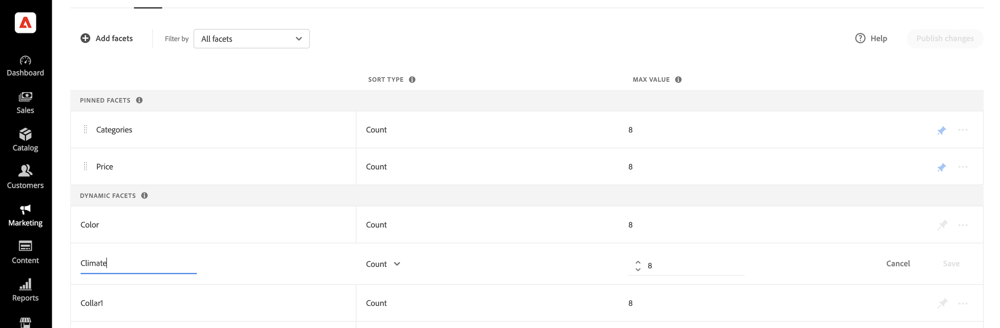

# Lägg till ansikten

Alla filterbara produktattribut kan användas som en fasett. Panelen *Lägg till facets* visar de aktuella faktorerna och gör det enkelt att tilldela ytterligare produktattribut som facets. Under den här trestegsprocessen väljs ett attribut som ska användas som en fasett, egenskaperna redigeras vid behov och ändringarna publiceras i butiken.

## Steg 1: Lägg till en fasett

1. Gå till **Markering** > SEO &amp; Search > **[!DNL Live Search]** i Admin.
1. På fliken *Motstående* klickar du på **Lägg till ansikten**.
1. I listan *Lägg till ansikten* har varje tillgängligt attribut en separat . Fyll i något av följande:

   * I listan *Motstående attribut* väljer du det produktattribut som du vill använda som begränsningsram och klickar på **Lägg till**.
   * Om du vill hitta ett visst produktattribut anger du de första tecknen i attributnamnet i rutan *Sök*. Klicka sedan på **Lägg till**.

     Mer information om hur du konfigurerar prisfaktureringsintervall och grupperingar finns i [Inställningar](settings.md). Gå till [Fasetttyper](facets-type.md) om du vill veta mer.
Fasetten läggs till längst ned i listan *Dynamiska ansikten* och knappen *Publiceringsändringar* blir tillgänglig.

1. Om det inte går att hitta den aspekt du vill lägga till går du till **Lager** > Attribut > **Produkt** och kontrollerar att attributet har de [obligatoriska egenskaperna](facets.md) som ska användas som en egenskap. Uppdatera vid behov följande storefront-egenskaper för attributet:

   * Använd i sökning - `No`
   * Använd i sökresultatnavigering i lager - `Yes`
   * Använd i navigering i lager - `Filterable (with results)`

1. Uppdatera cacheminnet när du uppmanas till detta.

   Fasetten blir tillgänglig i butiken nästa gång katalogen synkroniseras med [!DNL Live Search]. Om ansiktet inte är tillgängligt efter två timmar kan du läsa [Synkronisera katalogdata](install.md#synchronize-catalog-data).

## Steg 2: Redigera fasettegenskaper (valfritt)

1. Om du vill redigera ansiktsegenskaperna klickar du på alternativen **Mer** () i kolumnen längst till höger.
1. Klicka på **Redigera** på menyn. Justera sedan följande egenskaper efter behov.

   * Etikett - ([Endast Headless](facets-type.md)) Ange den ansiktsetikett som du vill använda.
   * Sorteringstyp - Fasetter sorteras i bokstavsordning för alla [!DNL Commerce]-butiker. För headless-implementationer kan ansiktena sorteras antingen i bokstavsordning eller efter antal. Alternativ: Alfabetisk, Antal (endast headless)
   * Maxvärde - Ange det maximala antalet fasettvärden som visas i butiken. Giltiga poster: 0 - 100; Standard: 8

1. Klicka på **Spara** när du är klar.

   

1. Om du vill fästa ansiktet överst i listan *Filter* klickar du på det grå kartnålen ().
1. Om du vill ändra ordningen på den fästa aspekten klickar du på ikonen **Flytta** () och drar raden till en ny plats i avsnittet *Fastnålade ansikten* .

## Steg 3: Publicera ändringar

1. När ansiktet är klart klickar du på **Publicera ändringar**.
1. Vänta tills ansiktet visas i butiken.
Om facet inte är tillgängligt efter två timmar kan du läsa [Verifiera export](install.md#synchronize-catalog-data) i installationsinstruktionerna.

## Fältbeskrivningar

| Fält | Beskrivning |
|--- |--- |
| Etikett | ([Endast Headless](facets-type.md)) Den [facet-etikett](facets-type.md) som visas i butiken kan redigeras för att vara konsekvent med ditt varumärke. |
| Sorteringstyp | Metoden som används för att [sortera](facets-type.md) ansikten. Alla [!DNL Commerce]-butiker sorterar endast ansikten i alfabetisk ordning. Headless-implementeringar kan också sortera efter `Count`. Alternativ: Alfabetiskt - Sorterar ansikten i bokstavsordning. Antal - (endast Headless) Sorterar ansikten baserat på antalet träffar. |
| Maxvärde | Det maximala antalet värden som kan visas i butiken för varje aspekt. Ansikten som representerar ett värdeintervall fördelas jämnt. Giltiga poster: 0 - 100; Standard: 8 |

### Kontroller

| Kontroll | Beskrivning |
|--- |--- |
|  | Fäster eller häftar upp en fasett högst upp i listan *Filter*. |
|  | Visar en meny med fler åtgärder som kan tillämpas på den valda aspekten. Alternativ: Redigera, Ta bort |
|  | Använd ikonen *Flytta* för att dra en fäst yta till en annan plats i avsnittet *Fastnålade ansikten*. |
