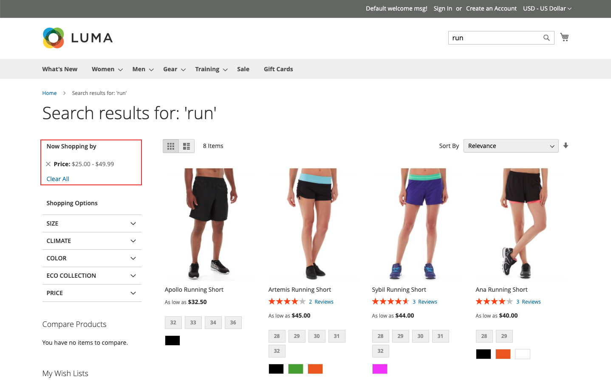

# Typer av ansikten

[!DNL Live Search] använder en mängd olika ansiktstyper och de visas bara i listan *Filter* när det är relevant. Listan över tillgängliga facets ändras beroende på vilka produkter som returneras. Följande egenskaper påverkar deras presentation och beteende:

* Fastnålade ansikten - De vanligaste ansiktena kan fästas överst i listan. De återstående ansiktena visas i ordningen *Sorteringstyp* efter de fästa ansiktena.
* Dynamiska aspekter - Produktattribut som [Adobe AI](https://business.adobe.com/ai.html) anser vara mest relevanta för en produktuppsättning och fråga. Beräkningen tar hänsyn till attributmetadata för hela katalogen och fastställer vid frågans tidpunkt de mest relevanta aspekterna.

  >[!NOTE]
  >
  >Om du märker att timeoutfel uppstår i GraphQL-frågesvaret när du har skapat dynamiska aspekter, ska du ändra alla aspekter så att de fästs för att se om detta löser prestandaproblemen.

* Populära aspekter - Produktattribut som oftast förekommer i sökresultat.
* Prisfaktorer - Returprodukter efter prisintervall. Du kan ange antalet markeringar och prisintervallet på arbetsytan [*Inställningar*](settings.md).

Vid frågetiden genererar [!DNL Live Search] sökresultaten i grupper med dynamiska och populära aspekter.

## Alternativ för Stock-front och headless

Ansikten som återges för [!DNL Commerce]-butiken bearbetas av sökadaptern, som dirigerar begäranden och återger resultaten i butiken. Alla [!DNL Commerce]-butiksfacet sorteras i bokstavsordning med alternativ för en markering, oavsett vilken indatatyp som tilldelas till motsvarande attribut. Ansikten som är tillgängliga i butiken återges enligt det aktuella temat och återspeglar eventuella anpassningar av presentationen av lagerstyrd navigering.

[Headless](https://developer.adobe.com/commerce/php/architecture/technical-vision/web-api/)-implementeringar bearbetas däremot av API:t och stöder ytterligare alternativ. Headless-aspekter kan sorteras alfabetiskt eller efter antal och kan ha antingen en- eller flervalsalternativ.

### Fasettetiketter

För [!DNL Commerce] butiker bestäms ansiktsetiketten av [*Attributegenskaper*](https://experienceleague.adobe.com/docs/commerce-admin/catalog/product-attributes/create/attribute-product-create.html?lang=sv-SE). För butiker med flera vyer kan ytterligare etiketter definieras under *Hantera etiketter*. För headless-implementeringar redigeras etiketter från [faceting-arbetsytan](faceting-workspace.md).

### Sorteringstyp

Alla ansikten som återges för butiken sorteras i alfabetisk ordning. För headless-implementationer kan ansiktena sorteras i bokstavsordning eller efter antal.

| Sorteringstyp | Beskrivning |
|--- |--- |
| Alfabetiskt | I listan *Filter* i butiken sorteras ansiktena i bokstavsordning. |
| Antal | (Endast Headless) För headless-implementationer kan facets också sorteras efter antalet värden som finns per facet i den aktuella uppsättningen returnerade produkter. |
