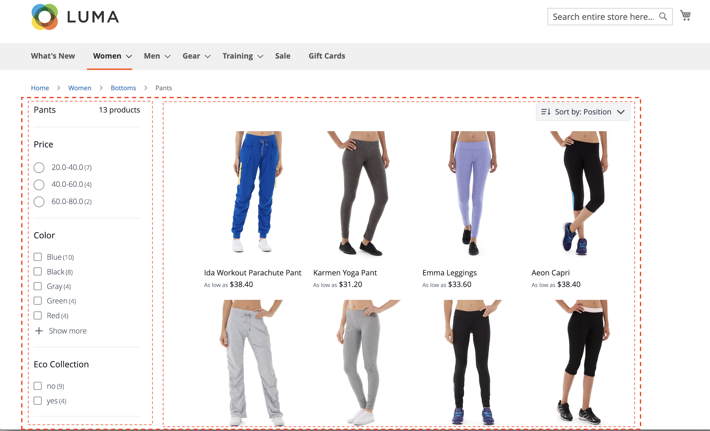
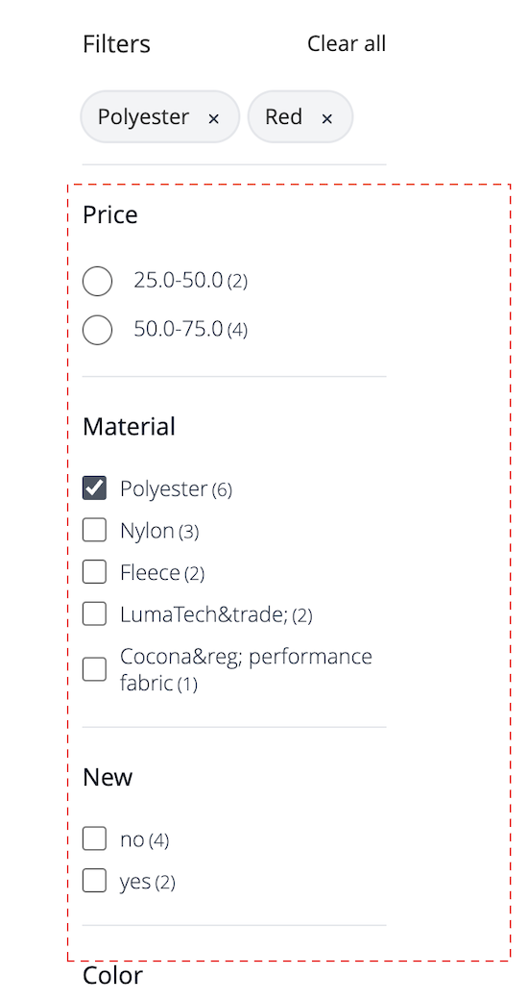

# Sidwidget för produktlista

[!DNL Live Search Product Listing Page Widget] (PLP) använder Commerce Services-plattformen för att tillhandahålla en utförlig, sökbar och faktablad produktlistsida. I det här avsnittet beskrivs hur du aktiverar och formaterar PLP-widgeten.

## Aktivera PLP-widgeten

När tjänsten [!DNL Live Search] är installerad konverteras standardsökfunktionen automatiskt till [!DNL Live Search].

PLP-widgeten [!DNL Live Search] är aktiverad som standard för nya installationer.

Om du uppgraderar [!DNL Live Search] och PLP-widgeten redan har inaktiverats, förblir det så. Så här aktiverar du den:
1. Gå till Lager → Inställningar → Konfiguration i Adobe Commerce Admin.
1. Klicka på **[!UICONTROL Live Search]** > **[!UICONTROL Storefront Features]** i den vänstra navigeringen.
1. Klicka på avsnittet [!UICONTROL Storefront Features].
1. Ange [!UICONTROL Enable Product Listing Widget] = Ja
1. Spara konfiguration
1. Om du uppmanas till det tömmer du cachen (gå till System > Verktyg > Cachehantering > [!UICONTROL Flush Magento Cache]).

>[!IMPORTANT]
>
>När [!DNL Live Search Product Listing Page Widget] är aktiverat går det inte att ändra sorteringsordningen på en produktlistsida.

## Widgetfunktioner

PLP-widgeten har följande färdiga funktioner:

- Knapparna Lägg till i kundvagnen - endast för enkla produkter.
- Flera bilder per produkt - Bilden kan ändras när en annan färg väljs för en konfigurerbar produkt.
- Stöd för färgrutor - Observera att färgattributet måste vara stavat `color` för att koden ska kunna valideras korrekt.

### Anpassa widgeten

Utöver de färdiga funktionerna i PLP-widgeten kan du anpassa widgeten ytterligare och inkludera följande funktioner:

- Filtrera efter attribut
- Stöd för flera språk
- Prisreglage

Information om hur du anpassar PLP-widgeten för att hantera ovanstående funktioner finns i `storefront-product-listing-page` Viktigt i följande [databas](https://github.com/adobe/storefront-product-listing-page/). Viktigt i den här databasen innehåller ett exempel på hur du anpassar PLP-widgeten och distribuerar anpassningarna till din plats.

>[!WARNING]
>
>Om du anpassar PLP-widgeten med koden som finns i rapporten ansvarar du för underhållet och de uppdateringar som behövs. Alla nya PLP-widgetfunktioner som Adobe-releaser kan vara inkompatibla med din anpassade implementering.

## Exempel på format

Du kan anpassa utseendet och känslan för PLP-widgeten så att den matchar webbplatsen med [CSS](https://developer.adobe.com/commerce/frontend-core/guide/css/).

>[!NOTE]
>
>Element med anpassade klasser inom ett Adobe Commerce-tema ärvs inte. Dessa element måste ha en specifik klass som mål för att matcha de anpassade klasserna. De primära åtgärdsklasserna fungerar inte med en widgetknapp. Allmänna målelement i CSS ärvs; `button` gäller för widgetknappar.

De markerade diven innehåller målklassen `ds-sdk-product-item__product-name`.


Anpassa produktnamnet genom att lägga till en regel som gör dem till stora bokstäver.

```css
.ds-sdk-product-item__product-name {
 text-transform: uppercase;
}
```


## CSS-klasser

### Produktlista

- `.ds-sdk-product-list`: Yttre div
- `.ds-sdk-product-list__grid`: Inre div


#### Sidnumrering av produktlista

- `.ds-plp-pagination`


- `.ds-plp-pagination_item`


- `.ds-plp-pagination_item--current`


### Widgetar

- `.ds-widgets`: Yttre div
- `.ds-widgets__actions`: inre div på vänster sida
- `.ds-widgets__results`: Inre div på höger sida



### Sortera-listrutan

- `.ds-sdk-sort-dropdown`


- `.ds-sdk-sort-dropdown__button`


- `.ds-sdk-sort-dropdown__items`


- `.ds-sdk-sort-dropdown__items--item`


- `.ds-sdk-sort-dropdown__items--item-selected`


- `.ds-sdk-sort-dropdown__items--item-active`


### Fasetter

- `.ds-plp-facets`
- `.ds-plp-facets__header`
- `.ds-plp-facets__header_title`
- `.ds-plp-facets__header__clear-all`

{width="350"}

- `.ds-plp-facets__pills`
- `.ds-sdk-pill`

{width="350"}

- `.ds-sdk-pill__label`
- `.ds-sdk-pill__cta`

{width="350"}

- `.ds-plp-facets__list`

{width="350"}

- `.ds-sdk-input`
- `.ds-sdk-input__label`
- `.ds-sdk-product-item__product-swatch-group`
- `ds-sdk-product-item__product-swatch-item`
- `.ds-sdk-input_fieldset_show-more`


- `.ds-sdk-labelled-input`


- `.ds-sdk-labelled-input__input`
- `.ds-sdk-labelled-input__label`


### Produktartikel

- `.ds-sdk-product-item`
- `.ds-sdk-product-item__image`
- `.ds-sdk-product-item__product-name`
- `.ds-sdk-product-item__product-options`
- `.ds-sdk-product-price`
   - `.ds-sdk-product-price--no-discount`
   - `.ds-sdk-product-price--grouped`
   - `.ds-sdk-product-price--bundle`
   - `.ds-sdk-product-price--discount`


### Läser in

- `.ds-sdk-loading`
- `.ds-sdk-loading__spinner`
- `.ds-sdk-loading__spinner-label`


## Inaktivera PLP-widgeten

Så här inaktiverar du PLP-widgeten:

1. Gå till **Store** > Inställningar > **Konfiguration** > **[!DNL Live Search]** > **StoreFront Features** och ställ in **Aktivera produktlistwidgetar** på Nej.
1. Välj **Spara konfiguration** om du vill spara inställningen.
