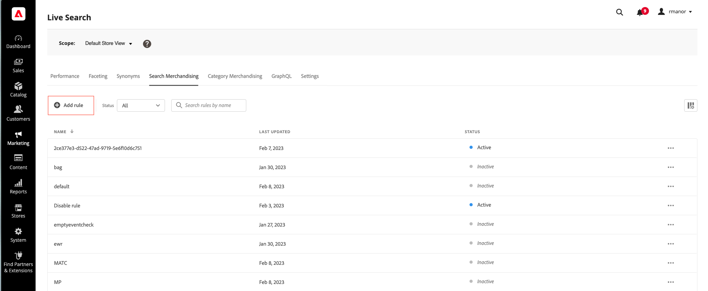

# Lägg till regler

För att skapa en regel är det första steget att använda regelredigeraren för att definiera villkoren i kundens frågetext som utlöser de associerade händelserna. Slutför sedan regelinformationen, testa resultatet och publicera regeln.

## Lägg till en regel

1. Gå till **Markering** > SEO &amp; Search > **[!DNL Live Search]** i Admin.
1. Ange **scopet** för att identifiera [butiksvyn](https://experienceleague.adobe.com/docs/commerce-admin/start/setup/websites-stores-views.html#scope-settings) där regeln gäller.
1. Klicka på arbetsytan **Sök efter marknadsföring**.
1. Klicka på **Lägg till regel** för att starta regelredigeraren.

## Regeltyp

En sökfråga är där du definierar en specifik sökterm, villkor och rankningstyper.

Du kan ange en standardregel som används för alla frågor, såvida inte en mer specifik sökfråga har definierats. Det går endast att ange en standardregel och den får inte innehålla några villkor. Om du väljer Standard visas inte villkorsgränssnittet.
Välj standardtyp för Intelligent rankning och eventuell manuell rankning som du vill använda för alla standardsökningar. Manuell rankning används alltid.

## Villkor

Villkor är krav för att utlösa en händelse. En regel kan ha upp till tio villkor och 25 händelser. En standardregel kan inte ha några villkor.

>[!NOTE]
>
>För närvarande går det inte att rikta regler mot en viss kundgrupp.

### Ett villkor

1. Under *Bygg din regel* väljer du det **villkor** som ska uppfyllas och följer instruktionerna för att slutföra satsen.

   * Sökfrågan innehåller - Ange den textsträng som måste finnas i kundens fråga. Inställningen Matcha avgör i vilken grad kundens fråga matchar katalogen. Alternativ:  Valfritt - Alla delar av kundens frågetext kan matcha villkoret. Alla - Alla kundens frågor måste matcha villkoret.
   * Sökfrågan är - Ange en textsträng som exakt matchar kundens fråga. Till exempel:&quot;yoga byxor&quot;. Regler med `Search query is` och Matcha `All` kan bara ha ett villkor.
   * Sökfrågan börjar med - Ange ett tecken eller en textsträng som måste vara i början av kundens fråga.
   * Sökfrågan avslutas med - Ange ett tecken eller en textsträng som måste vara i slutet av kundens fråga.

   Resultaten visas omedelbart i rutan *Testa regeln* och numreras efter prioritet. Du kan använda reglaget *Resultat per rad* i det övre    höger för att ändra antalet produkter i varje rad.

   

1. Om du vill testa andra frågor ändrar du frågetexten i sökrutan *Testa regeln* och trycker på **Retur**.
Testfönstret återger först frågan från sökrutan Villkor. Men nu återges frågan från testfrågerutan. Testfönstret återger bara en fråga i taget.
1. Om du gillar resultatet kan du uppdatera texten i sökrutan *Villkor*. Klicka sedan var som helst på sidan för att uppdatera resultatet i testfönstret.
1. Om du vill skapa en enkel regel med ett villkor går du till steg 3: [Lägg till händelser](#events).

### Flera villkor

1. Om du vill skapa en regel med flera villkor klickar du på **Lägg till villkor**.
En regel kan ha upp till tio villkor. Den logiska operatorn som ansluter till två villkor baseras på den aktuella *Matcha*-inställningen. Som standard är *Matcha* `All` och den logiska operatorn är `AND`.

1. Markera det andra villkoret och ange den obligatoriska frågetexten.

1. Om du vill ändra logiken för regeln ändrar du inställningen **Matcha** för att avgöra hur nära kundens sökvillkor måste matcha frågevillkoret. Ange **Matcha** till något av följande:

   * Valfri - (Standard) Alla logiska operatorer i regeln ställs in på `OR` och resultatet visas i testfönstret.
   * Alla - Alla logiska operatorer i regeln är inställda på `AND` och resultaten visas i testfönstret.

   Värdet *Matcha* avgör den logiska operatorn som används för att koppla flera villkor. Om du ändrar inställningen *Matcha* ändras alla logiska operatorer i regeln. Det går inte att kombinera `AND` och `OR` i samma regel.

   I det här exemplet, i stället för att söka efter &quot;yoga-byxor&quot;, finns det två separata frågor som söker efter &quot;yoga&quot; eller &quot;byxor&quot;. Den här regeln är mindre specifik och utlöses oftare i butiken än i den andra.

   

1. Om du vill lägga till ett till villkor klickar du på **Lägg till villkor** och upprepar processen.

## Intelligent rankning

Intelligent rankning kombinerar användarbeteenden och webbplatsstatistik för att avgöra produktrankningen.
Butiksägare kan skapa följande typer av rankningsstrategier:

* Mest köpta: Detta rangordnar produkter efter totala inköp per SKU under de senaste 7 dagarna.
* Mest tillagda i kundvagnen - rangordnas efter den totala &quot;Lägg i kundvagnen&quot;-aktiviteten under de senaste 7 dagarna.
* Mest visade: rangordnar det totala antalet visningar per SKU under de senaste 7 dagarna.
* Rekommenderas för dig - Använder datapunkten `viewed-viewed` - Handlare som visade denna SKU tittade också på dessa andra SKU:er.
* Trending: Återgår vid sidvyhändelser under de senaste 72 timmarna för bakgrundshändelser och 24 timmar för förgrundshändelser.
* Ingen: Produkterna beställs efter relevans.

Välj typ av strategi för regeln. Fönstret **Testa regeln** visar det förväntade resultatet.

### Hur smart rankning fungerar

Intelligent rankning avgör den slutliga produktordningen genom att kombinera två nyckelfaktorer: **textrelevans** och **beteendesignaler**. Genom att förstå hur dessa faktorer interagerar kan du ställa in realistiska förväntningar för sökresultaten.

**Bedömningskomponenter:**

* **Textuell relevans**: Den dominerande faktorn i poängsättningen. Detta mäter hur väl en produkts namn, beskrivning och attribut matchar sökfrågan. Textrelevansspåret är obegränsat (har ingen specifik övre gräns) och påverkas av faktorer som:

   * Hur ofta matchande ord förekommer.
   * Längd (med ord) på produktnamn/beskrivningar.

* **Beteendesignaler**: En avgränsad ökning används ovanpå textrelevansspåret. När du väljer en smart rankningsstrategi som&quot;Mest visade&quot; eller&quot;Mest köpta&quot; får produkter med högre beteendesignaler en fast förstärkning av poängen. Den här ökningen har dock en definierad gräns.

**Varför den mest visade produkten kanske inte visas först:**

Textuell relevans dominerar oftast rankningen eftersom poängen är obegränsade, medan beteendeförbättringar är fasta. Resultatet blir att produkter med stark text ofta matchar produkter med högre engagemangssignaler. Enbart beteendeförbättringar kanske inte kompenserar för stora luckor i textrelevansen. Intelligent rankning åtgärdar detta genom att ta hänsyn till både kvalitet och kundinteraktion, vilket förbättrar den övergripande relevansen. Kvaliteten på textmatchningen är dock fortfarande den primära drivrutinen för rankning.

**Exempel:**

En handlare använder den intelligenta rankningsstrategin&quot;Mest tittat&quot; och söker efter&quot;ljus&quot;. De förväntar sig att produkt-SKU YAN-K-E-512 ska visas högst upp i resultatet eftersom den har det högsta visningsantalet. Andra produkter kan dock klassificeras som högre:

* **Texas Candle** (första position): Har ett kortare, renare produktnamn som skapar ett mycket högt textrelevansresultat. Även om den har färre vyer än YAN-K-E-512 är textmatchningen bättre än beteendeökningen.

* **YAN-K-E-512** (undre position): Trots att den högsta vypercentilen finns i beteendedata som visas mest, genereras ett komplext SKU-baserat namn ett lägre textrelevansvärde. Den fasta beteendeökningen räcker inte till för att överbrygga det här problemet med textrelevans.

Se [sökregler](./best-practice.md#search-rules) om du vill veta mer om hur du kan förbättra produktsökningen med hjälp av regler.

### Caveats

* Apostrofer och citattecken i frågor kan leda till vissa mindre problem med rankning och relevans på vissa språk.
* För att den intelligenta rankningen ska fungera på rätt sätt måste **sökvikten** för alla produktattribut som används för sökning eller filtrering (facets) vara `5` eller mindre. Om du vill hitta den här inställningen i [!DNL Commerce]-administratören:

   1. Välj **Lagrar** > _Attribut_ > **Produkt**.
   1. Sök efter attributet, till exempel &quot;name&quot;.
   1. På sidan **Attributinformation** > **Egenskaper för Storefront** anger du att sökvikten ska vara mindre än eller lika med `5`.

      

>[!NOTE]
>
>Sökupplevelsen i storefront påverkas av flera konfigurationer som fungerar ihop, t.ex. facets, synonymer och regler för sökning/kategoriförsäljning, vilket kan leda till resultat som skiljer sig från dem som visas när du testar enskilda konfigurationer i Admin. Administratörstestning isolerar specifika konfigurationsområden, men butiken använder alla relevanta konfigurationer tillsammans, vilket ger ett mer komplext och realistiskt sökresultat.

## Manuell rankning

Manuell rankning (kallades tidigare Händelser) är åtgärder som ändrar sökresultaten när definierade villkor uppfylls. En regel kan ha upp till 25 händelser.

* Öka - Flyttar en produkt högre i sökresultaten.
* Bury - Flyttar en SKU nedåt i sökresultaten.
* Fäst en produkt - Produkten visas i den valda positionen på sidan.
* Dölj en produkt - Utesluter en SKU från sökresultaten.

Det enklaste sättet att fästa en produkt är genom att dra och släppa.

1. Klicka och dra en produkt i testfönstret. Dra och släpp den på önskad plats. Fälten Produkt och Placering fylls i automatiskt i rutan Händelser.

   

Du kan också klicka på nålikonen för att fästa en produkt på dess aktuella plats. Använd snabbmenyn för ellipsen för att fästa överst eller nederst.

>[!NOTE]
>
>Du kan bara fästa produkter som returneras i frågan.

Eller så kan händelser anges manuellt:

1. Under *Händelser* väljer du den **händelse** som ska äga rum när de associerade villkoren uppfylls.

   Välj till exempel `Hide a product`. Ange sedan namnet på den produkt som du vill dölja. Produkter föreslås när du skriver.

1. För flera händelser väljer du andra händelser som du vill ska utlösas när villkoren uppfylls.

## Ytterligare information

Informationen som anges här visas på panelen [Regelinformation](rules-workspace.md).

1. Under *Detaljer* anger du ett **Namn** för regeln. Alla regelnamn måste vara unika.
1. Ange en kort **beskrivning** av regeln.
1. Ange **Startdatum** och **Slutdatum** för att regeln ska vara aktiv eller välj datumen i kalendern.

   Om du vill markera ett datumintervall klickar du på det första datumet och drar för att markera intervallet.

   

## Slutför regeln

1. Granska resultatet av regeln i testfönstret.
1. Om regeln har flera frågor testar du var och en som kan påverkas av regeln.
1. När du är klar klickar du på **Spara och publicera**.

   Regeln läggs till i listan på arbetsytan *Regler*.

1. Även om de aktiva reglerna börjar gälla omedelbart kan du behöva vänta upp till 15 minuter på att de cachelagrade frågeresultaten i butiken ska uppdateras.

>[!NOTE]
>
>Regler och manuellt rankade produkter tillämpas på sökresultaten när standardsorteringsordningen, &quot;Sortera efter: mest relevant&quot; har valts. Om en kund ändrar sorteringsordningen till något som att sortera efter namn eller pris gäller inte längre regler och manuella rankningar.

## Fältbeskrivningar

### Villkor (om)

| Villkor | Beskrivning |
|--- |--- |
| Sökfrågan innehåller | Ett tecken eller en textsträng som ingår i kundens fråga. Köparens fråga behöver bara matcha en enda karaktär för att uppfylla det här villkoret. |
| Sökfrågan är | Ett tecken eller en textsträng som exakt matchar kundens fråga. Komplexa frågor med flera villkor kan inte disponeras när det här villkoret används. |
| Sökfrågan börjar med | Köparens fråga börjar med det här tecknet eller textsträngen. |
| Sökfrågan slutar med | Köparens fråga avslutas med det här tecknet eller textsträngen. |

### Logiska operatorer

| Operator | Beskrivning |
|--- |--- |
| ELLER | (Standard) Den logiska operatorn `OR` jämför två villkor och uppfyller kraven för att utlösa en händelse om minst ett villkor är sant. |
| OCH | Den logiska operatorn `AND` jämför två villkor och uppfyller kraven för att utlösa en händelse om båda villkoren är uppfyllda. |

### Matcha operatorer

| Operator | Beskrivning |
|--- |--- |
| Alla | Ändrar alla logiska operatorer i regeln till `OR` och returnerar uppsättningen med matchande produkter. |
| Alla | Ändrar alla logiska operatorer i regeln till `AND` och returnerar uppsättningen med matchande produkter. |

### Manuell rankning

| Händelse | Beskrivning |
|--- |--- |
| Öka | Flyttar en SKU eller ett intervall med SKU:er högre i sökresultaten. Var och en markeras med ett&quot;boosted&quot; preview badge i testsökresultaten. |
| Bury | Flyttar en SKU eller ett intervall med SKU:er nedåt i sökresultaten. Var och en markeras med ett&quot;nedgrävt&quot; förhandsvisningsmärke i testsökresultaten. |
| Fäst en produkt | Kopplar en enskild SKU till en viss plats i sökresultaten. Produkten är markerad med ett&quot;fäst&quot; förhandsvisningsmärke i testsökresultaten. |
| Dölj en produkt | Utesluter en SKU, eller ett intervall med SKU:er, från sökresultatet. |

### Information

| Fält | Beskrivning |
|--- |--- |
| Namn | Regelns namn. Regelnamn måste vara unika. |
| Regeltyp | Standard eller Fråga. Standard används för alla regler, såvida inte en mer specifik frågeregel har definierats. |
| Startdatum | Regelns startdatum, om det är schemalagt. |
| Slutdatum | Regelns slutdatum, om det är schemalagt. |
| Beskrivning | En kort beskrivning av regeln. |
