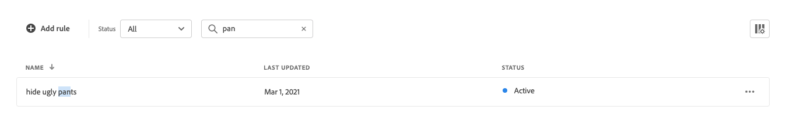

# Search Merchandising Workspace

På arbetsytan *Sök marknadsföring* visas det aktuella urvalet av regler och deras status, och du får tillgång till verktyg som du behöver för att skapa och hantera regler. Från arbetsytan kan du:

* Sök efter regler
* Visa regelinformation
* Aktivera/inaktivera regler
* Ta bort regler
* Åtkomst till regelredigeraren

## Ange omfånget

Om din Adobe Commerce-installation innehåller flera butiksvyer anger du **Scope** till den [butiksvy](https://experienceleague.adobe.com/docs/commerce-admin/start/setup/websites-stores-views.html#scope-settings) där reglerna gäller.

## Visa/dölj kolumner

1. Klicka på **Visa/dölj**  i det övre högra hörnet.
De synliga kolumnerna har en blå bockmarkering på alternativmenyn. Regelnamnet är den enda kolumnen som inte kan döljas.

1. Gör något av följande på menyn:

   * Om du vill visa en dold kolumn klickar du på ett kolumnnamn utan bockmarkering.
   * Om du vill dölja en synlig kolumn klickar du på ett kolumnnamn med en bock.

## Filtrera regler efter status

1. Om din butik har många regler kan du filtrera reglerna efter status för att förkorta listan. Som standard visas alla regler i listan Regler.

1. Om du bara vill visa regler med en viss statusinställning anger du **Status** till något av följande:

   * Alla
   * Aktiv
   * Inaktiv
   * Schemalagd

## Sök efter sökregler efter namn

Börja skriva regelns namn eller något ord i regelnamnet.
Sökfunktionen hittar matchande regler när du skriver. Strängen med matchande tecken markeras i namnet på varje regel som hittas.

## Visa detaljer

På informationspanelen visas regelnamn, status, villkor och händelser, start- och slutdatum, beskrivning och datum för senaste redigering. Regler kan aktiveras, redigeras och tas bort från informationspanelen.

1. Leta reda på regeln i rutnätet som du vill visa på arbetsytan *Sök efter marknadsföring* och klicka på **Mer** (..).
1. Klicka på **Visa information**.
Du kan göra något av följande från panelen Visa information:

   * Redigera regel
   * Ta bort regel
   * Aktivera/inaktivera regel

1. Om du vill stänga panelen *Visa information* klickar du på **Stäng** (X) i det övre högra hörnet.

   

## Kolumnbeskrivningar

| Kolumn | Beskrivning |
|--- |--- |
| Namn | Regelns namn. |
| Senast uppdaterad | Det datum då regeln senast uppdaterades. |
| Startdatum | Startdatumet för en schemalagd regel. |
| Slutdatum | Slutdatumet för en schemalagd regel. |
| Status | Den färgkodade statusen anger regelns aktuella läge. Använd statuskontrollen ovanför rutnätet för att filtrera regler efter status. Värden: All status - Visar alla regler oavsett status. Aktiv (blå) - Visar endast aktiva regler. Schemalagd (Orange) - visar endast schemalagda regler. Inaktiv (grå) - visar endast inaktiva regler. |

## Kontroller

| Kontroll | Beskrivning |
|--- |--- |
| Lägg till regel | Öppnar [regelredigeraren](rules-add.md). |
| Status | Filtrerar listan med regler efter status. Alternativ: Alla, Aktiva, Inaktiva, Schemalagda |
|  | Anger vilka kolumner som visas i rutnätet. Alternativ: Senast uppdaterad, Startdatum, Slutdatum, Status |
| Sök | Söker efter en regel efter fullständigt namn eller partiell matchning. |
|  | Visar en meny med fler åtgärder som kan tillämpas på den valda regeln. Alternativ: Redigera, Visa information, Ta bort |

## Regelinformation

| Fält | Beskrivning |
|--- |--- |
| Status | Regelns aktuella status. |
| Villkor | Sökfrågan som beskriver villkoren som är kopplade till regeln. |
| Startdatum | Det datum då regeln träder i kraft, om den är schemalagd. |
| Slutdatum | Det datum då regeln förfaller, om den är schemalagd. |
| Beskrivning | En kort beskrivning av regeln. |
| Senast uppdaterad | Datum och tid då regeln senast uppdaterades. |
| Aktiverad | En kontroll som ändrar regelns status. Alternativ: Aktiverad/Inaktiverad |
