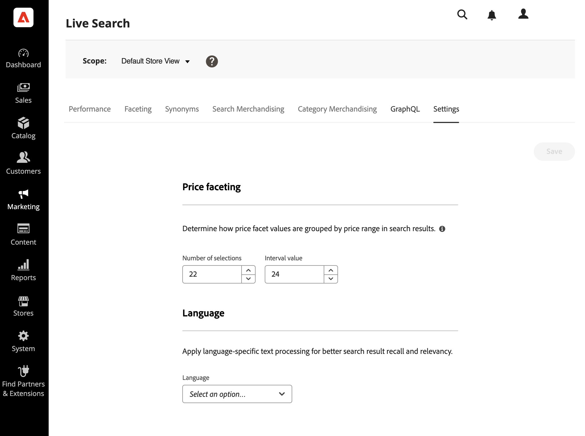

# Inställningar

Använd arbetsytan *Inställningar* om du vill konfigurera intervall och intervall för prisfaktor samt standardspråket för indexet.

Prisfakteting anger antalet prisintervallgrupper och hur prisvärden fördelas mellan dem.

Språkinställningen talar om för [!DNL Live Search]-tjänsten vilket språk som ska användas när indexet skrivs.

## Prisfakturor

Du kan ange antalet prisintervallgrupper och hur prisvärden fördelas mellan dem. Varje prisintervall överlappar den föregående gruppen med ett. Fem grupper med intervallet 20 skapar till exempel följande prisintervall: 0-20, 20-40, 40-60, 60-80 och >80. Om det inte finns tillräckligt många produkter i katalogen för att fylla alla definierade intervall justeras visningen av tillgängliga grupper därefter. Exempel: 0-20, 60-80, >80.

1. Gå till **Marknadsföring** > *SEO &amp; Search* > **[!DNL Live Search]** i Admin.
1. Gör följande på arbetsytan **Inställningar** under *Prisfaktablad*:
   * Ange **antalet markeringar** eller prisgrupperingar som ska vara tillgängliga. Med [!DNL Live Search] 4.4.0 kan du definiera upp till 100 prisgrupperingar. I tidigare versioner var det tillåtet med 50 prisgrupperingar.
   * Ange värdet **Intervall** eller prisintervallet för varje grupp. Maxvärdet är 40 000 000.
1. Klicka på **Spara**.

   Det tar ca 15 minuter innan de uppdaterade inställningarna är tillgängliga i butiken.

### Fältbeskrivningar

| Fält | Beskrivning |
|--- |--- |
| Antal markeringar | Anger antalet prisintervallgrupperingar som kan användas som sökfilter i butiken. Standardvärde: 8, maximalt värde: 100 (från och med [!DNL Live Search] 4.4.0) |
| Intervallvärde | Anger prisintervallen för varje grupp. Fem markeringar med ett intervallvärde på 20 skapar till exempel fem grupperingar av 0-20, 20-40, 40-60, 60-80 och >80. Standardvärde: 5, maximalt värde: 40 000 000 |

## Språk

Språkinställningen talar om för [!DNL Live Search] vilket språk som ska förväntas när katalogen läses och indexet skrivs.

Språk har olika uppsättningar regler för grammatik: hur ord avgränsas, verbtoner och ordformer till exempel.
Inställningen Språk säkerställer att rätt uppsättning regler tillämpas på indexeringsmekanismen.

Ställ in språkinställningen på katalogens primära språk. När du ändrar språket för indexet kan det ta mellan 5 och 60 minuter att återspegla ändringen på butiken, beroende på storleken och komplexiteten hos katalogen.

| Språk | Code |
|----|----|
| Arabiska | ar |
| Armeniska | hy |
| Baskiska | eu |
| Bengali | bn |
| Brasilianska | pt-br |
| Bulgariska | bg |
| Katalanska | ca |
| Kinesiska (förenklad) | zh-cn |
| Kinesiska (traditionell) | zh-tw |
| Tjeckiska | cs |
| Danska | da |
| Nederländska | nl |
| Engelska | en |
| Estniska | et |
| Finska | fi |
| Franska | fr |
| Galiciska | gl |
| Tyska | de |
| Grekiska | el |
| Hindi | hi |
| Ungerska | hu |
| Indonesiska | id |
| Irländska | ga |
| Italienska | it |
| Japanska (Katakana) | ja |
| Koreanska | ko |
| Lettiska | lv |
| Litauiska | lt |
| Norska | no |
| Persiska | fa |
| Portugisiska | pt |
| Rumänska | ro |
| Ryska | ru |
| Sorani | ku |
| Spanska | es |
| Svenska | sv |
| Turkiska | tr |
| Thailändska | th |
