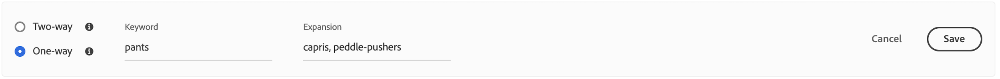

# Lägg till synonymer

Öka kundengagemanget genom att lägga till en egen strukturerad lista med [!DNL Live Search] synonymer. [!DNL Live Search] kan hantera upp till 200 synonymer per `Data Space ID`.

![[!DNL Live Search] synonymer](assets/synonym-workspace.png)

## Steg 1: Lägg till en synonym

1. Gå till **Markering** > SEO &amp; Search > **[!DNL Live Search]** i Admin.
1. För flera arkiv anger du **Scope** till den [butiksvy](https://experienceleague.adobe.com/docs/commerce-admin/start/setup/websites-stores-views.html#scope-settings) där synonyminställningarna gäller.
1. Klicka på fliken **Synonymer**.
1. Klicka på knappen **Lägg till synonymer**.

## Steg 2: Definiera synonymen efter typ

Följ instruktionerna för den [typ av synonym](synonyms-type.md) som du vill skapa.

### Tvåvägssynonym

1. Acceptera standardalternativet **Tvåvägs**.

   

1. Ange termen eller frasen **Nyckelord** som ska matchas.
1. Ange den/de **uttryck** som du vill lägga till som synonymer för nyckelordet. Avgränsa flera termer med komma.
I det här exemplet är nyckelordet som ska matchas&quot;byxor&quot; och uppsättningen expansionstermer är&quot;byxor, slackar&quot;.

   

1. Klicka på **Spara** när du är klar.
Synonymuppsättningen visas i listan med en dubbelriktad pil mellan varje term, vilket betyder att termerna är utbytbara.

   

### Envägssynonym

1. Klicka på synonytypen **Envägs**.

   

1. Ange villkoren **Nyckelord** och **Utökning**. Avgränsa flera termer med komma.

   

   I det här exemplet är nyckelordet &quot;byxor&quot; och de ensidiga expansionstermerna &quot;capris, peddle-pushers&quot; är en delmängd av &quot;byxor&quot;, men med en specifik betydelse.

1. Klicka på **Spara** när du är klar.
Synonymuppsättningen visas i listan med en enkelriktad pil som pekar från expanderingsvillkoren till nyckelordet för att ange att termerna är deluppsättningar av nyckelordet. Ett plustecken avgränsar varje expansionsterm.

   

## Steg 3: Publicera ändringar

1. När dina synonymer är klara klickar du på **Publicera ändringar**.
1. Vänta i upp till två timmar tills dina uppdateringar är tillgängliga i butiken.

## Fältbeskrivningar

| Fält | Beskrivning |
|--- |--- |
| [Typ](synonyms.md) | Avgör om synonymer har samma betydelse som nyckelordet eller är en delmängd av nyckelordet. Alternativ: Tvåvägs (standard) - Termer som har samma betydelse som nyckelordet och returnerar samma sökresultat Envägs - Termer som är en delmängd av nyckelordet. Envägssynonymer returnerar en mer smal lista över specifika produkter. |
| Nyckelord | Ett ord som vanligtvis associeras med ett urval produkter i din katalog. |
| Utbyggnad | Ytterligare termer som har samma eller liknande betydelse som nyckelordet. |
