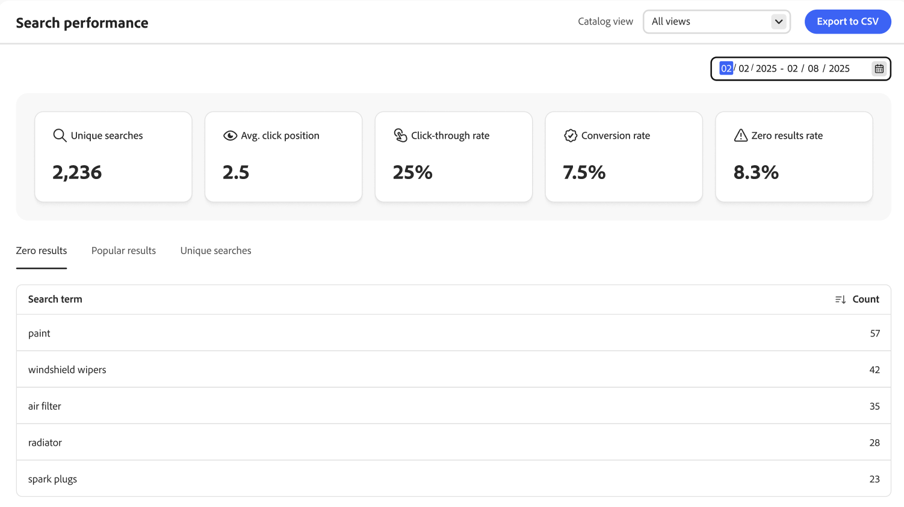

# Sökprestanda

Sidan *Sökprestanda* ger insikt i de söktermer som kunderna använder. Informationen kan användas för att identifiera trender, öka klickfrekvensen och förbättra konverteringsgraden. På sidan Sökprestanda finns en ögonblicksbild av sökstatistik för ett visst datumintervall och följande rapporter:

- Unika sökningar
- Genomsnittlig klickningsposition
- Genomklickningsfrekvens
- Konverteringsgrad
- Nollresultatfrekvens

{zoomable="yes"}

>[!IMPORTANT]
>
>Om du inte ser några sökresultatmått kontrollerar du att data för söktiden [samlas in](../setup/events/overview.md).

## Välj **katalogvyn**

Välj [katalogvyn](../setup/catalog-view.md) om du vill se specifika sökresultatresultat.

## Visa en rapport

Klicka på kalendern och gör något av följande:

- Om du vill ange ett enstaka datum dubbelklickar du på datumet i kalendern.
- Om du vill ange ett datumintervall klickar du på det första och det sista datumet i kalendern.

>[!NOTE]
>
>Datumintervallet får inte vara längre än ett år.

Klicka på **[!UICONTROL Export to CSV]** om du vill generera en CSV-fil med sökprestanda.

## Förbättra sökprestanda

I följande avsnitt beskrivs strategier som du kan använda för att förbättra sökfunktionen på webbplatsen, vilket ger en smidig och effektiv shoppingupplevelse som maximerar konverteringsgraden.

Det finns flera viktiga faktorer som avgör sökresultatens relevans och effektivitet:

- Välstrukturerade produktdata säkerställer att sökalgoritmer effektivt kan matcha produkter mot frågor. Produktdata av låg kvalitet leder till mindre relevanta sökresultat. Så här påverkar du er marknadsföringsstrategi direkt:
   - Ställ in rätt [attribut som sökbara](https://developer.adobe.com/commerce/services/reference/rest/#operation/createProductMetadata) med motsvarande vikt.
   - Se till att data i dessa attribut är relevanta.
- En väldesignad sökupplevelse skapar förtroende hos kunderna och ser till att de hittar det de behöver.
- Sökreglerna är avgörande eftersom de kan öka synligheten för vissa produkter baserat på popularitet, nya kunder, kampanjkriterier eller andra marknadsföringsstrategier för att uppfylla era affärskrav.
- Med enkel navigering kan kunderna förfina sina sökningar och få relevanta resultat snabbt.

### Övervaka sökresultat

Om du vill optimera sökresultaten med [!DNL Adobe Commerce Optimizer] ska du övervaka relevanta KPI:er (Key Performance Indicators), som unika frågor, genomsnittlig klickposition, klickfrekvens, konverteringsgrad och nollresultatfrekvens, för att förstå hur kunderna interagerar med sökfunktionen. Denna information hjälper dig att regelbundet uppdatera och förfina sökreglerna.

- **Unika sökningar** - Antalet distinkta sökfrågor som har utförts på din [!DNL Adobe Commerce Optimizer]-plats. Varje unik sökning räknas bara en gång, även om den upprepas flera gånger av samma kund eller olika köpare. Denna mätmetod hjälper er att förstå de olika söktermer som används av kunder och ger insikter om vilka produkter eller vilken information som kunderna vill ha. Genom att spåra unika sökningar kan du:

   - Identifiera populära söktrender och ofta sökta objekt.
   - Identifiera potentiella luckor i produktkatalogen eller innehållet.
   - Optimera sökfunktionen genom att lägga till [synonymer](../merchandising/synonyms/overview.md), skapa eller uppdatera [sökregler](../merchandising/rules/overview.md).

- **Genomsnitt klickningsposition** - Anger att den genomsnittliga positionen för sökresultat som kunderna klickat på efter att ha utfört en sökfråga på webbplatsen är densamma. Det här måttet ger insikter om sökresultatens relevans och effektivitet.

  En lägre genomsnittlig klickposition (närmare 1) tyder på att kunderna snabbt hittar relevanta resultat, vilket indikerar att din sökstrategi är effektiv. Det hjälper er att förstå kundernas beteende och hur långt de är villiga att rulla för att hitta den önskade produkten. Om den genomsnittliga klickpositionen är hög kan det tyda på att de mest relevanta resultaten inte visas överst, vilket kräver en granskning och optimering av sökstrategin.

- **Genomklickningsfrekvens (CTR)** - Mäter den procentandel av kunderna som klickar på ett sökresultat efter att ha utfört en sökfråga. En hög CTR indikerar att sökresultaten är relevanta och tilltalande för kunderna när de klickar på de resultat de hittar. Övervakning av CTR kan hjälpa till att identifiera områden som kan förbättras. Låg CTR kan tyda på att sökresultaten inte matchar kundens avsikt, vilket innebär att man måste förfina sökreglerna, förbättra produktinformationen eller förbättra resultatpresentationen.

- **Konverteringsgrad** - Anger sökfunktionens effektivitet när det gäller att öka försäljningen och uppnå affärsmål. Det återspeglar den övergripande effektiviteten i sökfunktionen när det gäller att tillgodose kundernas behov och underlätta en smidig shoppingupplevelse. En hög konverteringsgrad visar att sökresultaten är mycket relevanta och övertygande, vilket leder kunderna till att slutföra köpet. Om konverteringsgraden är låg kan det tyda på problem med sökrelevans, produkttillgänglighet eller den totala kundresan från sökning till köp.

- **Ingen resultatfrekvens** - Mäter den procentandel sökfrågor på din [!DNL Adobe Commerce Optimizer]-webbplats som inte ger några resultat. Denna mätmetod är avgörande för att förstå hur ofta kundernas sökningar misslyckas och kan ge insikter i potentiella luckor i produktkatalogen eller sökinställningarna. Ett högt resultatvärde på noll kan frustrera kunderna, vilket leder till en dålig shoppingupplevelse och potentiell förlust av kunder. Det kan visa att det finns saknade produkter eller kategorier i din katalog som kunderna söker efter, och ge dem vägledning när det gäller lager och produktlistor.

  Om du vill minska nollresultatfrekvensen kan du:

   - Erbjud alternativa eller relaterade söktermer, till exempel [synonymer](../merchandising/synonyms/overview.md), när inga exakta träffar hittas.
   - Granska regelbundet nollresultatfrågor för att identifiera mönster och göra nödvändiga justeringar i produktkatalogen och sökinställningarna.

Du kan använda dessa mätdata för att optimera sökfunktionen på följande sätt:

- Implementera regler som automatiskt rangordnar populära produkter högre i sökresultaten. Produkter som du ofta klickar på eller köper kan prioriteras så att de visas högst upp. Manuellt strukturera listor med populära produkter för specifika sökfrågor och se till att dessa objekt visas tydligt.
- Markera produkter som för närvarande trendar eller nyligen har sett en ökning av popularitet. Detta kan vara särskilt effektivt under säsongsevenemang, helger eller kampanjperioder. För att uppnå detta använder du den intelligenta rankning som bättre passar ditt användningssätt och ditt företags behov när du skapar en sökregel.
- Markera populära filter eller ansikten, om kunderna ofta filtrerar efter vissa varumärken eller prisintervall, så gör dessa alternativ mer framträdande genom att fästa dem och sortera dem därefter.
- När en sökning ger noll resultat kan du använda populära resultatdata för att föreslå alternativa produkter eller relaterade kategorier som har ett högt kundengagemang.
- Analysera populära söktermer och produktdata för att identifiera viktiga nyckelord. Optimera dina produktsökbara attribut med dessa nyckelord för att förbättra sökrelevansen.
- Analysera regelbundet era resultatdata för att förstå förändrade trender, kundernas preferenser och beteende, identifiera de viktigaste söktermerna och identifiera problem. Använd den här feedbackslingan för att kontinuerligt förfina och förbättra dina sökregler och produkterbjudanden

## Optimera sökfunktionerna

Om du vill optimera sökfunktionen använder du [synonymer och stavningar](../merchandising/synonyms/overview.md) för att se till att kunderna hittar produkter även om de använder olika ord och [facets](../merchandising/facets/overview.md) för att ge kunderna möjlighet att begränsa sökresultaten.

## Förbättra relevansen i sökresultatet

Om du vill förbättra sökresultatets relevans implementerar du [sökregler](../merchandising/rules/overview.md) och använder produktmetadata för att säkerställa att korrekta och detaljerade [attribut är sökbara](https://developer.adobe.com/commerce/services/reference/rest/#operation/createProductMetadata).

### Bilder

Se till att de underordnade produkterna för konfigurerbara produkter har bilder med rätt roller. Om du har överordnade eller underordnade produkter kan det leda till att sökresultatet inte innehåller bilder.

>[!NOTE]
>
>Bilderna i sökresultaten kan vara olika beroende på söktermen. Om söktermen anger att en underordnad produkt är mer relevant kommer bilder från den underordnade produkten att användas i stället för bilder från den överordnade produkten.

### Använd produktmetadata

Kontrollera att korrekta och detaljerade produktattribut för [&#x200B; har angetts som sökbara och har tilldelats en vikt på &#x200B;](https://developer.adobe.com/commerce/services/reference/rest/#operation/createProductMetadata). Observera att SKU-, namn- och kategoriattribut som standard är sökbara och inte kan uteslutas från sökningen. För bästa resultat ska du inte använda blanksteg i dina SKU:er.

Om du vill öka sökrelevansen tilldelar du en vikt till varje sökbart attribut. Attribut med högre vikt bör visas högre i sökresultatet. Sorteringen efter relevans påverkas av flera kriterier, t.ex. sökvikt. Det innebär att attribut med lägre sökvikt ibland kan ha större relevans än attribut med högre sökvikt. Andra villkor kan vara antalet matchningar i ett givet attribut, positionen för det sökord som hittats och den övergripande textstrukturen före och efter ett sökord.

Se till att varje produkt har relevant innehåll inom varje sökbart attribut. Du bör inte ange ett attribut som sökbart om det har en stor mängd innehåll, eftersom det kan minska sökresultatets relevans.

## Fältbeskrivningar

| Ögonblicksbildsdata | Beskrivning |
|--- |--- |
| Unika sökningar | Det totala antalet unika sökningar för det angivna datumintervallet. Flera sökningar av samma kund, även om de avser samma fråga, anses unika om de skickas med mer än en timmes mellanrum. |
| Genomklickningsfrekvens | Hur många procent av sökningarna som avslutas när kunden klickar på en produkt. Klickfrekvensen är till exempel 50 % om kunden söker efter &quot;byxor&quot; och &quot;skjorta&quot; och sedan klickar på ett resultat i &quot;skjortsökningen&quot;. |
| Konverteringsgrad | Procentandelen produkter som kunden köper jämfört med antalet produkter som kunden klickar på för det angivna datumintervallet. Konverteringsgraden för interaktionen är till exempel 100 % om kunden tittar på sex produkter i povern, klickar på en och gör ett köp.   Konverteringsgraden påverkas inte av antalet vyer för en viss produkt. Konverteringsgraden är till exempel densamma om kunden använder sökfunktionen, men klickar inte på några produkter. |
| Nollresultatfrekvens | Procentandelen unika sökningar som inte returnerar några resultat för det angivna datumintervallet. Exempelvis är nollresultatfrekvensen 66,67 % om användaren söker efter &quot;fjajfjjfjf&quot; två gånger (utan resultat) och efter &quot;byxor&quot; en gång (med resultat). |
| Medel. klickningsposition | Den relativa positionen för den genomsnittliga klickfrekvensen baserat på unika sökningar för det angivna datumintervallet. |

| Rapporter | Beskrivning |
|--- |--- |
| Nollresultat | Visar en lista över sökfrågor som inte returnerar några resultat och det antal gånger som används under det angivna datumintervallet. Rapportgräns: De 500 vanligaste villkoren |
| Populära resultat | Visar namnen på de produkter som har fått flest vyer under det angivna datumintervallet. Populära resultat beräknas endast utifrån visningar och påverkas inte av antalet klick eller genererade intäkter. Rapportgräns: De 500 vanligaste villkoren |
| Unika sökningar | Visar en lista med unika sökfrågor som används under det angivna datumintervallet. Rapportdata beräknas på samma sätt som unika data för ögonblicksbilder av sökningar. Om en kund skriver samma sökfråga två gånger, men med mer än en timmes mellanrum, betraktas sökningen som två unika sökningar. Rapportgräns: De 500 vanligaste villkoren |

## Standardegenskaper för icke-systemattribut

I följande tabell visas standardegenskaperna för sökning och filtrering av attribut som inte är systemattribut. Om du anger attributegenskapen *Använd i sökning* till `Yes` blir attributet sökbart i [!DNL Adobe Commerce Optimizer].

| Attributkod | Sökbart |
|--- |--- |
| aktivitet | Ja |
| attributes_brand | Ja |
| varumärke | Ja |
| klimat | Ja |
| räntekrage | Ja |
| färg | Ja |
| kostnad | Ja |
| eco_collection |  |
| kön | Ja |
| tillverkare | Ja |
| material | Ja |
| syfte | Ja |
| strap_bag | Ja |
| style_general | Ja |

## Standardegenskaper för systemattribut

I följande tabell visas standardegenskaperna för sökning och filterbarhet för systemattribut.

| Attributkod | Sökbart |
|--- |--- |
| allow_open_amount | Ja |
| description | Ja |
| name | Ja |
| pris | Ja |
| short_description | Ja |
| sku | Ja |
| status | Ja |
| tax_class_id | Ja |
| url_key | Ja |
| vikt | Ja |
