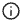

# Skapa och hantera rekommendationer

När du skapar en rekommendation skapar du en _rekommendationsenhet_, eller widget, som innehåller de rekommenderade _produktobjekten_.

_Rekommendationsenhet_

När du aktiverar rekommendationsenheten börjar Adobe Commerce [samla in data](../../manage-results/recommendation-performance.md) för att mäta visningar, vyer, klick och så vidare. Tabellen Rekommendationer visar måtten för varje rekommendationsenhet så att du kan fatta välgrundade affärsbeslut.

1. Gå till _Merchandising_ > _Recommendations_ på sidofältet **Adobe Commerce Optimizer** för att visa arbetsytan _Recommendations_ .

1. Klicka på **Skapa rekommendation**.

1. I avsnittet _Namnge din rekommendation_ anger du ett beskrivande namn för intern referens, till exempel `Home page most popular`.

1. I avsnittet _Välj rekommendationstyp_ anger du önskad [typ av rekommendation](types.md) baserat på din strategi.

1. Ange den _etikett_ som är synlig för dina kunder, till exempel&quot;Top sellers&quot;, i avsnittet [Store-visningsrubrik](best-practice.md#recommendation-labels).

1. I avsnittet _Välj antal produkter_ använder du skjutreglaget för att ange hur många produkter du vill ska visas i rekommendationsenheten.

   Standardvärdet är `5`, men högst `20`.

1. (Valfritt) I avsnittet _Filter_ använder [du filter](filters.md) för att kontrollera vilka produkter som visas i rekommendationsenheten.

1. När du är klar klickar du på något av följande:

   - **Spara som utkast** om du vill redigera rekommendationsenheten senare. Du kan inte ändra rekommendationstypen för en rekommendationsenhet i ett utkasttillstånd.

   - **Aktivera** om du vill aktivera rekommendationsenheten på din butik.

   Din rekommendation visas på arbetsytan Rekommendationer. Om du vill använda din rekommendation i din butik måste du hitta [rekommendation-ID](#get-recommendation-id).

>[!NOTE]
>
> Du kan skapa upp till 50 aktiva rekommendationsenheter.

>[!IMPORTANT]
>
>Vissa webbläsare kan blockera viktiga skript som förhindrar att rekommendationerna fungerar som de ska.

## Hämta rekommendation-ID

När du har skapat en rekommendation måste du hämta dess ID för att implementera rekommendationsenheten på din butik.

1. Välj rekommendation på sidan **Rekommendationer**.

1. Klicka på informationsikonen () bredvid rekommendationsnamnet.

   Sidan **Information om rekommendationsenhet** visas.

   

1. Kopiera ID:t i avsnittet **Rekommendation-ID**.

1. Använd det här ID:t för att konfigurera [rekommendationstillägget](https://experienceleague.adobe.com/developer/commerce/storefront/merchants/blocks/product-recommendations/?lang=sv-SE) i din Edge Delivery Services-butik.

## Hantera befintliga rekommendationer

Du kan redigera, inaktivera eller ta bort en befintlig rekommendation.

1. Gå till _Merchandising_ > _Rekommendationer_ på sidofältet **Adobe Commerce Optimizer**.

1. Välj den rekommendation som du vill ändra.

1. Klicka på ytterligare väljare ().

1. På menyn kan du **inaktivera**, **ta bort** eller **redigera** rekommendationen. Om du väljer **Redigera** kan du justera följande inställningar efter behov:

   - Rekommendationsnamn
   - Etikett för butiken
   - Antal produkter
   - Filtrera produkter

   Du kan inte ändra rekommendationstypen.

1. När du är klar klickar du på **Spara ändringar**.

## Beredskapsindikatorer

Beredskapsindikatorer visar vilka rekommendationstyper som fungerar bäst utifrån tillgängliga katalog- och beteendedata. Du kan också använda beredskapsindikatorer för att avgöra om du har problem med [händelsesamlingen](../../setup/events/overview.md) eller om du inte har tillräckligt med trafik för att fylla i rekommendationstypen.

Beredskapsindikatorer kategoriseras i antingen [statisk-baserad](#static-based) eller [dynamisk-baserad](#dynamic-based). Statisk användning av endast katalogdata, medan dynamiska beteendedata från era kunder används. Dessa beteendedata används för att [utbilda maskininlärningsmodeller](../../setup/events/overview.md) för att skapa personaliserade rekommendationer och för att beräkna deras beredskapspoäng.

### Hur beredskapsindikatorer beräknas

Beredskapsindikatorerna är en indikation på hur mycket modellen är utbildad. Indikatorerna är beroende av vilka typer av händelser som samlas in, hur breda de produkter som interagerar med och storleken på katalogen.

Procentsatsen för beredskapsindikatorn härleds från en beräkning som anger hur många produkter som kan rekommenderas beroende på rekommendationstypen. Statistik tillämpas på produkter baserat på katalogens totala storlek, volymen för interaktioner (till exempel vyer, klick, tillägg i varukorgar) och andelen SKU:er som registrerar dessa händelser inom ett visst tidsfönster. Vid högtrafik under högsäsong kan beredskapsindikatorerna till exempel visa högre värden än vid normal volym.

Som ett resultat av dessa variabler kan procentvärdet för beredskapsindikatorn variera. Detta förklarar varför du kanske ser att rekommendationstyper kommer in och ut som&quot;klara för driftsättning&quot;.

Beredskapsindikatorer beräknas utifrån några faktorer:

- Tillräcklig storlek för resultatuppsättning: Finns det tillräckligt många resultat som returneras i de flesta scenarier för att [rekommendationerna för säkerhetskopiering](../../setup/events/overview.md#backuprecs) inte ska användas?
- Tillräcklig mängd resultat: Representerar de returnerade produkterna en mängd olika produkter från din katalog? Målet med den här faktorn är att undvika att en liten andel produkter är de enda objekt som rekommenderas på webbplatsen.

Baserat på ovanstående faktorer beräknas ett beredskapsvärde och visas enligt följande:

- 75 % eller mer innebär att de rekommendationer som föreslås för den rekommendationstypen är mycket relevanta.
- Minst 50 % betyder att de rekommendationer som föreslås för den rekommendationstypen är mindre relevanta.
- Mindre än 50 % betyder att de rekommendationer som föreslås för den rekommendationstypen kanske inte är relevanta. I det här fallet används [rekommendationer för säkerhetskopiering](../../setup/events/overview.md#backuprecs).

Läs mer om [varför beredskapsindikatorerna kan vara låga](#what-to-do-if-the-readiness-indicator-percent-is-low).

### Statisk-baserad

Följande rekommendationstyper är statiska eftersom de bara kräver katalogdata. Inga beteendedata används.

- _Mer såhär_

### Dynamiskt baserad

Följande rekommendationstyper är dynamiska baserade eftersom de använder beteendedata från storefront.

De senaste sex månaderna av storefront-beteendedata:

- _Visade det här, visade att_
- _Den här visades och_ köptes
- _Köpte det här, köpte det_
- _Rekommenderas för dig_

De sju senaste dagarna med beteendedata från butiken:

- _Mest visade_
- _Mest köpta_
- _Mest tillagda i kundvagnen_
- _Trending_
- _Visa för köpkonvertering_
- _Visa för kundvagnskonvertering_

Senaste beteendedata för kunder (endast vyer):

- _Senast visade_

### Visualisera förlopp

I avsnittet _Välj rekommendationstyp_ visas ett mått på beredskap för varje typ, så att du kan visualisera utbildningsförloppet för varje rekommendationstyp.

_Rekommendationstyp_

>[!NOTE]
>
>Indikatorer kan aldrig nå 100 %.

Procentvärdet för beredskapsindikatorn för rekommendationstyper som är beroende av katalogdata ändras inte särskilt mycket eftersom handlarens katalog inte ändras så ofta. Men procentandelen beredskapsindikator för rekommendationstyper som baseras på kundbeteendedata kan ändras ofta beroende på den dagliga kundaktiviteten.

#### Vad du ska göra om procentvärdet för beredskapsindikatorn är lågt

En låg beredskapsprocent anger att det inte finns många produkter i katalogen som kan inkluderas i rekommendationerna för den här rekommendationstypen. Detta innebär att det är mycket troligt att [säkerhetskopieringsrekommendationer](../../setup/events/overview.md#backuprecs) returneras om du distribuerar den här rekommendationstypen ändå.

>[!IMPORTANT]
>
>_Paket_, _grupperad_ och anpassade produkttyper stöds inte. Om katalogen innehåller ett stort antal av dessa produkttyper kan du förvänta dig ett lågt beredskapstal. Dessutom kan SKU:er med blanksteg minska rekommendationens relevans och bör undvikas.

I följande exempel visas möjliga orsaker och lösningar till vanliga låga beredskapsbetyg:

- **Statisk-baserad** - Låga procentsatser för de här indikatorerna kan orsakas av att katalogdata saknas för de visningsbara produkterna. Om de är lägre än förväntat kan en fullständig synkronisering åtgärda problemet.
- **Dynamisk-baserad** - Låga procentsatser för dynamiska indikatorer kan orsakas av:

   - Fält saknas i de obligatoriska [storefront-händelserna](../../setup/events/overview.md) för respektive rekommendationstyp (requestId, product context, osv.).
   - Låg trafik i butiken, vilket innebär att antalet beteendehändelser är lågt.
   - Det finns få beteendehändelser i olika produkter i butiken. Om till exempel bara tio procent av dina produkter visas eller köps för det mesta av tiden blir respektive beredskapsindikatorer låga.

## Förhandsgranska rekommendationer

Panelen _Rekommenderad produktförhandsvisning_ är alltid tillgänglig med ett urval produkter som kan visas i rekommendationsenheten när den distribueras till butiken.

Om du vill testa en rekommendation när du arbetar i en icke-produktionsmiljö kan du hämta rekommendationsdata från en annan källa. På så sätt kan handlare experimentera med regler och förhandsgranska rekommendationerna innan de distribuerar till produktionen.

| Fält | Beskrivning |
|---|---|
| Namn | Produktens namn. |
| SKU | Den lagerhållningsenhet som tilldelats produkten |
| Pris | Produktens pris. |
| Resultattyp | Primär - anger att det finns tillräckligt med utbildningsdata för att visa en rekommendation. Säkerhetskopiering - indikerar att det inte finns tillräckligt med utbildningsdata insamlade så en rekommendation för säkerhetskopiering används för att fylla platsen. Gå till [Beteendedata](../../setup/events/overview.md) om du vill veta mer om maskininlärningsmodeller och rekommendationer för säkerhetskopiering. |

När du skapar rekommendationsenheten kan du experimentera med rekommendationstypen och filtren för att få omedelbar feedback i realtid om de produkter som kommer att ingå. När du börjar förstå vilka produkter som visas kan du konfigurera rekommendationsenheten så att den uppfyller dina affärsbehov.

[!DNL Adobe Commerce Optimizer] [filters](filters.md) rekommendationer för att undvika att dubblettprodukter visas när flera rekommendationsenheter distribueras på en sida. Det innebär att de produkter som visas på förhandsvisningspanelen kan skilja sig från de som visas i butiken.
