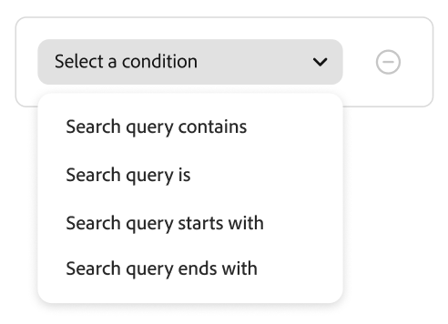

# Skapa och hantera regler

För att skapa en regel är det första steget att använda regelredigeraren för att definiera villkoren i kundens frågetext som utlöser de associerade händelserna. Slutför sedan regelinformationen, testa resultatet och publicera regeln.

## Skapa en regel

1. Gå till _Merchandising_ > **Merchandising Rules** i den vänstra listen.
1. Klicka på **Skapa regel** för att starta regelredigeraren.

I avsnittet **Bygg din regel** definierar du specifika sökvillkor och rankningstyper.

1. Ange ett namn för regeln i fältet **[!UICONTROL Name]**. Alla regelnamn måste vara unika.
1. Ange en beskrivning för regeln i fältet **[!UICONTROL Description]**.
1. I fältet **[!UICONTROL Date range]** anger du det datum eller datumintervall som du vill att regeln ska vara aktiv.
1. I avsnittet **[!UICONTROL Rule applies to]** har du två alternativ: **[!UICONTROL All product listings]** eller **[!UICONTROL Specific conditions]**.

   - **Alla produktlistor** - Detta är i princip standardregeln och används för alla sökfrågor, såvida inte en mer specifik sökfråga har definierats. Du kan bara skapa en standardregel och den får inte innehålla några villkor. Välj den intelligenta rankningstypen och eventuella manuella rankningar som du vill använda för alla standardsökningar.
   - **Specifika villkor** - I nästa avsnitt finns mer information om de typer av villkor som du kan ange för din regel.

### Villkor

Villkor är krav för att utlösa en händelse. En regel kan ha upp till tio villkor och 25 händelser. En standardregel kan inte ha några villkor.

#### Ett villkor

1. Under *Bygg din regel* väljer du det **villkor** som ska uppfyllas och följer instruktionerna för att slutföra satsen.

   - Sökfrågan innehåller - Ange den textsträng som måste finnas i kundens fråga. Inställningen Matcha avgör i vilken grad kundens fråga matchar katalogen. Alternativ:  Valfritt - Alla delar av kundens frågetext kan matcha villkoret. Alla - Alla kundens frågor måste matcha villkoret.
   - Sökfrågan är - Ange en textsträng som exakt matchar kundens fråga. Till exempel:&quot;yoga byxor&quot;. Regler med `Search query is` och Matcha `All` kan bara ha ett villkor.
   - Sökfrågan börjar med - Ange ett tecken eller en textsträng som måste vara i början av kundens fråga.
   - Sökfrågan avslutas med - Ange ett tecken eller en textsträng som måste vara i slutet av kundens fråga.

   Resultaten visas omedelbart i rutan *Testa regeln* och numreras efter prioritet. Du kan använda reglaget *Resultat per rad* i det övre högra hörnet för att ändra antalet produkter i varje rad.

1. Om du vill testa andra frågor ändrar du frågetexten i sökrutan *Testa regeln* och trycker på **Retur**.
Testfönstret återger först frågan från sökrutan Villkor. Men nu återges frågan från testfrågerutan. Testfönstret återger bara en fråga i taget.
1. Om du gillar resultatet kan du uppdatera texten i sökrutan *Villkor*. Klicka sedan var som helst på sidan för att uppdatera resultatet i testfönstret.

#### Flera villkor

1. Om du vill skapa en regel med flera villkor klickar du på **Lägg till villkor**.
En regel kan ha upp till tio villkor. Den logiska operatorn som ansluter till två villkor baseras på den aktuella *Matcha*-inställningen. Som standard är *Matcha* `All` och den logiska operatorn är `AND`.

1. Markera det andra villkoret och ange den obligatoriska frågetexten.

1. Om du vill ändra logiken för regeln ändrar du inställningen **Matcha** för att avgöra hur nära kundens sökvillkor måste matcha frågevillkoret. Ange **Matcha** till något av följande:

   - Valfri - (Standard) Alla logiska operatorer i regeln ställs in på `OR` och resultatet visas i testfönstret.
   - Alla - Alla logiska operatorer i regeln är inställda på `AND` och resultaten visas i testfönstret.

   Värdet *Matcha* avgör den logiska operatorn som används för att koppla flera villkor. Om du ändrar inställningen *Matcha* ändras alla logiska operatorer i regeln. Det går inte att kombinera `AND` och `OR` i samma regel.

   I det här exemplet, i stället för att söka efter &quot;yoga-byxor&quot;, finns det två separata frågor som söker efter &quot;yoga&quot; eller &quot;byxor&quot;. Den här regeln är mindre specifik och utlöses oftare i butiken än i den andra.

1. Om du vill lägga till ett till villkor klickar du på **Lägg till villkor** och upprepar processen.

### Intelligent rankning

Intelligent rankning kombinerar användarbeteenden och webbplatsstatistik för att avgöra produktrankningen.
Butiksägare kan skapa följande typer av rankningsstrategier:

- Mest köpta: Detta rangordnar produkter efter totala inköp per SKU under de senaste 7 dagarna.
- Mest tillagda i kundvagnen - rangordnas efter den totala &quot;Lägg i kundvagnen&quot;-aktiviteten under de senaste 7 dagarna.
- Mest visade: rangordnar det totala antalet visningar per SKU under de senaste 7 dagarna.
- Rekommenderas för dig - Använder datapunkten `viewed-viewed` - Handlare som visade denna SKU tittade också på dessa andra SKU:er.
- Trending: Återgår vid sidvyhändelser under de senaste 72 timmarna för bakgrundshändelser och 24 timmar för förgrundshändelser.
- Ingen: Produkterna beställs efter relevans.

Välj typ av strategi för regeln. Fönstret **Testa regeln** visar det förväntade resultatet.

#### Hur smart rankning fungerar

Intelligent rankning avgör den slutliga produktordningen genom att kombinera två nyckelfaktorer: **textrelevans** och **beteendesignaler**. Genom att förstå hur dessa faktorer interagerar kan du ställa in realistiska förväntningar för sökresultaten.

**Bedömningskomponenter:**

- **Textuell relevans**: Den dominerande faktorn i poängsättningen. Detta mäter hur väl en produkts namn, beskrivning och attribut matchar sökfrågan. Textrelevansspåret är obegränsat (har ingen specifik övre gräns) och påverkas av faktorer som:

   - Hur ofta matchande ord förekommer.
   - Längd (med ord) på produktnamn/beskrivningar.

- **Beteendesignaler**: En avgränsad ökning används ovanpå textrelevansspåret. När du väljer en smart rankningsstrategi som&quot;Mest visade&quot; eller&quot;Mest köpta&quot; får produkter med högre beteendesignaler en fast förstärkning av poängen. Den här ökningen har dock en definierad gräns.

**Varför den mest visade produkten kanske inte visas först:**

Textuell relevans dominerar oftast rankningen eftersom poängen är obegränsade, medan beteendeförbättringar är fasta. Resultatet blir att produkter med stark text ofta matchar produkter med högre engagemangssignaler. Enbart beteendeförbättringar kanske inte kompenserar för stora luckor i textrelevansen. Intelligent rankning åtgärdar detta genom att ta hänsyn till både kvalitet och kundinteraktion, vilket förbättrar den övergripande relevansen. Kvaliteten på textmatchningen är dock fortfarande den primära drivrutinen för rankning.

**Exempel:**

En handlare använder den intelligenta rankningsstrategin&quot;Mest tittat&quot; och söker efter&quot;ljus&quot;. De förväntar sig att produkt-SKU YAN-K-E-512 ska visas högst upp i resultatet eftersom den har det högsta visningsantalet. Andra produkter kan dock klassificeras som högre:

- **Texas Candle** (första position): Har ett kortare, renare produktnamn som skapar ett mycket högt textrelevansresultat. Även om den har färre vyer än YAN-K-E-512 är textmatchningen bättre än beteendeökningen.

- **YAN-K-E-512** (undre position): Trots att den högsta vypercentilen finns i beteendedata som visas mest, genereras ett komplext SKU-baserat namn ett lägre textrelevansvärde. Den fasta beteendeökningen räcker inte till för att överbrygga det här problemet med textrelevans.

Se [sökregler](./best-practice.md#tips-to-optimize-search-rules) om du vill veta mer om hur du kan förbättra produktsökningen med hjälp av regler.

#### Caveats

- Apostrofer och citattecken i frågor kan leda till vissa mindre problem med rankning och relevans på vissa språk.
- För att den intelligenta rankningen ska fungera på rätt sätt måste **sökvikten** för alla attribut som används för sökning eller filtrering (facets) vara `5` eller mindre.

Mer information om hur du anger sökvikter finns i [Metadata API](https://developer.adobe.com/commerce/services/reference/rest/).

### Manuell rankning

**Manuell rankning** är åtgärder som ändrar sökresultaten när definierade villkor uppfylls. En regel kan ha upp till 25 händelser.

- Öka - Flyttar en produkt högre i sökresultaten.
- Bury - Flyttar en SKU nedåt i sökresultaten.
- Fäst en produkt - Produkten visas i den valda positionen på sidan.
- Dölj en produkt - Utesluter en SKU från sökresultaten.

Det enklaste sättet att fästa en produkt är genom att dra och släppa.

1. Klicka och dra en produkt i testfönstret. Dra och släpp den på önskad plats. Fälten Produkt och Placering fylls i automatiskt i rutan Händelser.

Du kan också klicka på nålikonen för att fästa en produkt på dess aktuella plats. Använd snabbmenyn för ellipsen för att fästa överst eller nederst.

>[!NOTE]
>
>Du kan bara fästa produkter som returneras i frågan.

Eller så kan händelser anges manuellt:

1. Under *Händelser* väljer du den **händelse** som ska äga rum när de associerade villkoren uppfylls.

   Välj till exempel `Hide a product`. Ange sedan namnet på den produkt som du vill dölja. Produkter föreslås när du skriver.

1. För flera händelser väljer du andra händelser som du vill ska utlösas när villkoren uppfylls.

### Slutför regeln

1. Granska resultatet av regeln i testfönstret.
1. Om regeln har flera frågor testar du var och en som kan påverkas av regeln.
1. När du är klar klickar du på **Spara och publicera**.

   Regeln läggs till i listan på arbetsytan *Regler*.

1. Även om de aktiva reglerna börjar gälla omedelbart kan du behöva vänta upp till 15 minuter på att de cachelagrade frågeresultaten i butiken ska uppdateras.

>[!NOTE]
>
>Regler och manuellt rankade produkter tillämpas på sökresultaten när standardsorteringsordningen, &quot;Sortera efter: mest relevant&quot; har valts. Om en kund ändrar sorteringsordningen till något som att sortera efter namn eller pris gäller inte längre regler och manuella rankningar.

## Redigera, visa och ta bort regler

Följ de här instruktionerna för att uppdatera egenskaperna för befintliga regler.

### Redigera regel

1. Leta reda på regeln i rutnätet som du vill redigera på arbetsytan för *marknadsföringsregler* och klicka på **Fler** (..) alternativ.
1. Klicka på **Redigera** för att öppna regelredigeraren.
1. Uppdatera villkor, operatorer och händelser efter behov.
1. Uppdatera namn-, start- och slutdatum samt beskrivningsfält efter behov. Alla regelnamn måste vara unika.
1. Testa regeln.
1. Publicera ändringarna.
Regeln läggs till i listan på arbetsytan *Regler*. Även om aktiva regler börjar gälla omedelbart kan det ta upp till 15 minuter innan cachelagrade frågeresultat i butiken uppdateras.

### Visa detaljer

Med det här alternativet kan du snabbt se alla regelparametrar, samtidigt som du behåller tabellen *Regler*.

1. Leta reda på regeln i rutnätet som du vill redigera på arbetsytan för *marknadsföringsregler* och klicka på **Fler** (..) alternativ.
1. Klicka på **Visa information** om du vill visa regelparametrarna.
1. Välj **Redigera** eller **Ta bort**, eller klicka på krysset för att stänga panelen.

### Ta bort regel

1. Leta reda på regeln i rutnätet som du vill redigera på arbetsytan *Regler* och klicka på **Fler** (..) alternativ.
1. Klicka på **Ta bort**.

## Fältbeskrivningar

### Villkor (om)

| Villkor | Beskrivning |
|--- |--- |
| Sökfrågan innehåller | Ett tecken eller en textsträng som ingår i kundens fråga. Köparens fråga behöver bara matcha en enda karaktär för att uppfylla det här villkoret. |
| Sökfrågan är | Ett tecken eller en textsträng som exakt matchar kundens fråga. Komplexa frågor med flera villkor kan inte disponeras när det här villkoret används. |
| Sökfrågan börjar med | Köparens fråga börjar med det här tecknet eller textsträngen. |
| Sökfrågan slutar med | Köparens fråga avslutas med det här tecknet eller textsträngen. |

### Logiska operatorer

| Operator | Beskrivning |
|--- |--- |
| ELLER | (Standard) Den logiska operatorn `OR` jämför två villkor och uppfyller kraven för att utlösa en händelse om minst ett villkor är sant. |
| OCH | Den logiska operatorn `AND` jämför två villkor och uppfyller kraven för att utlösa en händelse om båda villkoren är uppfyllda. |

### Matcha operatorer

| Operator | Beskrivning |
|--- |--- |
| Alla | Ändrar alla logiska operatorer i regeln till `OR` och returnerar uppsättningen med matchande produkter. |
| Alla | Ändrar alla logiska operatorer i regeln till `AND` och returnerar uppsättningen med matchande produkter. |

### Manuell rankning

| Händelse | Beskrivning |
|--- |--- |
| Öka | Flyttar en SKU eller ett intervall med SKU:er högre i sökresultaten. Var och en markeras med ett&quot;boosted&quot; preview badge i testsökresultaten. |
| Bury | Flyttar en SKU eller ett intervall med SKU:er nedåt i sökresultaten. Var och en markeras med ett&quot;nedgrävt&quot; förhandsvisningsmärke i testsökresultaten. |
| Fäst en produkt | Kopplar en enskild SKU till en viss plats i sökresultaten. Produkten är markerad med ett&quot;fäst&quot; förhandsvisningsmärke i testsökresultaten. |
| Dölj en produkt | Utesluter en SKU, eller ett intervall med SKU:er, från sökresultatet. |

### Information

| Fält | Beskrivning |
|--- |--- |
| Namn | Regelns namn. Regelnamn måste vara unika. |
| Regeltyp | Standard eller Fråga. Standard används för alla regler, såvida inte en mer specifik frågeregel har definierats. |
| Startdatum | Regelns startdatum, om det är schemalagt. |
| Slutdatum | Regelns slutdatum, om det är schemalagt. |
| Beskrivning | En kort beskrivning av regeln. |
