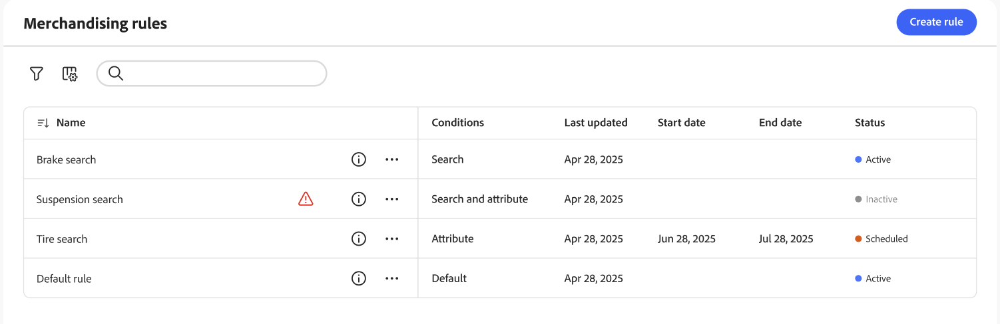

# Merchandising Rules Workspace

Arbetsytan *Regler för marknadsföring* visar det aktuella urvalet av regler och deras status, och ger tillgång till verktyg som du behöver för att skapa och hantera regler. Du kan omforma regler till alla [katalogvyer](../../setup/catalog-view.md) (globala) eller till en enda katalogvy. Se [Välj katalogvy](#select-catalog-view) för hur du filtrerar efter katalogvy och skapar regler per katalogvy. Från arbetsytan kan du:

- Sök efter regler
- Visa regelinformation
- Aktivera/inaktivera regler
- Ta bort regler
- Åtkomst till regelredigeraren

## Visa/dölj kolumner

1. Klicka på **Visa/dölj**  i det övre högra hörnet.

1. Gör något av följande på menyn:

   - Om du vill visa en dold kolumn klickar du på ett kolumnnamn utan bockmarkering.
   - Om du vill dölja en synlig kolumn klickar du på ett kolumnnamn med en bock.

## Filtrera regler efter status

1. Om din butik har många regler kan du filtrera reglerna efter status för att förkorta listan. Som standard visas alla regler i listan Regler.

1. Om du bara vill visa regler med en viss statusinställning anger du **Status** till något av följande:

   - Alla
   - Aktiv
   - Inaktiv
   - Schemalagd
   - Utkast

   Du kan också filtrera efter **Villkor**, **Startdatum**, **Slutdatum** och **Senast uppdaterad**.

## Visa detaljer

På informationspanelen visas regelnamn, status, villkor och händelser, start- och slutdatum, beskrivning och datum för senaste redigering. Regler kan aktiveras, redigeras och tas bort från informationspanelen.

1. Leta reda på regeln i rutnätet som du vill visa på arbetsytan för *marknadsföringsregler* och klicka på ikonen ().

   Du kan göra något av följande på menyn:

   - Redigera regel
   - Ta bort regel
   - Aktivera/inaktivera regel

## Kolumnbeskrivningar

| Kolumn | Beskrivning |
|--- |--- |
| Namn | Regelns namn. |
| Senast uppdaterad | Det datum då regeln senast uppdaterades. |
| Startdatum | Startdatumet för en schemalagd regel. |
| Slutdatum | Slutdatumet för en schemalagd regel. |
| Status | Den färgkodade statusen anger regelns aktuella läge. Använd statuskontrollen ovanför rutnätet för att filtrera regler efter status. Värden: All status - Visar alla regler oavsett status. Aktiv (blå) - Visar endast aktiva regler. Schemalagd (Orange) - visar endast schemalagda regler. Inaktiv (grå) - visar endast inaktiva regler. |

## Kontroller

| Kontroll | Beskrivning |
|--- |--- |
| Lägg till regel | Öppnar [regelredigeraren](add.md). |
| Katalogvy | Filtrerar tabellen efter regler som gäller för den valda katalogvyn. Anger också omfånget när du [skapar en regel](add.md). Alternativ: *Alla vyer* eller en specifik [katalogvy](../../setup/catalog-view.md). Se [Välj katalogvy](#select-catalog-view). |
| Status | Filtrerar listan med regler efter status. Alternativ: Alla, Aktiva, Inaktiva, Schemalagda |
|  | Anger vilka kolumner som visas i rutnätet. Alternativ: Senast uppdaterad, Startdatum, Slutdatum, Status |
| Sök | Söker efter en regel efter fullständigt namn eller partiell matchning. |
|  | Visar en meny med fler åtgärder som kan tillämpas på den valda regeln. Alternativ: Redigera, Visa information, Ta bort |

## Regelinformation

| Fält | Beskrivning |
|--- |--- |
| Status | Regelns aktuella status. |
| Villkor | Sökfrågan som beskriver villkoren som är kopplade till regeln. |
| Startdatum | Det datum då regeln träder i kraft, om den är schemalagd. |
| Slutdatum | Det datum då regeln förfaller, om den är schemalagd. |
| Beskrivning | En kort beskrivning av regeln. |
| Senast uppdaterad | Datum och tid då regeln senast uppdaterades. |
| Aktiverad | En kontroll som ändrar regelns status. Alternativ: Aktiverad/Inaktiverad |

## Välj katalogvy

>[!IMPORTANT]
>
>Den här funktionen är för närvarande i betaversion.

**[!UICONTROL Catalog view]**-väljaren på sidan Merchandising Rules gör två saker:

1. **Filtrerar tabellen** - Visar endast regler (och deras information) som gäller för den valda katalogvyn.
1. **Anger omfånget för nya regler** - När du [skapar en regel](add.md) används den valda katalogvyn som regelns omfång. Alternativen är *Alla vyer* eller en specifik [katalogvy](../../setup/catalog-view.md).

   - **Alla vyer** - Regeln gäller för alla katalogvyer. Sökning och rankning fungerar likadant i alla butiker där katalogen används.
   - **Katalogvy** - Regeln gäller bara för den valda katalogvyn (till exempel en butiksvy, region, återförsäljare eller varumärke). Använd detta när olika katalogvyer behöver olika försäljningslogik.

Mer information om hur du skapar en regel och anger dess omfång finns i [Skapa och hantera regler](add.md).

### Varför skapa en regel per katalogvy?

Skapa regler per katalogvy när olika butiker, regioner eller varumärken behöver olika sök- och rankningsbeteenden. Exempel:

- **Återförsäljar- eller distributörsnätverk** - Varje återförsäljare har en egen katalogvy. Du vill ha olika fasta, boostrade eller nedgrävda produkter per återförsäljare.
- **Flera regioner** - separata katalogvyer för EU, USA eller andra regioner med regionspecifika försäljningsregler.
- **Flera varumärken** - Varje varumärke har en egen katalogvy och du vill ha varumärkesspecifika regler (t.ex. olika standardrankningar eller kampanjprodukter per varumärke).

Beteendedata som används för [intelligent rankning](add.md#intelligent-ranking) (som mest visade, mest köpta, trending) beräknas som standard per katalogvy. Regler som använder intelligent rankning återspeglar därför katalogvyns kundbeteende. När ditt konto har ett stort antal katalogvyer kan systemet samla in beteendedata globalt för att behålla prestandan. I så fall kan rankningen påverkas mer av katalogvyer med hög trafik och relevansen för visningar med lägre trafik kan minskas. Aktuella begränsningar finns i [Gränser och gränser](../../boundaries-limits.md).

### Så här ställer du in en regel per katalogvy

1. Använd listrutan *på arbetsytan* Marknadsföringsregler **[!UICONTROL Catalog view]** för att välja katalogvyn där regeln ska tillämpas.
1. Klicka på **[!UICONTROL Create rule]**.

   Regeln som du skapar omfattar den valda katalogvyn.
1. Skapa din regel i [regelredigeraren](add.md).

   I redigeraren definierar du villkor, händelser och information. Regeln gäller bara sökresultat i den katalogvyn.

Du kan inte ändra katalogvyn (omfånget) för en regel efter att den har skapats. Om du vill använda liknande logik i en annan katalogvy skapar du en ny regel och markerar katalogvyn innan du skapar den.
