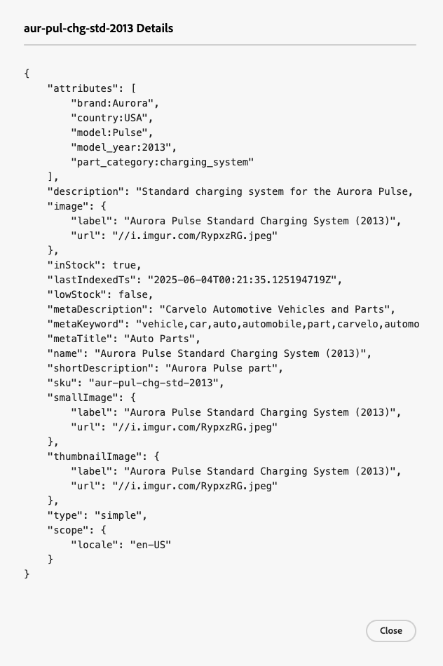

# Datasynkronisering

På sidan **Datasynkronisering** visas en översikt över synkroniseringsstatusen för produktdata som överförts från din datakälla (din befintliga Commerce-katalog, PIM-system, ERP-system (Enterprise Resource Planning) och så vidare) till [!DNL Adobe Commerce Optimizer].

Sidan **Datasynkronisering** ger värdefulla insikter om tillgängligheten av produktdata för din butik, så att den snabbt kan visas för dina kunder.

Sidan **Datasynkronisering** finns på *Inställningar* > **Datasynkronisering**.

Sidan **Datasynkronisering** innehåller följande fält:

| Fält | Beskrivning |
|--- |--- |
| Katalogkälla | Specifik språkinställning för synkroniserade data. |
| [!DNL Catalog Service] | Visar den senaste synkroniseringsuppdateringen, det totala antalet mottagna produkter, ett sökfält och en tabell över synkroniserade produkter för [!DNL Catalog Service]. |
| Produktidentifiering | Visar den senaste synkroniseringsuppdateringen, det totala antalet mottagna produkter, ett sökfält och en tabell över synkroniserade produkter för sökning. |
| Rekommendationer | Visar den senaste synkroniseringsuppdateringen, det totala antalet mottagna produkter, ett sökfält och en tabell över synkroniserade produkter för rekommendationer. |
| Produkter som tagits emot under de senaste tre timmarna | Visar antalet produkter som har överförts från katalogkällan till Adobe Commerce Optimizer under de senaste tre timmarna. Om du gör ovanliga uppdateringar av katalogen är det här värdet ofta noll. |
| Totalt antal produkter i katalog | Återger det totala antalet katalogprodukter som är tillgängliga för Adobe Commerce Optimizer. |
| Synkroniserade produkter | Innehåller information om de produkter som synkroniseras med Adobe Commerce Optimizer. Som standard sorteras den här tabellen efter&quot;Senast uppdaterad&quot;. Om du vill hitta en viss produkt använder du fältet **[!UICONTROL Search by Name or SKU]**. |

## Lista över synkroniserade produkter

Om du vill visa information om en synkroniserad produkt i JSON-format klickar du på kodikonen  på produktraden i tabellen med synkroniserade produkter.

## Synkronisera om katalogdata

Om du inte ser specifika produkter på sidan **Datasynkronisering** måste du initiera en omsynkronisering från det överordnade systemet. Tänk dock på att en omsynkronisering kan öka belastningen på maskinvaruresurserna. Du kan dock behöva synkronisera om katalogen i följande scenarier:

- När du gör stora ändringar i produktkatalogen, till exempel lägger till nya produkter, uppdaterar produktinformation eller ändrar kategorier

- Om du märker några avvikelser eller prestandaproblem när du visar produktdata i dina butiker

>[!IMPORTANT]
>
>Den tid det tar att slutföra synkroniseringen varierar beroende på katalogstorleken och den datamängd som har uppdaterats.
