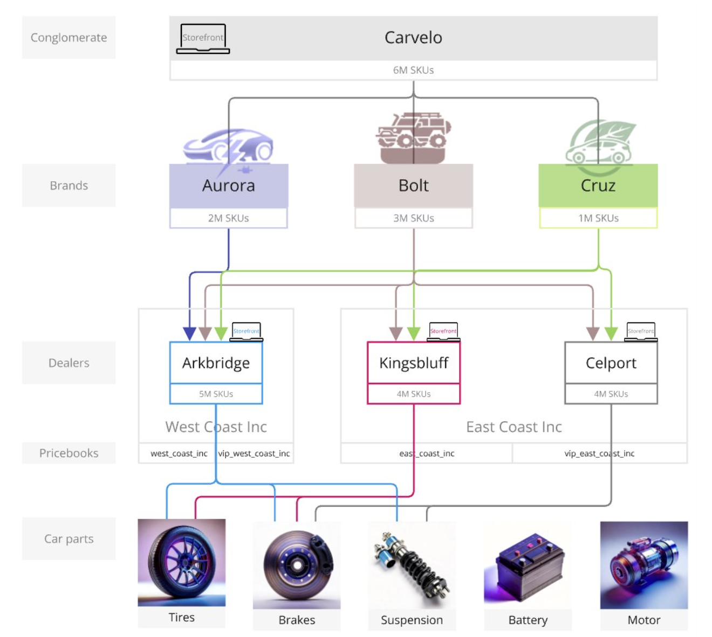

# Handläggaren Storefront och katalogadministratören - från början till slut

Detta användningsexempel bygger på ett fiktivt bilkonglomerat som kallas Carvelo Automobilis, som har en komplex driftskonfiguration. Det visar hur du använder [!DNL Adobe Commerce Optimizer] för att hantera en katalog som stöder flera varumärken, återförsäljare och prisböcker samtidigt som du levererar en anpassad butiksupplevelse.

## Förutsättningar

Det här användningsexemplet är utformat för administratörer och utvecklare som vill lära sig hur du konfigurerar en butik och hanterar en katalog med [!DNL Adobe Commerce Optimizer]. Du förutsätts ha en grundläggande förståelse för [!DNL Adobe Commerce Optimizer] och dess funktioner.

**Beräknad tid för slutförande:** 45-60 minuter

### Nödvändig konfiguration

Innan du börjar den här självstudiekursen måste du se till att du har följande krav:

- **Adobe Commerce Optimizer Instance**
   - Åtkomst till en testinstans i Cloud Manager
   - Se [Kom igång](../get-started.md) för installationsanvisningar

- **Användarbehörigheter**
   - Administratörsåtkomst till Adobe Admin Console
   - Se [Användarhantering](../user-management.md) för kontokonfiguration
   - Om du inte har tillgång till tjänsten kontaktar du Adobe.

- **Exempeldata**
   - Carvelo Automomobile-katalogdata som har lästs in i din instans
   - Följ instruktionerna i [databasen för datainhämtning från exempelkatalog](https://github.com/adobe-commerce/aco-sample-catalog-data-ingestion)
   - Du kan ta bort exempeldata efter slutförandet med det inkluderade `reset.js`-skriptet

- **StoreFront Environment**
   - Lokal utvecklingsmiljö med Node.js
   - Layoutprojektet Storefront klonas och konfigureras
   - Mer information finns i [Inställningar för Storefront](../storefront.md)

## Kom så börjar vi

I det här fallet arbetar du med följande:

1. [!DNL Adobe Commerce Optimizer]-gränssnitt - Konfigurera katalogvyer och principer för att hantera den komplexa katalogens driftsinställning för Carvelos användningsfall.

1. Commerce Storefront - Återge butiken med exempelkatalogdata som lästs in i [!DNL Adobe Commerce Optimizer]-instansen och konfigurationsfilerna för Commerce Storefront, `fstab.yaml` och `config.json`.

>[!NOTE]
>
> Lär dig mer om konfigurationsfiler för butiker genom att läsa avsnittet [Utforska standardmallen](https://experienceleague.adobe.com/developer/commerce/storefront/get-started/boilerplate-project/?lang=sv-SE) i dokumentationen för Adobe Commerce Storefront.

### ‌ viktiga uppgifter

I slutet av den här artikeln ska du:

- Lär dig grunderna i [!DNL Adobe Commerce Optimizer] med dess prestanda och skalbara katalogdatamodell.
- Läs om hur katalogdatamodellen integreras med plattformsoberoende butikskomponenter som byggts av Adobe.
- Lär dig hur du använder katalogvyer och principer från Adobe Commerce Optimizer för att skapa anpassade katalogvyer och dataåtkomstfilter och skickar data till en Adobe Commerce-butik som drivs av Edge Delivery.

## Affärsscenario - Carvelo Automoble

Carvelo Automomobile är ett fiktivt bilkonglomerat med en komplex driftskonfiguration.



I det här diagrammet ser du att Carvelo säljer bilprodukter från tre varumärken. Varje varumärke är ett eget underordnat företag:

- Aurora (elfordon)
- Bult (SUV)
- Cruz (hybrid)

Den säljer dessa varumärken genom tre återförsäljare:

- Arkbridge
- Kingsbluff
- Celport

Dessa återförsäljare tillhör två olika moderbolag:

- West Coast Inc. (Arkbridge)
- East Coast Inc. (Kingsblå, Celport)

Varje företag har två prislistor som används för att sälja produkter till ett visst pris för olika kunder (bas, VIP).

- `west_coast_inc` och `vip_west_coast_inc`
- `east_coast_inc` och `vip_east_coast_inc`

Som du ser är detta ett mycket komplext affärsexempel. Med [!DNL Adobe Commerce Optimizer] kan en handlare stödja en komplex affärsstruktur genom att använda en enda baskatalog för att syndikera data utan katalogduplicering, skala prisböcker (30 kB+ prisböcker) och leverera alla dessa data till en Edge Delivery Services-butik.

Nu när du har en översikt över användningsfallet för företag kan du göra följande:

>[!BEGINSHADEBOX]

Carvelo vill sälja delar av sina tre varumärken (Aurora, Bolt och Cruz) genom de olika återförsäljarna (Arkbridge, Kingsbluff och Celport). Carvelo vill se till att återförsäljarna bara har tillgång till rätt delar och priser enligt sina respektive licensavtal.

I slutändan har Carvelo två viktiga mål:

1. Upprätthåll en&quot;global&quot; webbplats som har alla SKU:er för alla tre varumärkena.
1. Tillhandahåll en väg för återförsäljare att skapa egna butiker baserat på unik SKU-synlighet och priser för varje SKU för varje återförsäljare. Allt samtidigt som du använder en enda baskatalog, vilket eliminerar katalogduplicering.

>[!ENDSHADEBOX]

## &#x200B;1. Få åtkomst till instansen [!DNL Adobe Commerce Optimizer]

Navigera till URL:en för det Commerce Optimizer-program som är förkonfigurerat med exempeldata. Du kan hitta URL:en i Commerce Cloud Manager från instansinformationen för ditt Commerce Optimizer-projekt eller hämta den från systemadministratören. (Se [Åtkomst till en instans](../get-started.md#access-an-instance).)

När du startar [!DNL Adobe Commerce Optimizer] ser du följande:

![[!DNL Adobe Commerce Optimizer]-gränssnitt](../assets/user-interface.png)

>[!NOTE]
>
>Läs artikeln [overview](../overview.md) om du vill veta mer om viktiga komponenter i användargränssnittet i [!DNL Adobe Commerce Optimizer].

I den vänstra navigeringen expanderar du avsnittet _Store setup_ och klickar på **[!UICONTROL Catalog views]**. Observera att återförsäljarna av Arkbridge och Kingsbluff redan har katalogvyer:


>[!NOTE]
>
>Du kan ignorera katalogvyn **Global** för tillfället.

Klicka på informationsikonen om du vill granska katalogvyinformationen.

Arkbridge har följande policyer:

- Varumärke
- Modell
- West Coast Inc-varumärken
- Arkbridge-delkategorier

Kingsbluff har följande policyer:

- Varumärke
- Modell
- East Coast Inc-varumärken
- Kingsbluff - delkategorier

I nästa avsnitt skapar du en katalogvy och principer för Celport-återförsäljaren.

## &#x200B;2. Skapa en policy- och katalogvy

Carvelos handelschef måste skapa en ny butik för en återförsäljare som heter *Celport* som tillhör företaget *East Coast Inc*. Celport säljer bromsar och suspensioner för varumärkena Bolt och Cruz.


Med [!DNL Adobe Commerce Optimizer] kan e-handelshanteraren:

1. Skapa en ny policy som heter *Celport part categories* för Celport så att bara broms- och suspensionsdelar säljs.
1. Skapa en ny katalogvy för Celport-butiken.

   I den här katalogvyn används din nya policy *Celport part-kategorier* och befintliga *East Coast Inc-varumärken* för att se till att Celport bara kan sälja varumärken som Bolt och Cruz som en del av avtalet med East Coast Inc. I Celport-katalogvyn används prisboken `east_coast_inc` för att stödja produktprisscheman som är anpassade till varumärkeslicensavtal.
1. Uppdatera konfigurationen för e-handelslager så att data från katalogvyn i Celport som du har skapat används.

I slutet av det här avsnittet kommer Celport att vara igång och redo att sälja Carvelos produkter.

### Skapa en profil

Låt oss skapa en ny policy som kallas *Celport-delkategorier* för att filtrera SKU:er som Celport-återförsäljaren säljer, som innehåller broms- och suspensionsdelar.

1. Utöka avsnittet _Store setup_ i den vänstra listen och klicka på **[!UICONTROL Policies]**.

1. Klicka på **[!UICONTROL Create Policy]**.

   En ny sida visas där profilinformationen läggs till.

1. Lägg till nödvändig information:

   **Namn** = *Exportera delkategorier*

1. Klicka på **[!UICONTROL Add Filter]**.

   En dialogruta visas där du kan lägga till filterinformation.

1. Lägg till filterinformation:

   - **Attribut** = *part_category*
   - **Operator** = **IN**
   - **Värde Source** = **STATIC**
   - **Värde** = *bromsar*, *suspension*

   >[!IMPORTANT]
   >
   >Kontrollera att det attributnamn du anger exakt matchar SKU-attributnamnet i katalogen.

   Mer information om skillnaden mellan en STATIC- och TRIGGER-värdekälla finns i [värdekälltyper](../setup/policies.md#value-source-types).

1. Klicka på **[!UICONTROL Filter details]** i dialogrutan **[!UICONTROL Save]**.

1. Om du vill aktivera filtret som du nyss skapade klickar du på åtgärdspunkterna (...) och väljer **Aktivera**.

1. Klicka på **[!UICONTROL Save]**.

   >[!NOTE]
   >
   >Om knappen **[!UICONTROL Save]** inte är aktiv (blå) kanske du saknar principnamnet. Klicka på pennikonen bredvid *Ny profil* för att lägga till den.

1. Gå tillbaka till listan med profiler genom att klicka på bakåtpilen.

   Din nya princip för *Delkategorier för att exportera* visas i listan.

**Så här verifierar du att det här steget har slutförts korrekt:**

- Profilen visas i principlistan
- Principstatusen visas som aktiverad (grön indikator)
- Filterinformationen visar &quot;part_category IN (bromsar, suspension)&quot;
- Principnamnet är &quot;Celport Part Categories&quot;

### Skapa en katalogvy

Skapa en ny katalogvy för *Celport*-återförsäljaren och länka följande profiler: *East Coast Inc-varumärken* och *Celport Part Categories*.

1. Utöka avsnittet _Store setup_ i den vänstra listen och klicka på **[!UICONTROL Catalog views]**.

   Observera de befintliga katalogvyerna: *Arkbridge*, *Kingsbluff* och *Global*.

   

1. Klicka på **[!UICONTROL Add catalog view]**.

1. Fyll i katalogvyinformation:

   - **Namn** = *Cirkapp*
   - **Katalogkällor** = *en-US*
   - **Profiler** (använd listruta) = *East Coast Inc-varumärken*; *Exportera delkategorier*; *Märke*; *Modell*                          
1. Klicka på **[!UICONTROL Add]** för att skapa katalogvyn.

   Sidan Katalog visar uppdateras för att visa den nya katalogvyn.

   

1. Hämta ID:t för katalogvyn i Celport.

   Klicka på informationsikonen för vyn för att exportera katalog på sidan **Katalogvyer**.

   

   Kopiera och spara katalogvyns ID. Du behöver detta ID när du uppdaterar butikskonfigurationen för att kunna leverera data till din nya Celport-katalog.

   **Så här verifierar du att det här steget har slutförts korrekt:**
   - Katalogvyns namn är &quot;Celport&quot;
   - Katalogvyn visar fyra associerade principer
   - Katalogvyns ID visas och kan kopieras
   - Katalogkällan visar &quot;en-US&quot;

När du har skapat katalogvyn och tillhörande profiler är nästa steg att konfigurera butiken så att den använder din nya Celport-katalog.

## &#x200B;3. Uppdatera din butik

Den sista delen av den här självstudien är att uppdatera butiken som [du redan har skapat](#prerequisite) för att leverera data till den nya Celport-katalogen. I det här avsnittet ersätter du katalogvyns ID i konfigurationsfilen för butiken med katalogvyns ID för Celport.

1. I den lokala utvecklingsmiljön öppnar du den mapp där du klonade GitHub-databasen med konfigurationsfilerna för lagerplatserna.

1. Öppna filen `config.json` i mappens rotkatalog.

   +++config.json-kod

   ```json
   {
    "public": {
      "default": {
      "commerce-core-endpoint": "https://www.aemshop.net/graphql",
      "commerce-endpoint": "https://na1-sandbox.api.commerce.adobe.com/Fwus6kdpvYCmeEdcCX7PZg/graphql",
      "headers": {
         "cs": {
            "ac-catalog-view-id": "9ced53d7-35a6-40c5-830e-8288c00985ad",
            "ac-price-book-id": "west_coast_inc",
            "ac-source-locale": "en-US"
           }
         },
         "analytics": {
            "base-currency-code": "USD",
            "environment": "Production",
            "store-id": 1,
            "store-name": "ACO Demo",
            "store-url": "https://www.aemshop.net",
            "store-view-id": 1,
            "store-view-name": "Default Store View",
            "website-id": 1,
            "website-name": "Main Website"
          }
       }
      }
   }
   ```

   Observera att följande värden finns i katalogvyhuvudet:

   - `commerce-endpoint`: `"https://na1-sandbox.api.commerce.adobe.com/Fwus6kdpvYCmeEdcCX7PZg/graphql"`
   - `ac-catalog-view-id`:`"9ced53d7-35a6-40c5-830e-8288c00985ad"`
   - `ac-price-book-id`: `"west_coast_inc"`
   - `ac-source-locale`: `"en-US"`

1. I värdet `commerce-endpoint` ersätter du klientorganisations-ID:t i URL:en med URL:en för din [!DNL Adobe Commerce Optimizer]-instans.

   Du hittar klient-ID:t i URL:en för Commerce Optimizer-gränssnittet. I följande URL är till exempel klient-ID `XDevkG9W6UbwgQmPn995r3`.

   ```text
   https://experience.adobe.com/#/@commerceprojectbeacon/in:XDevkG9W6UbwgQmPn995r3/commerce-optimizer-studio/catalog
   ```

1. Ersätt `ac-catalog-view-id`-värdet med det ID för katalogvyn som du kopierade tidigare.

1. Ersätt värdet `ac-price-book-id` med `"east_coast_inc"`.

   När du har gjort dessa ändringar bör `config.json`-filen se ut ungefär så här, med platshållarna `ACO-tenant-id` och `celport-catalog-view-id` ersatta med dina värden:

   ```json
   {
     "public": {
        "default": {
        "commerce-core-endpoint": "https://www.aemshop.net/graphql",
        "commerce-endpoint": "https://na1-sandbox.api.commerce.adobe.com/{{ACO-tenant-id}}/graphql",
        "headers": {
            "cs": {
                "ac-catalog-view-id": "{{celport-catalog-view-id}}",
                "ac-price-book-id": "east_coast_inc",
                "ac-source-locale": "en-US"
              }
            },
            "analytics": {
                "base-currency-code": "USD",
                "environment": "Production",
                "store-id": 1,
                "store-name": "ACO Demo",
                "store-url": "https://www.aemshop.net",
                "store-view-id": 1,
                "store-view-name": "Default Store View",
                "website-id": 1,
                "website-name": "Main Website"
             }
         }
     }
   }
   ```

1. Spara filen.

   När du sparar ändringarna uppdaterar du katalogkonfigurationen så att den använder Carvelo-katalogvyn, som har konfigurerats att endast sälja broms- och suspensionsdelar.

## &#x200B;4. Förhandsgranska butiken

Nu när du har uppdaterat butikskonfigurationen så att den använder katalogvyn i Celport kan du förhandsgranska butiken för att se hur den återger katalogdata.

1. Starta butiken för att visa den Celport-specifika katalogupplevelse som har skapats i din storefront-konfiguration.

   1. Från terminalfönstret i IDE-miljön startar du den lokala förhandsgranskningen i butiken.

      ```shell
      npm start
      ```

      Webbläsaren öppnas för den lokala utvecklingsförhandsgranskningen på `http://localhost:3000`.

      Om kommandot misslyckas eller om webbläsaren inte öppnas går du igenom [instruktionerna för lokal utveckling](../storefront.md) i installationsavsnittet för Storefront.

1. Sök efter `brakes` i webbläsaren och tryck på **Retur**.

   Lagerfronten uppdateras för att visa sidan med produktlistan med bromsdelarna.

   

   Klicka på en bild av en bromsdel för att visa produktinformationen med prisinformation och notera produktprisinformationen.

1. Sök efter `tires`, som är en annan delkategori som är tillgänglig i användningsfalldata för din [!DNL Adobe Commerce Optimizer]-instans.

   

   Observera att inga resultat returneras. Detta beror på att Celport-katalogvyn har konfigurerats så att endast broms- och upphängningsdelar säljs.

1. Experimentera med att uppdatera konfigurationsfilen för butiken (`config.json`).

   1. Ändra värdena för `ac-catalog-view-id` och `ac-price-book`.

   Du kan till exempel ändra katalogvyns ID till Kingsbluff-katalogvyn och prisbokens ID till `east_coast_inc`. Du kan se vilka kategorier som är tillgängliga för Kingsbluff genom att granska principen för *Kingsbluff-delen*.

   1. Spara filen.

      När du sparar filen uppdateras den lokala förhandsvisningen i butiken automatiskt.

   1. Förhandsgranska ändringarna i webbläsaren genom att använda sökfunktionen för att hitta däckdelar.

      Lägg märke till de olika tillgängliga deltyperna och observera priserna som tilldelats katalogvyn Kingsbluff.

   Experimenten visar på flexibiliteten i Adobe Commerce Optimizer - du kan snabbt växla mellan olika katalogvyer och prisböcker och skapa anpassade shoppingupplevelser för olika målgrupper utan att behöva duplicera katalogdata.

## Felsökning

Om du stöter på problem under kursen kan du prova med följande lösningar:

### Problem med att skapa profiler

**Problem:** Knappen Spara är inte aktiv

- **Lösning:** Kontrollera att principnamnet har angetts och att alla obligatoriska fält har fyllts i

**Problem:** Filtret fungerar inte som förväntat

- **Lösning:** Kontrollera att attributnamnet exakt matchar SKU-attributet i din katalog

### Problem i katalogvyn

**Problem:** Katalogvyn visas inte i listan

- **Lösning:** Kontrollera att alla associerade principer är aktiverade och korrekt konfigurerade

### Konfigurationsproblem för Storefront

**Problem:** Storefront läses inte in

- **Lösning:** Kontrollera att ditt klient-ID och katalogvisnings-ID är korrekt angivna i filen config.json

**Problem:** Inga produkter visas

- **Lösning:** Kontrollera att prisbokens ID matchar det som finns i din Adobe Commerce Optimizer-instans

**Problem:** Sökningen returnerar inga resultat

- **Lösning:** Bekräfta att katalogvyprinciperna tillåter den sökta produktkategorin

Mer hjälp finns i [Adobe Commerce Optimizer-dokumentationen](../overview.md) eller kontakta Adobe support.

## Sammanfattning

I den här självstudiekursen kan du:

- Skapade en ny policy för att filtrera produktkategorier för Celport-återförsäljaren
- Ställ in en katalogvy med flera profiler för att styra produktsynlighet
- Konfigurerade en butik för att använda den nya katalogvyn
- Verifierade konfigurationen genom att testa produktsynlighet och priser

## Nästa steg

Så här fortsätter du lära dig om Adobe Commerce Optimizer:

- Utforska [försäljningsfunktionerna](../merchandising/overview.md) för att anpassa shoppingupplevelsen
- Läs om [avancerade principkonfigurationer](../setup/policies.md)
- Konfigurera [ytterligare katalogvyer](../setup/catalog-view.md) för andra leverantörer
- Granska [API-dokumentationen](https://developer.adobe.com/commerce/services/optimizer/) för programmatisk kataloghantering
- Lär dig hur du konfigurerar instickskomponenter för din Edge Delivery Services-butik för att skapa anpassade butiksupplevelser för produktupptäckt, rekommendationer och andra butiksfunktioner. Se [dokumentationen för Storefront](https://experienceleague.adobe.com/developer/commerce/storefront/dropins/all/introduction/?lang=sv-SE)
