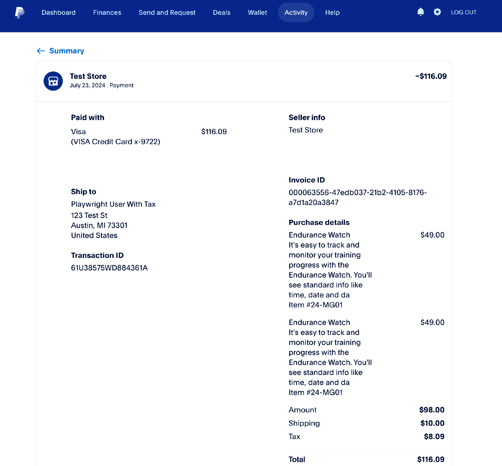
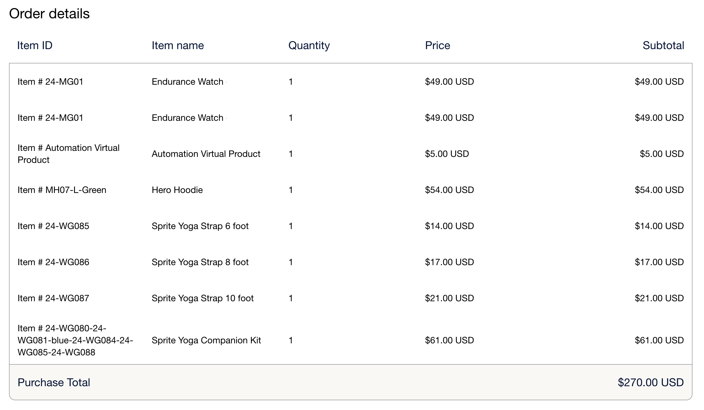

# Radobjekt för [!DNL Payment Services]

Radobjekt för [!DNL Payment Services] är de objekt som ingår i en order. De här radobjekten innehåller information som:

* Produktinformation
* Kvantitet
* Pris (inklusive skatter, rabatter och annan relevant information)

Den här informationen är användbar för kundservice, orderhantering och korrekt fakturering.

## Konfigurera radartiklar

Radobjekt aktiveras som standard för [!DNL Payment Services]. Konfigurera:

1. Navigera till _>_ > **[!UICONTROL Stores]** på sidofältet _[!UICONTROL Settings]_&#x200B;Admin **[!UICONTROL Configuration]**.

1. Gå till **[!UICONTROL Sales]** och välj **[!UICONTROL Payment Methods]**.

1. Expandera avsnittet _[!UICONTROL FEATURED ADOBE PAYMENT SOLUTION]_.

1. Expandera avsnittet _[!UICONTROL Payment Services]_&#x200B;i avsnittet&#x200B;_[!UICONTROL Line Items]_.

1. För **[!UICONTROL Line Items Enabled]** väljer du `Yes` om du vill aktivera (standard) eller `No` om du vill inaktivera radobjekt.

1. Klicka på **[!UICONTROL Save Config]** om du vill spara ändringarna.

>[!IMPORTANT]
>
> Om du har tillägg från tredje part som lägger till anpassade avgifter (till exempel hanteringsavgifter) i dina order kan du behöva inaktivera radartiklar. [!DNL Payment Services] beräknar radobjekt baserat på Commerce standardkomponenter (artiklar, moms, frakt och rabatter). Tredjepartsavgifter som inte känns igen av [!DNL Payment Services] kan orsaka en felmatchning mellan radartikelsumman och ordersumman, vilket kan förhindra att utcheckningen slutförs.

## Visa radartiklar

Så här visar du radobjekt:

1. Navigera till din [PayPal-kontrollpanel](https://www.paypal.com/merchant/){target=_blank}.

1. Klicka på **Aktivitet** > **Alla transaktioner**.

1. Markera önskad ordning och visa radobjekten:

   > Exempel på radartiklar i butikens kontrollpanel

   {width="500" zoomable="yes"}

## Attribut för radobjekt

Radobjekt genereras när beställningen placeras via Adobe Commerce och information skickas till PayPal, med följande attribut:

| Attribut | Datatyp | Beskrivning |
| --- | --- | --- |
| `name` | Sträng! | Objektnamnet. Om en artikel har mer än en rad på grund av flera kvantiteter eller en momsavrundningsutleverans, förblir artikelnamnet detsamma för alla rader, men det visade priset kan variera något på grund av avrundning. |
| `unit_amount` | Objekt! | Artikelpris eller pris per enhet. Innehåller följande attribut: `currency_code` och `value`. |
| `tax` | Objekt | Artikelmoms för varje enhet. Innehåller följande attribut: `currency_code` och `value`. |
| `quantity` | Sträng! | Artikelkvantiteten. Det blir ett heltal. |
| `description` | Sträng | Den detaljerade artikelbeskrivningen. |
| `sku` | Sträng | Lagerhållningsenheten (eller SKU) för artikeln. |
| `url` | Sträng | `URL` till det objekt som ska köpas. Synligt för köpare och används i köpupplevelser. |
| `upc` | Objekt | The Universal Product Code (eller UPC) of the item. |
| `category` | Sträng | Artikelkategoritypen. |

### `unit_amount` attribut

Objektet `unit_amount` innehåller följande attribut:

| Attribut | Datatyp | Beskrivning |
| --- | --- | --- |
| `currency_code` | Sträng! | Den [ISO-4217-valutakod &#x200B;](https://developer.paypal.com/api/rest/reference/currency-codes/) med tre tecken som identifierar valutan. |
| `value` | Sträng! | Anger artikelns värde. `currency_code` avgör antalet decimaler som krävs, om sådana finns. |

### `tax` attribut

Objektet `tax` innehåller följande attribut:

| Attribut | Datatyp | Beskrivning |
| --- | --- | --- |
| `currency_code` | Sträng! | Den [ISO-4217-valutakod &#x200B;](https://developer.paypal.com/api/rest/reference/currency-codes/) med tre tecken som identifierar valutan. |
| `value` | Sträng! | Anger artikelns värde. Beroende på varje `currency_code` för det antal decimaler som krävs. |

### `upc` attribut

Objektet `upc` innehåller följande attribut:

| Attribut | Datatyp | Beskrivning |
| --- | --- | --- |
| `type` | sträng! | UPC-typen. |
| `code` | sträng! | The UPC product code of the item. |

+++Exempel på radartiklar

```json
{
    "name": "Crown Summit Backpack - 1",
    "unit_amount": {
        "currency_code": "USD",
        "value": "38.50"
    },
    "tax": {
        "currency_code": "USD"
        "value": "3.13"
    },
    "quantity": "1",
    "description": "The Crown Summit Backpack is equally at home in a gym locker, study cube or a pup tent, so be sure yours is packed with books,",
    "sku": "24-MB03",
    "url": "https://magento.test/crown-summit-backpack.html",
    "upc": {
        "type": "UPC-A",
        "code": "000003"
    },
    "category": "PHYSICAL_GOODS"
},
{
    "name": "Crown Summit Backpack - 2",
    "unit_amount": {
        "currency_code": "USD",
        "value": "38.50"
    },
    "tax": {
        "currency_code": "USD",
        "value": "3.14"
    },
    "quantity": "1",
    "description": "The Crown Summit Backpack is equally at home in a gym locker, study cube or a pup tent, so be sure yours is packed with books,",
    "sku": "24-MB03",
    "url": "https://magento.test/crown-summit-backpack.html",
    "upc": {
        "type": "UPC-A",
        "code": "000003"
    },
    "category": "PHYSICAL_GOODS"
}
```

+++

Mer information om de här fälten och deras begränsningar finns i [dokumentationen för PayPal-utvecklare om radobjekt](https://developer.paypal.com/docs/api/orders/v2/#definition-line_item){target=_blank}.

## Hantera radartiklar

Adobe Commerce [beräknar moms baserat på det totala beloppet för varje rad &#x200B;](https://experienceleague.adobe.com/en/docs/commerce-admin/stores-sales/site-store/taxes/taxes#warning-messages){target=_blank}, vilket kan orsaka avrundningsproblem om flera kvantiteter av samma artikel beställs eller om taxinkluderade priser visas i katalogen. I sådana fall kan den totala kvantiteten delas upp i två rader, men kvantiteten motsvarar den totala beställda artikeln.

> Exempel på radobjekt med avrundningsproblem i kontrollpanelen för handlare

{width="600" zoomable="yes"}

+++Hur Adobe Commerce beräknar ett avrundningsproblem i radobjekt

Radartiklar för [!DNL Payment Services] balanserar den här avrundningsutleveransen så att värdet `unit_amount` eller `unit_tax` motsvarar orderns totala belopp. Ett objekt kan delas upp i två rader för att lösa problemet med avrundning:

* När avrundningsproblemet visas på `unit_amount`, ska säljaren se en skillnad på priset på den här extra raden.
* När avrundningsproblemet visas på `unit_tax` visas ingen skillnad för de enskilda radobjekten eftersom `tax` inte visas i rutnätet, utan bara som en summa längst ned.

+++
