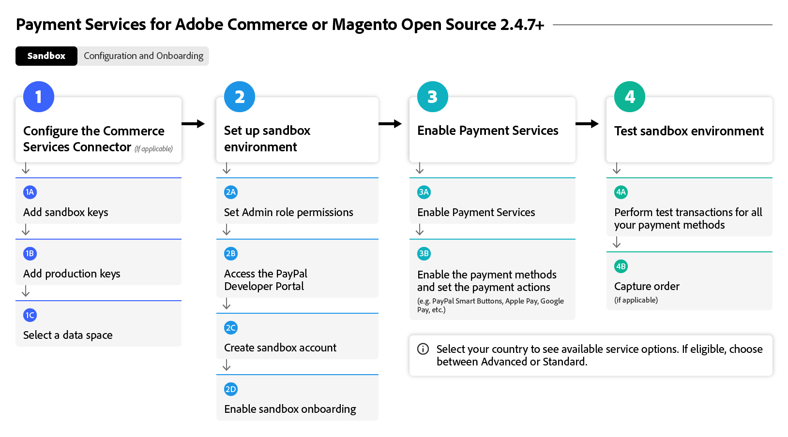
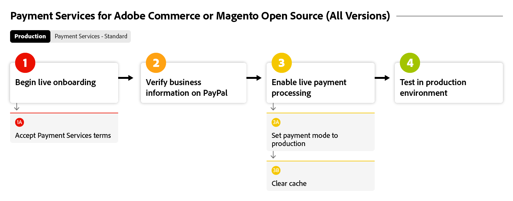

# Startar [!DNL Payment Services]-flöde

Om du vill börja använda [!DNL Payment Services] måste du slutföra några startsteg. Om du vill ha mer detaljerad vägledning väljer du det Adobe Commerce-alternativ nedan som bäst passar organisationens instans och version.

Det här flödesdiagrammet visar den allmänna processen för introduktion av [!DNL Payment Services] i alla versioner:

{width="700" zoomable="yes"}

Se nedan för din specifika Adobe Commerce-version som du kan använda med [!DNL Payment Services].

## Hjälp mig att hitta min instans och version

### Adobe Commerce eller Magento Open Source | v2.4.7+

Dessa flödesdiagram visar den allmänna processen för att komma igång med [!DNL Payment Services] med en Adobe Commerce eller Magento Open Source som är nyare än v2.4.7.

>[!BEGINTABS]

>[!TAB Sandbox]

I det här flödesdiagrammet visas processen för introduktionssandlådan med en Adobe Commerce eller Magento Open Source som är nyare än v2.4.7, där [!DNL Payment Services] är körklar med Adobe Commerce.

{width="700" zoomable="yes"}

**Startsteg för version 2.4.7+ Del 1: Sandbox**

1. [Anslut instansen](connect.md#configure-commerce-services) till Commerce Services. Anslutningen får endast göras en gång per Commerce-instans. [!BADGE Endast PaaS]{type=Informative tooltip="Gäller endast Adobe Commerce i molnprojekt (Adobe-hanterad PaaS-infrastruktur)."}
1. [Konfigurera sandlådetjänsten](sandbox.md#enable-sandbox-testing) (eller, alternativt, fortsätta till [aktivera live-betalningar](sandbox.md#enable-live-payments) om du har testat funktioner i en annan miljö) med ett PayPal-betalningshanteringskonto.
1. Testa betalningar i en [sandlådemiljö](sandbox.md#test-in-sandbox-environment).

>[!TAB Produktion]

Det här flödesdiagrammet visar de produktionssteg som krävs för att aktivera [!DNL Payment Services].

{width="700" zoomable="yes"}

**Startsteg för version 2.4.7+ del 2: Produktion**

1. [Ange [!DNL Payment Services] som betalningsmetod](production.md#set-payment-services-as-payment-method), i sandlådeläge, för att börja bearbeta testbetalningar.
1. [Begär betalningsberättigande](production.md#request-payments-entitlement-from-adobe) för att aktivera liveintroduktion.
1. [Fullständig registrering av handlare](production.md#complete-merchant-onboarding) för att aktivera livebetalningar för dina Commerce-webbplatser.
1. [Hämta ditt  [!DNL Payment Services] handels-ID](production.md#configure-pricing-tier) och skicka det till Försäljning för att konfigurera rätt prisnivå.
1. [Aktivera [!DNL Payment Services] i direktläge](production.md#enable-live-payments) för att börja bearbeta direktbetalningar.
1. Testa betalningar i både [sandbox](sandbox.md#test-in-sandbox-environment)- och [production](production.md#test-in-production)-miljöer.

>[!ENDTABS]

### Adobe Commerce eller Magento Open Source | v2.4.0-2.4.6 [!BADGE Endast PaaS]{type=Informative tooltip="Gäller endast Adobe Commerce i molnprojekt (Adobe-hanterad PaaS-infrastruktur)."}

Dessa flödesdiagram visar den allmänna processen för att komma igång med [!DNL Payment Services] med Adobe Commerce eller Magento Open Source version 2.4.0 till 2.4.6. Du måste hämta och installera [!DNL Payment Services] för att kunna börja prenumerera.

>[!BEGINTABS]

>[!TAB Sandbox]

I det här flödesdiagrammet visas de sandlådesteg som krävs för att starta [!DNL Payment Services] med Adobe Commerce eller Magento Open Source version 2.4.0 till 2.4.6.

{width="700" zoomable="yes"}

**Startsteg för versionerna v2.4.0-2.4.6 del 1: Sandbox**

1. [Installera  [!DNL Payment Services] tillägget](install.md#get-payment-services) om det behövs.
1. [Hämta API-autentiseringsuppgifter](connect.md#obtain-api-credentials).
1. [Anslut instansen](connect.md#configure-commerce-services) till Commerce Services. Anslutningen får endast göras en gång per Commerce-instans.
1. [Konfigurera sandlådetjänsten](sandbox.md#enable-sandbox-testing) (eller, alternativt, fortsätta till [aktivera live-betalningar](sandbox.md#enable-live-payments) om du har testat funktioner i en annan miljö) med ett PayPal-betalningshanteringskonto.
1. Testa betalningar i en [sandlådemiljö](sandbox.md#test-in-sandbox-environment).

>[!TAB Produktion]

I det här flödesdiagrammet visas den allmänna processen för att aktivera [!DNL Payment Services] i en produktionsmiljö med Adobe Commerce eller Magento Open Source version 2.4.0 till 2.4.6.

{width="700" zoomable="yes"}

**Startsteg för versionerna v2.4.0-2.4.6 Part 2: Production**

1. [Ange [!DNL Payment Services] som betalningsmetod](production.md#set-payment-services-as-payment-method), i sandlådeläge, för att börja bearbeta testbetalningar.
1. [Begär betalningsberättigande](production.md#request-payments-entitlement-from-adobe) för att aktivera liveintroduktion.
1. [Fullständig registrering av handlare](production.md#complete-merchant-onboarding) för att aktivera livebetalningar för dina Commerce-webbplatser.
1. [Hämta ditt  [!DNL Payment Services] handels-ID](production.md#configure-pricing-tier) och skicka det till Försäljning för att konfigurera rätt prisnivå.
1. [Aktivera [!DNL Payment Services] i direktläge](production.md#enable-live-payments) för att börja bearbeta direktbetalningar.
1. Testa betalningar i både [sandbox](sandbox.md#test-in-sandbox-environment)- och [production](production.md#test-in-production)-miljöer.

>[!ENDTABS]

>[!NOTE]
>
>Om du inte konfigurerar dina Commerce-tjänster i Admin (del 1) kan du inte konfigurera sandlådor eller direktbetalningar.

>[!MORELIKETHIS]
>
> * [Felsök [!DNL Payment Services] installationen](https://experienceleague.adobe.com/docs/commerce-knowledge-base/kb/troubleshooting/payments/payservices-install.html?lang=sv-SE)
> * [PayPal-sandlådekontot har inte verifierats](https://experienceleague.adobe.com/docs/commerce-knowledge-base/kb/troubleshooting/payments/payservices-paypal-acct.html?lang=sv-SE)
> * [Fördröjd [!DNL Payment Services] rapportdata](https://experienceleague.adobe.com/docs/commerce-knowledge-base/kb/troubleshooting/payments/payservices-report-info-delayed.html?lang=sv-SE)
> * [Testkreditkortet fungerar inte med PayPal när betalningar bearbetas i sandlådemiljö](https://experienceleague.adobe.com/docs/commerce-knowledge-base/kb/troubleshooting/payments/payservices-cc-sandbox-failure.html?lang=sv-SE)
> * [Inaktivera  [!DNL Payment Services] tillägget](https://experienceleague.adobe.com/sv/docs/commerce-on-cloud/user-guide/configure-store/extensions#manage-extensions-1)