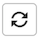

# Statusrapport för orderbetalning

[!DNL Payment Services] för [!DNL Adobe Commerce] och [!DNL Magento Open Source] erbjuder omfattande rapportering så att du kan få en tydlig bild av butikens [transaktioner](reporting.md), order och betalningar.

Det finns två tillgängliga rapportvyer över orderbetalningsstatus som gör att du snabbt kan visa betalningsstatus för dina order:

* **[Visualisering av orderbetalningsstatus](#order-payment-status-data-visualization-view)** - Diagram på startsidan för Betalningstjänster som är en visuell representation av aggregerade betalningsstatusar per dag från rapportvyn för orderbetalningsstatus
* **[Rapportvy för orderbetalningsstatus](#order-payment-status-report-view)** - Rapportera tillgänglig i orderbetalningsstatus som visar detaljerad betalning, fakturering, leverans, återbetalning och tviststatus för alla transaktioner

Med orderbetalningsstatusvyerna blir det enkelt att förstå var en viss order ligger i orderflödet. Med hjälp av de här rapporterna kan du snabbt visa beställningar, baserat på betalningsstatus och betalningsdatum, och identifiera eventuella problem.

Du kan [hämta betalningsstatus för beställning](#download-order-payment-statuses) i ett CSV-filformat för användning i befintliga redovisnings- eller orderhanteringsprogram.

>[!NOTE]
>
>Du kan inte visa ekonomiska rapporter om du inte har [registrerat och aktiverat Live-läge](production.md#enable-live-payments) för [!DNL Payment Services].

## Datavisualisering av orderbetalningsstatus

Vyn över orderbetalningsstatus är tillgänglig på startsidan för Betalningstjänster. Det är en visuell representation av de aggregerade betalningsstatusarna per dag från den detaljerade tabellvyn [Orderbetalningsstatus](#order-payment-status-report-view).

Gå till **Försäljning** > **Betalningstjänster** > _Beställningar_ på sidofältet _Admin_ för att se datavisualisering [diagram över betalningsstatus](#statuses-information).

{width="800" zoomable="yes"}

Klicka på **[!UICONTROL View Report]** för att navigera till den detaljerade tabellvyn [Rapport om orderbetalningsstatus](#order-payment-status-report-view).

### Anpassa tidsram för statusvärden

Som standard visas 30 dagars betalningsstatus.

I visualiseringsvyn för orderbetalningsstatus kan du anpassa tidsramen för de betalningsstatusar du vill visa genom att välja ett datumintervall:

1. Gå till **[!UICONTROL Sales]** > **[!UICONTROL Payment Services]** på sidofältet _Admin_. Vyn för visualisering av orderbetalningsstatus visas i avsnittet _Beställningar_.
1. Klicka på väljarfiltret **[!UICONTROL Range]**.
1. Välj datumintervall: 30 dagar, 15 dagar eller 7 dagar.
1. Visa statusinformation för angivna datum.

### Statusinformation

Betalningsstatusarna för ett valt datumintervall visas till vänster om visualiseringsvyn för orderbetalningsstatus. Datumen för det valda datumintervallet visas längst ned i vyn. Om det inte fanns några order på ett visst datum visas inte det datumet.

Vyn för visualisering av orderbetalningsstatus innehåller följande information.

| Data | Beskrivning |
| ------------ | -------------------- |
| [!UICONTROL Orders] | Mängdintervall för order i angiven tidsram; data på Y-axeln (vänster) |
| Datumintervall | Datumintervall för den angivna tidsramen; data på X-axeln (nederst) |
| Auktoriserad | Beställning auktoriserad |
| Hämtning begärd | Hämtning begärd för beställning |
| Hämtning bekräftad | Orderinspelningen är klar |
| Delvis hämtning | Ordning som delvis fångats |
| Hämtningen misslyckades | Orderhämtningen misslyckades |
| Annullerad | Annullerad order |

## Rapportvy för orderbetalningsstatus

Vyn för orderbetalningsstatus är tillgänglig i vyn Hem för Betalningstjänster. Den innehåller detaljerade statusvärden - betalning, fakturering, leverans, återbetalning, tvist med mera - för alla transaktioner.

På sidofältet _Admin_ går du till **[!UICONTROL Sales]** > **[!UICONTROL Payment Services]** > _[!UICONTROL Orders]_>**[!UICONTROL View Report]**&#x200B;för att visa den detaljerade rapportvyn för orderbetalningsstatus i tabellformat.

{width="800" zoomable="yes"}

Du kan konfigurera den här vyn, per avsnitt i det här avsnittet, så att du på bästa sätt kan presentera de data du vill se.

Du kan [hämta utbetalningstransaktioner](#download-order-payment-statuses) i ett CSV-filformat för användning i befintliga redovisnings- eller orderhanteringsprogram.

>[!NOTE]
>
>Data som visas i den här tabellen sorteras i fallande ordning (`DESC`) som standard med `TRANS DATE`. `TRANS DATE` är det datum och den tidpunkt då transaktionen initierades.

### Betalningsstatusuppdateringar

Vissa betalningsmetoder kräver en viss tidsperiod för att få betalningen. [!DNL Payment Services] identifierar nu väntande status för en betalningstransaktion i en order genom att:

* Identifierar `pending capture` transaktioner synkront
* Övervaka `pending capture`-transaktioner asynkront

>[!NOTE]
>
>Genom att identifiera väntande status för betalningstransaktioner i en order förhindras att order skickas av misstag om betalningen ännu inte har tagits emot. Detta kan inträffa för e-check- och PayPal-transaktioner.

#### Synkron identifiering av väntande hämtningstransaktioner

Identifiera automatiskt hämtningstransaktioner med statusen `Pending` och förhindra att order anger statusen `Processing` när en sådan transaktion identifieras.

Under kundutcheckning eller när en administratör skapar en faktura för en tidigare auktoriserad betalning, identifierar [!DNL Payment Services] automatiskt transaktioner med statusen `Pending` och flyttar motsvarande order till statusen `Payment Review`.

#### Asynkron övervakning av väntande hämtningstransaktioner

Identifiera när en väntande hämtningstransaktion anger statusen `Completed` så att säljarna kan återuppta bearbetningen av den berörda ordern.

För att processen ska fungera som förväntat måste säljarna konfigurera ett nytt cron-jobb. När jobbet har konfigurerats att köras automatiskt förväntas inga andra åtgärder från handlaren.

Se [Konfigurera cron-jobb](https://experienceleague.adobe.com/docs/commerce-operations/configuration-guide/cli/configure-cron-jobs.html?lang=sv-SE). När det nya jobbet har konfigurerats körs det var 30:e minut för att hämta uppdateringar för order som har statusen `Payment Review`.

Handlare kan kontrollera den uppdaterade betalningsstatusen via rapportvyn för orderbetalningsstatus.

### Data som används i rapporten

[!DNL Payment Services] använder orderdata och kombinerar dem med aggregerade betalningsdata från andra källor (inklusive PayPal) för att skapa meningsfulla och användbara rapporter.

Orderdata exporteras och sparas i betaltjänsten. När du [ändrar eller lägger till orderstatus](https://experienceleague.adobe.com/sv/docs/commerce-admin/stores-sales/order-management/orders/order-status#custom-order-status) eller [redigerar en butiksvy](https://experienceleague.adobe.com/sv/docs/commerce-admin/stores-sales/site-store/store-views#edit-a-store-view), [store](https://experienceleague.adobe.com/sv/docs/commerce-admin/start/setup/store-details#store-information) eller webbplatsnamn kombineras dessa data med betalningsdata och rapporten om orderbetalningsstatus fylls i med den kombinerade informationen.

Det finns två steg:

1. Indexet ändras antingen `ON SAVE` (varje gång orderinformation eller butiksinformation ändras) eller `BY SCHEDULE` (enligt ett förkonfigurerat kundschema), beroende på hur det har konfigurerats i [Indexhantering](https://experienceleague.adobe.com/sv/docs/commerce-admin/systems/tools/index-management) i Admin.

   Som standard sker dataindexeringen `ON SAVE`, vilket innebär att omindexeringsprocessen sker omedelbart varje gång något ändras i ordningen, i ordningen, i butiksvyn, i butiken eller på webbplatsen.

1. Indexerade data skickas till betalningstjänsten som sedan fylls i i rapporten över orderbetalningsstatus.

De enda data som exporteras och sorteras för rapportändamål är data som används av rapporten om orderbetalningsstatus.

>[!NOTE]
>
>Data som visas i den här tabellen sorteras i fallande ordning (`DESC`) som standard med `ORDER DATE`. `ORDER DATE` är tidsstämpeln för datumet när ordern skapades.

#### Konfigurera dataexport

Även om omindexering som standard sker i läget `ON SAVE` rekommenderar vi att du indexerar i läget `BY SCHEDULE`. Indexet `BY SCHEDULE` körs med ett cron-schema på en minut och alla ändrade data visas i din orderstatusrapport inom två minuter efter dataändringen. Denna schemalagda omindexering hjälper dig att minska eventuella påfrestningar i din butik, särskilt om du har ett stort antal inkommande order, eftersom den inträffar enligt ett schema (inte efter varje beställning).

Du kan ändra indexläget -`ON SAVE` eller `BY SCHEDULE` -[ - i Admin](https://experienceleague.adobe.com/sv/docs/commerce-admin/systems/tools/index-management#change-the-index-mode).

Mer information om hur du konfigurerar dataexporten finns i [Kommandoradskonfiguration](configure-cli.md#configure-data-export).

### Välj datakälla

I rapportvyn Orderbetalningsstatus kan du välja datakälla - **[!UICONTROL Live]** _ eller **[!UICONTROL Sandbox]** - som du vill visa rapportresultat för.

{width="300" zoomable="yes"}

Om _[!UICONTROL Live]_&#x200B;är den valda datakällan kan du visa rapportinformation för dina butiker som använder [!DNL Payment Services] i produktionsläge. Om&#x200B;_[!UICONTROL Sandbox]_ är den valda datakällan kan du visa rapportinformation för sandlådeläge.

Datakällmarkeringar fungerar så här:

* Om du inte har några arkiv som använder [!DNL Payment Services] i Live-läge är datakällans val som standard _[!UICONTROL Sandbox]_.
* Om du har några arkiv (en eller flera) som använder [!DNL Payment Services] i Live-läge, blir datakällans val som standard _[!UICONTROL Live]_.
* Vid export av rapporter respekteras alltid valet av datakälla.

Så här väljer du datakälla för din [!UICONTROL Order Payment Status]-rapport:

1. Gå till **[!UICONTROL Sales]** > **[!UICONTROL [!DNL Payment Services]]** > **[!UICONTROL Orders]** > **[!UICONTROL View Report]** på sidofältet _Admin_.
1. Klicka på väljarfiltret _[!UICONTROL Data source]_&#x200B;och välj **[!UICONTROL Live]**&#x200B;eller **[!UICONTROL Sandbox]**.

   Rapportresultaten genereras om baserat på den valda datakällan.

### Anpassa tidsram för orderdatum

I rapportvyn Orderbetalningsstatus kan du anpassa tidsramen för statusresultaten genom att välja specifika datum. Som standard visas 30 dagars betalningsstatus i rutnätet.

1. Gå till **[!UICONTROL Sales]** > **[!UICONTROL [!DNL Payment Services]]** > _[!UICONTROL Orders]_>**[!UICONTROL View Report]**&#x200B;på sidofältet_ Admin _.
1. Klicka på kalenderväljarfiltret _[!UICONTROL Order dates]_.
1. Välj tillämpligt datumintervall.
1. Visa orderbetalningsstatus för angivna datum i rutnätet.

### Filtrera rapportinformation

I rapportvyn Orderbetalningsstatus kan du filtrera statusresultaten som du vill visa genom att välja filtervillkor.

1. Gå till **[!UICONTROL Sales]** > **[!UICONTROL [!DNL Payment Services]]** > _[!UICONTROL Orders]_>**[!UICONTROL View Report]**&#x200B;på sidofältet_ Admin _.
1. Klicka på väljaren **[!UICONTROL Filter]**.
1. Växla alternativen för _Lönestatus_ om du vill visa rapportresultat för endast valda orderbetalningsstatusar.
1. Visa rapportresultat inom ett orderbeloppsintervall genom att ange en _[!UICONTROL Min Order Amount]_&#x200B;eller _[!UICONTROL Max Order Amount_].
1. Klicka på **[!UICONTROL Hide filters]** om du vill dölja filtret.

### Visa och dölja kolumner

I rapporten Orderbetalningsstatus visas alla tillgängliga informationskolumner som standard. Du kan dock anpassa vilka kolumner som visas i rapporten.

1. Gå till **[!UICONTROL Sales]** > **[!UICONTROL [!DNL Payment Services]]** > _[!UICONTROL Orders]_>**[!UICONTROL View Report]**&#x200B;på sidofältet_ Admin _.
1. Klicka på ikonen _Kolumninställningar_ ({width="20" zoomable="yes"}).
1. Om du vill anpassa vilka kolumner som ska visas i rapporten markerar eller avmarkerar du kolumnerna i listan.

   Statusrapporten för orderbetalning visar omedelbart ändringar som du har gjort på menyn Kolumninställningar. Kolumninställningarna sparas och gäller även om du navigerar bort från rapportvyn.

### Visa statusvärden

I rapportvyn Orderbetalningsstatus visas omfattande lönestatusinformation för varje order.

Som standard visas 30 dagars betalningsstatus i rutnätet.

Bläddra till vänster och höger för att visa [information om betalningsstatus för beställningar](#column-descriptions), inklusive orderdatum, auktoriserat datum, fakturerad, levererad, betalningsstatus och mycket annat.

Antalet rader som returneras i en sökning, eller som visas i standardinställningstiden på 30 dagar för orderbetalningsstatus, visas ovanför vystödrastret för orderbetalningsstatus bredvid väljarfiltret för orderdatumkalender.

#### Lönestatus

Kolumnen Betala visar aktuell status för alla betalningar. En `Capture failed`-betalning visar en röd aviseringsstatus och en `Voided`-betalning visar en grå aviseringsstatus.

#### Återbetalningsstatus

I kolumnen Återbetalningsstatus visas aktuell status för alla återbetalningar. En `Capture failed`-betalning visar en röd aviseringsstatus och en `Voided`-betalning visar en grå aviseringsstatus.

### Uppdatera rapportdata

I rapportvyn över orderbetalningsstatus visas en _[!UICONTROL Last updated]_-tidsstämpel som visar den senaste gången rapportinformationen uppdaterades. Som standard uppdateras rapportdata för beställningsbetalningsstatus automatiskt var tredje timme.

Du kan också manuellt framtvinga en uppdatering av rapportdata för orderbetalningsstatus för att se den senaste rapportinformationen.

1. Gå till **[!UICONTROL Sales]** > **[!UICONTROL [!DNL Payment Services]]** > _[!UICONTROL Orders]_>**[!UICONTROL View Report]**&#x200B;på sidofältet_ Admin _.
1. Klicka på ikonen _Uppdatera_ ({width="20" zoomable="yes"}).

   Rapportdata för orderbetalningsstatus uppdateras, en *[!UICONTROL Update complete]*-bekräftelse visas och den senaste informationen finns i rutnätet.

### Visa tvister

Du kan visa eventuella tvister om dina beställningar och navigera till PayPal Resolution Center och vidta åtgärder för dem i rapporten om status för beställningsbetalning.

1. Gå till **[!UICONTROL Sales]** > **[!UICONTROL [!DNL Payment Services]]** > _[!UICONTROL Orders]_>**[!UICONTROL View Report]**&#x200B;på sidofältet_ Admin _.
1. Navigera till **[!UICONTROL Disputes column]**.
1. Visa eventuella tvister om en viss order och se [tvistens status](#order-payment-status-information).
1. Granska tvistinformation från [PayPal Resolution Center](https://www.paypal.com/us/cshelp/article/what-is-the-resolution-center-help246) genom att klicka på den tvist-ID-länk som börjar med _PP-D-_.
1. Vidta lämpliga åtgärder för tvisten efter behov.

   Klicka på kolumnrubriken [!UICONTROL Disputes] om du vill sortera beställningstvister efter status.

### Hämta betalningsstatus för order

Du kan hämta en CSV-fil med alla statusvärden synliga i vystödrastret för orderbetalningsstatus, oavsett om du visar standardstatusvärdena för 30 dagar eller en anpassad tidsram.

1. Gå till **[!UICONTROL Sales]** > **[!UICONTROL [!DNL Payment Services]]** > _[!UICONTROL Orders]_>**[!UICONTROL View Report]**&#x200B;på sidofältet_ Admin _.
1. Om du vill se statusvärden för en annan tidsram än de senaste 30 dagarna [anpassar du tidsramen för datumintervallet för statusvärdena](#customize-dates-timeframe).
1. Klicka på ikonen _Hämta_ ({width="20" zoomable="yes"}).

Din orderbetalningsstatus hämtas i .csv-format.

### Kolumnbeskrivningar

Rapporter om orderbetalningsstatus innehåller följande information.

| Kolumn | Beskrivning |
| ------------ | -------------------- |
| [!UICONTROL Order ID] | Commerce order-ID   Om du vill visa relaterad [orderinformation](https://experienceleague.adobe.com/sv/docs/commerce-admin/stores-sales/order-management/orders/orders){target="_blank"} klickar du på ID:t. |
| [!UICONTROL Order Date] | Tidsstämpel för orderdatum |
| [!UICONTROL Authorized Date] | Tidsstämpel för betalningsauktorisering |
| [!UICONTROL Order Status] | Aktuell beställningsstatus för Commerce [&#128279;](https://experienceleague.adobe.com/sv/docs/commerce-admin/stores-sales/order-management/orders/order-status){target="_blank"} |
| [!UICONTROL Invoiced] | Fakturastatus för ordern -*[!UICONTROL No]*, *[!UICONTROL Partial]* eller *[!UICONTROL Yes]* |
| [!UICONTROL Shipped] | Leveransstatus för ordern -*[!UICONTROL No]*, *[!UICONTROL Partial]* eller *[!UICONTROL Yes]* |
| [!UICONTROL Order Amt] | Orderns totalbelopp |
| [!UICONTROL Cur] | Valutatyp för order |
| [!UICONTROL Pay Status] | Status för betalning för en viss order |
| [!UICONTROL Paid Amt] | Belopp som betalats på en order |
| [!UICONTROL Cur] | Valutatyp för beloppet som betalats på en order |
| [!UICONTROL Refund Status] | Status för en återbetalning på en order (t.ex. information från returer, RMA och kreditnotor)—   *[!UICONTROL Requires refund]*, *[!UICONTROL Refund requested]*, *[!UICONTROL Refunded]*, *[!UICONTROL Refund failed]* eller *[!UICONTROL Voided]* |
| [!UICONTROL Refund Amount] | Totalt återbetalt belopp för en order |
| [!UICONTROL Cur] | Valutatyp för beloppet som återbetalas för en order |
| [!UICONTROL Disputes] | Status för en tvist på en order (information från tvister och återbetalningar) -*[!UICONTROL Open]*, *[!UICONTROL Waiting for buyer response]*, *[!UICONTROL Waiting for seller response]*, *[!UICONTROL Under review]*, *[!UICONTROL Resolved]* eller *[!UICONTROL Other]* |
| [!UICONTROL Payment Method] | Betalningsmetod som används i Commerce-transaktionen för en order |
| [!UICONTROL Website] | Webbplats som beställningen placerades från |
| [!UICONTROL Store] | Butiker som beställningen placerades från |
| [!UICONTROL Store View] | Butiksvy som ordern placerades från |
