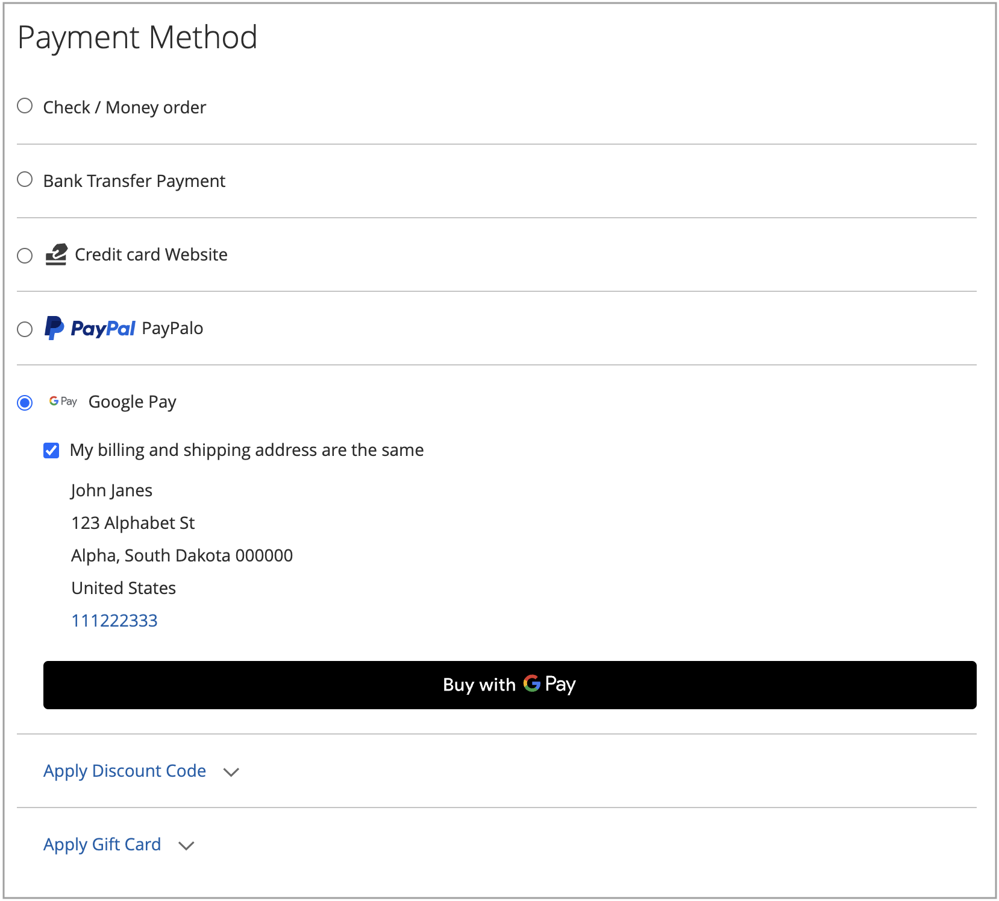

# Betalningsalternativ

Med [!DNL Adobe Commerce] och [!DNL Magento Open Source] [!DNL Payment Services] har du flera betalningsalternativ tillgängliga.

Du kan konfigurera de här betalningsalternativen i [Hem-](payments-home.md) eller [Store-konfigurationen](configure-admin.md) (rekommenderas för äldre betalningsalternativ eller en konfiguration för flera butiker).

Det finns olika beteenden för varje betalningsmetod beroende på var du befinner dig i utcheckningsprocessen:

* Produktsida - produktsidan för en artikel
* Mini cart - Tillgängligt när du klickar på varukorgen när en produkt har lagts till i varukorgen
* Kundvagn - Tillgänglig när du klickar på _Visa och redigera kundvagnen_ från minivagnen
* Utcheckningsvy - Tillgängligt när du klickar på _Fortsätt till utcheckning_ från mini-kundvagn eller kundvagn

>[!IMPORTANT]
>
>[!DNL Payment Services]-introduktionen måste slutföras innan betalningar kan bearbetas.

## Standard vs. Advanced Payments Experience

[!DNL Payment Services] innehåller betalningsalternativ för **Avancerat** (stöds fullt ut) och **Standard** (Express Checkout) samt startflöden, beroende på vilket land du arbetar i.

* **Avancerat** - Alla tillgängliga [betalningsalternativ](../payment-services/payments-options.md) är tillgängliga för aktuella [länder med fullt stöd](../payment-services/introduction.md#availability). Under introduktionen för att aktivera livebetalningar väljer du alternativet [Avancerad introduktion](../payment-services/production.md#advanced-onboarding).

* **Standard** - En delmängd av betalningsalternativ (Express Checkout) - PayPal-kort för kredit och debitering - finns för andra tillgängliga länder som stöds. [Kreditkortsfälten](#credit-card-fields) och [Apple Pay](#apple-pay-button) är inte tillgängliga för det här startalternativet. Under introduktionen för att aktivera livebetalningar väljer du alternativet [Standard onboarding](../payment-services/production.md#standard-onboarding).

Se [Aktivera [!DNL Payment Services] för produktion](../payment-services/production.md#complete-merchant-onboarding) för information om hur du slutför avancerad introduktion och standardintroduktion.

## [!UICONTROL Credit Card Fields]

[!UICONTROL Credit Card Fields] erbjuder en enkel och säker utcheckning för betalningsmetoder med kreditkort eller betalkort. När en kund checkar ut med kreditkortsfält anger han/hon sitt namn, sin faktureringsadress och kreditkortsinformation för att göra sin beställning. Deras kundinformation används säkert under köpsessionen för att smidigt vägleda dem genom utcheckningsflödet.

{width="500" zoomable="yes"}

## [!UICONTROL Digital Wallets]

### [!DNL Fastlane]-knapp

[!DNL Fastlane] erbjuder ett snabbt, säkert och problemfritt sätt att betala online. Under en **gästutcheckning** kan du på ett säkert sätt lagra ditt kort och leveransinformation för ännu snabbare inköp i framtiden.

* **Direktåtkomst för verifierade kunder**: Identifiera miljontals återkommande kunder och aktivera smidiga betalningar på några sekunder.
* **Öka intäkterna**: Förbättra konverterings- och auktoriseringsnivåerna med fler slutförda inköp.
* **Snabba upp utcheckningen**: Minska friktionen med en säker, lösenordslös inloggningsupplevelse.

När [!DNL Fastlane] är aktiverat är alternativet [!UICONTROL Credit Card Fields] inaktiverat som standard.

>[!NOTE]
>
> Fastlane stöds för närvarande bara för handlare i USA. Därför stöds inte [!UICONTROL 3D Secure authentication] för närvarande.

Mer information finns i avsnittet [Fastlane av PayPal](https://www.paypal.com/us/fastlane){target=_blank}.

### [!DNL Apple Pay]-knapp

Med [!DNL Apple Pay] kan handlare tillhandahålla en säker och smidig utcheckningsupplevelse i Safari (för upp till 99 domäner per handlarkonto), vilket kan öka konverteringarna. Knappen [!DNL Apple Pay] fyller automatiskt i information om lagrade betalningar, kontaktuppgifter och leveranser från kundernas iOS- eller macOS-enheter, vilket ger en snabb, enkel utcheckning.

{width="500" zoomable="yes"}

När det här alternativet är aktiverat visas knappen [!DNL Apple Pay] på produktsidan, i minikundvagnen, i kundvagnen och i kassan. Du kan konfigurera [!DNL Apple Pay] i butikskonfigurationen eller tilläggets Hem.

>[!NOTE]
>
>  Verifieringscertifikatet för domänen Apple Pay ingår redan i koden för betaltjänster. Kontrollera att sökvägen `/.well-known/apple-developer-merchantid-domain-association` returnerar en 200-svarskod. Mer information om [Apple Pay Domain-verifieringscertifikatet](https://developer.paypal.com/docs/checkout/apm/apple-pay/#download-and-host-sandbox-domain-association-file) finns i **dokumentationen för PayPal-utvecklare om hur du integrerar med Apple Pay**.

Mer information finns i [Inställningar](configure-admin.md#apple-pay).

### [!DNL Google Pay]-knapp

Genom att integrera [!DNL Google Pay] i utcheckningsupplevelsen kan handlare samla in sparad betalnings-, kontakt- och leveransinformation från kundens Google-konto, vilket ger en bekväm och smidig utcheckning i olika webbläsare och appar som stöds.

[!DNL Google Pay] är bara tillgängligt i vissa länder eller regioner och på vissa enheter. Mer information finns i [[!DNL Google Pay] dokumentationen](https://developer.paypal.com/docs/checkout/apm/google-pay/#link-googlepayintegration).

{width="500" zoomable="yes"}

När det här alternativet är aktiverat visas knappen [!DNL Google Pay] på produktsidan, i minikundvagnen, i kundvagnen och i kassan. Mer information finns i [Inställningar](configure-admin.md).

>[!NOTE]
>
> API:t [!DNL Google Pay] kan bara användas på webbplatser i en säker kontext. Mer information finns i [Felsökning](https://developers.google.com/pay/api/web/support/troubleshooting) -dokumentationen.

### [!DNL PayPal Payment Buttons]

[!DNL PayPal payment buttons], som använder PayPal för att slutföra ett köp, lagrar kundens leveransadress, faktureringsadresser och betalningsinformation för senare bruk. Köpare kan använda vilken betalningsmetod som helst som tidigare lagrats eller erbjuds av PayPal.

{width="350" zoomable="yes"}

Du kan konfigurera [!UICONTROL PayPal payment buttons] i butikskonfigurationen eller startsidan för [!DNL Payment Services].

Lär dig mer om tillgängligheten för betalningsmetoder per land i PayPals [dokumentation om betalningsmetoder](https://developer.paypal.com/docs/checkout/payment-methods/).

#### [!DNL PayPal]-knapp

Med PayPal-knappen kan kunderna enkelt och säkert kolla in resultatet.

Knappen [!DNL PayPal] visas på produktsidan, i minikundvagnen, i kundvagnen och i kassan.

#### [!DNL Venmo]-knapp

Kunder kan checka ut med knappen [Venmo](https://venmo.com/).

Knappen [!DNL Venmo] visas på produktsidan, i minikundvagnen, i kundvagnen och i kassan.

#### PayPal Debit eller kreditkortsknapp

Kunder kan checka ut med PayPal Debit- eller kreditkortsknappen.

Knappen PayPal Debit eller Kreditkort visas på utcheckningssidan.

Det här alternativet kan användas för att visa kunderna ett betalnings- eller kreditkortsalternativ med en PayPal-värdbaserad knapp som ett alternativ till en kreditkortsintegrering.

#### [!DNL Pay Later]-knapp

Erbjud dina kunder kortfristiga räntefria betalningar och andra finansieringsalternativ så att de kan köpa nu och betala senare med knappen [!DNL Pay Later].

Knappen [!DNL Pay Later] visas på produktsidan, i minikundvagnen, i kundvagnen och i kassan.

Mer information om [Pay Later Senare-erbjudanden](https://developer.paypal.com/docs/checkout/pay-later/us/) finns i dokumentationen för PayPal Developer. Använd listrutan **Land eller region** för att välja ett område av intresse.

Lär dig hur du inaktiverar eller aktiverar meddelandet [!DNL Pay Later] genom att uppdatera konfigurationen för [Inställningar](configure-admin.md#pay-later-button).

##### Valfritt. Konfigurera Betala senare meddelanden

**Konfigurera meddelanden** för [Betala senare](configure-admin.md#pay-later-button) tillåter handlare att ändra standardstilarna för det här betalningsalternativet. Om du ställer in **[!UICONTROL Display Pay Later Message]** på `Yes` i [&#x200B; Settings](configure-admin.md#pay-later-button) -konfigurationen visas en spärrknapp för **[!UICONTROL Configure Messaging]** så att du kan ställa in stilarna för **[!UICONTROL PayPal Pay Later messaging]**.

{width="500" zoomable="yes"}

### Använd endast PayPal-betalningsknappar

Om du snabbt vill försätta din butik i produktionsläge kan du konfigurera _endast_ betalningsknappar för PayPal (Venmo, PayPal osv.)- i stället för att också använda betalningsalternativet PayPal-kreditkort.

På så sätt kan du:

* Ange olika betalningsalternativ för dina kunder, inklusive betalningsknapparna Venmo och PayPal, med möjlighet att stänga av värdkortsfälten för PayPal och använda en befintlig kreditkortsleverantör.
* Använd din befintliga kreditkortsleverantör för kreditkortsbetalningar, samtidigt som du använder PayPals andra betalningsalternativ.
* Använd PayPals betalningsknappar i regioner där PayPal inte stöder kreditkort som betalningsalternativ.

Om du vill **hämta betalningar med _only_ PayPal-betalningsknappar (_inte_ betalningsalternativet PayPal-kreditkort)**:

1. Kontrollera att din butik är [i produktionsläge](configure-admin.md#enable-payment-services).
1. [Konfigurera önskade PayPal-betalningsknappar](configure-admin.md#payment-buttons) i Inställningar.
1. Stäng av _Av_, alternativet **[[!UICONTROL Show PayPal Credit and Debit card button]](configure-admin.md#payment-buttons)** i avsnittet _[!UICONTROL Payment buttons]_.

Så här **tar du emot betalningar med din befintliga kreditkortsleverantör _och_ betalningsknappar för PayPal**:

1. Kontrollera att din butik är [i produktionsläge](configure-admin.md#enable-payment-services).
1. [Konfigurera önskade PayPal-betalningsknappar](configure-admin.md#payment-buttons).
1. Stäng av _Av_, alternativet **[[!UICONTROL PayPal Show Credit and Debit card button]](configure-admin.md#payment-buttons)** i avsnittet _[!UICONTROL Payment buttons]_.
1. Aktivera alternativet _Av_ **[[!UICONTROL Show on checkout page]](configure-admin.md#credit-card-fields)** i avsnittet _[!UICONTROL Credit card fields]_&#x200B;och använd ditt [befintliga kreditkortsleverantörskonto](https://experienceleague.adobe.com/docs/commerce-admin/stores-sales/payments/payments.html?lang=sv-SE#payments).

## Utcheckningsalternativ

Med [!DNL Payment Services] kan du konfigurera utcheckningen för Adobe Commerce så att den passar dina kunders preferenser och beteenden. Funktioner som kreditkort [vaulting](vaulting.md) och automatisk annullering av beställningar säkerställer en smidig, problemfri transaktion för dina kunder.

Med Adobe Commerce och Magento Open Source [!DNL Payment Services] har du tillgång till flera utcheckningsupplevelser. Det finns olika beteenden för varje betalningsmetod beroende på var du befinner dig i utcheckningsprocessen:

* Produktsida - - - produktsidan för en artikel

* Mini cart - Tillgänglig när du klickar på varukorgen när en produkt har lagts till i varukorgen

* Kundvagn - Tillgänglig när du klickar på Visa och redigerar vagnen i minivagnen

* Utcheckningsvy - - Tillgängligt när du klickar på Gå till kassan från mini-kundvagnen eller kundvagnen

### Orderomberäkning

När en kund går in i kassan från minikorgen, kundvagnen eller produktsidan dirigeras de till en ordergranskningssida där de kan se den valda leveransadressen i ett popup-fönster i PayPal. När kunden har valt leveranssätt beräknas orderbeloppet om på lämpligt sätt och kunden kan se fraktkostnader och skatter.

När en kund går in i utcheckningsflödet från utcheckningssidan är systemet redan medvetet om leveransadressen och det slutliga beräknade beloppet, och summorna representeras korrekt.

Skattehelgdagar, fraktkostnader och moms kan variera mycket mellan olika platser. När [!DNL Payment Services] har tagit emot leveransadressen och fraktkostnaden beräknas alla tillämpliga kostnader snabbt om och visas korrekt under de sista stegen i utcheckningen.

Lär dig mer om tillgängliga betalningsmetoder per land i dokumentationen för [PayPals betalningsmetoder](https://developer.paypal.com/docs/checkout/payment-methods/){target=_blank}.
