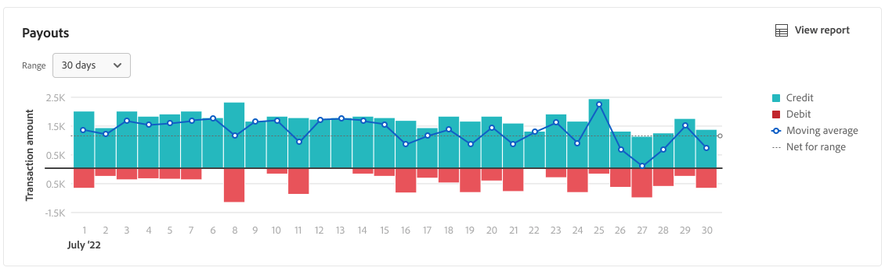

# Utbetalningsrapport

[!DNL Payment Services] för [!DNL Adobe Commerce] och [!DNL Magento Open Source] erbjuder omfattande rapportering så att du kan få en tydlig bild av butikens transaktioner, order och betalningar.

Det finns två tillgängliga rapportvyer för utbetalningarna som gör att du kan se detaljerad information om alla dina utbetalningar:

* **[Vyn Visualisering av utbetalningsdata](#payouts-data-visualization-view)** - Diagram på startsidan för betalningstjänst som är en visuell representation av aggregerade belopp per dag från rapportvyn Utbetalningar
* **[Utbetalningsrapportvy](#payouts-report-view)** - Rapportera tillgänglig i Utbetalningar som visar detaljerad utbetalningsinformation för alla transaktioner

Utbetalningsvyerna visar omfattande utbetalningsinformation i korthet, vilket ger er full insyn i betalningsbelopp, bearbetad volym och detaljerad rapportering om transaktionsnivån för finansiell avstämning.

Du kan [hämta utbetalningstransaktioner](#download-transactions) i ett CSV-filformat för användning i befintliga redovisnings- eller orderhanteringsprogram.

>[!NOTE]
>
>Utbetalningsrapporter visar endast order som har hämtats (betalningsåtgärden är inställd på [`Authorize and Capture`](https://experienceleague.adobe.com/docs/commerce-merchant-services/payment-services/get-started/production.html?lang=sv-SE#set-payment-services-as-payment-method)) eller [markerats som `Invoiced`](https://experienceleague.adobe.com/sv/docs/commerce-admin/stores-sales/order-management/invoices#create-an-invoice).

## Vy över visualisering av betaldata

Vyn för visualisering av utbetalningsdata är tillgänglig på startsidan för betalningstjänsterna. Det är en visuell representation av aggregerade belopp per dag från den detaljerade tabellrapportvyn [Utbetalningar](#payouts-report-view).

På sidofältet _Admin_ går du till **[!UICONTROL Sales]** > **[!UICONTROL Payment Services]** för att se datavisualiseringstabellen för krediter jämfört med debet och de rörliga medelvärdena över tiden.

{width="800" zoomable="yes"}

Klicka på **[!UICONTROL View Report]** för att navigera till den detaljerade tabellvyn [Utbetalningsrapport](#payouts-report-view).

### Anpassa tidsram för transaktioner

Som standard visas 30 dagars transaktioner.

I datavisualiseringsvyn Betalningar kan du anpassa tidsramen för de utbetalningstransaktioner som du vill visa genom att välja ett datumintervall:

1. Gå till **[!UICONTROL Sales]** > **[!UICONTROL Payment Services]** på sidofältet _Admin_. Vyn för visualisering av utbetalningsdata visas i avsnittet Utbetalningar.
1. Klicka på väljarfiltret **[!UICONTROL Range]**.
1. Välj datumintervall: 30 dagar, 15 dagar eller 7 dagar.
1. Visa transaktionsinformationen för de angivna datumen.

### Transaktionsinformation

Transaktionsbeloppen för ett valt datumintervall visas till vänster om visualiseringsvyn för utbetalningsdata. Datumen för det valda datumintervallet visas längst ned i vyn. Om det inte fanns några utbetalningar på ett visst datum visas inte det datumet.

Vyn för visualisering av utbetalningsdata innehåller följande information.

| Data | Beskrivning |
| ------------ | -------------------- |
| [!UICONTROL Transaction amount] | Mängdintervall för transaktioner i angiven tidsram; data på Y-axeln (vänster) |
| Datumintervall | Datumintervall för den angivna tidsramen; data på X-axeln (nederst) |
| Kredit | Betalningar för den angivna tidsramen |
| Debet | Skulder (återbetalningar) för den angivna tidsramen |
| Glidande medelvärde | Representation av den genomsnittliga utbetalningen för varje datum i den angivna tidsramen |
| Net for range | Nettoutbetalningsbelopp för den angivna tidsramen (intervall) |

## Rapportvy för utbetalningar

Utbetalningsrapportvyn är tillgänglig i vyn Utbetalningar i Betalningstjänster. Den innehåller all tillgänglig information om utbetalningar för din butik/dina butiker.

På sidofältet _Admin_ går du till **[!UICONTROL Sales]** > **[!UICONTROL Payment Services]** > _[!UICONTROL Payouts]_>**[!UICONTROL View Report]**&#x200B;för att visa den detaljerade rapportvyn i tabellformat.

{width="800" zoomable="yes"}

Du kan konfigurera den här vyn, per avsnitt i det här avsnittet, så att du på bästa sätt kan presentera de data du vill se.

Se länkade order- och transaktions-ID:n för Commerce, transaktionsbelopp, betalningsmetod per transaktion med mera i den här rapporten.

Du kan [hämta utbetalningstransaktioner](#download-transactions) i ett CSV-filformat för användning i befintliga redovisnings- eller orderhanteringsprogram.

>[!NOTE]
>
>Data som visas i den här tabellen sorteras i fallande ordning (`DESC`) som standard med `TRANS DATE`. `TRANS DATE` är det datum och den tidpunkt då transaktionen initierades.

### Välj datakälla

I rapportvyn Betalningar kan du välja datakälla -**[!UICONTROL Live]** eller **[!UICONTROL Sandbox]** - som du vill visa rapportresultat för.

{width="300" zoomable="yes"}

Om _[!UICONTROL Live]_&#x200B;är den valda datakällan kan du visa rapportinformation för butiker i produktionsläge. Om&#x200B;_[!UICONTROL Sandbox]_ är den valda datakällan kan du visa rapportinformationsarkiv i sandlådeläge.

Datakällmarkeringar fungerar så här:

* Om du inte har några arkiv som är i Live-läge är datakällans val som standard _[!UICONTROL Sandbox]_.
* Om du har några arkiv (en eller flera) i Live-läge är datakällans val som standard _[!UICONTROL Live]_.
* Vid export av rapporter respekteras alltid valet av datakälla.

Så här väljer du datakälla för rapporten för orderbetalningsstatus:

1. Gå till **[!UICONTROL Sales]** > **[!UICONTROL Payment Services]** > _[!UICONTROL Payouts]_>**[!UICONTROL View Report]**&#x200B;på sidofältet_ Admin _.
1. Klicka på **[!UICONTROL Data source]** och välj **[!UICONTROL Live]** eller **[!UICONTROL Sandbox]**.

   Rapportresultaten genereras om baserat på den valda datakällan.

### Visa transaktioner

Som standard visas 30 dagars transaktioner.

Antalet rader som returneras i en sökning, eller som visas i standardvärdet för 30 dagar med transaktioner, visas ovanför stödrastret i betalningsvyn bredvid kalenderväljarfiltret för transaktionsdatum.

Bläddra till vänster och höger för att visa [information för varje utbetalningstransaktion](#column-descriptions) i den dagliga rapporten, inklusive transaktionsdatum, referens-ID, fakturanummer och betalningsmetodinformation.

#### Anpassa tidsram för transaktioner

I rapportvyn Betalningar kan du anpassa tidsramen för de utbetalningstransaktioner som du vill visa genom att ange specifika datum eller välja ett datumintervall från datumväljaren:

1. Gå till **[!UICONTROL Sales]** > **[!UICONTROL Payment Services]** > _[!UICONTROL Payouts]_>**[!UICONTROL View Report]**&#x200B;på sidofältet_ Admin _.
1. Klicka på kalenderväljarfiltret _[!UICONTROL Transaction dates]_.
1. Välj tillämpligt datumintervall.
1. Visa utbetalningsstatus i rutnätet för de angivna datumen.

### Visa och dölja kolumner

I rapportvyn Utbetalningar visas de mest tillgängliga informationskolumnerna som standard. Du kan dock anpassa vilka kolumner som visas i rapporten.

1. Gå till **[!UICONTROL Sales]** > **[!UICONTROL [!DNL Payment Services]]** > _[!UICONTROL Payouts]_>**[!UICONTROL View Report]**&#x200B;på sidofältet_ Admin _.
1. Klicka på ikonen _Kolumninställningar_ ({width="20" zoomable="yes"}).
1. Om du vill anpassa vilka kolumner som ska visas i rapporten markerar eller avmarkerar du kolumnerna i listan.

   Utbetalningsrapportvyn visar omedelbart de ändringar du har gjort på menyn Kolumninställningar. Kolumninställningarna sparas och gäller även om du navigerar bort från rapportvyn.

### Hämta transaktioner

Du kan ladda ned en CSV-fil som innehåller alla transaktioner som visas i stödrastret i utbetalningsvyn.

1. Gå till **[!UICONTROL Sales]** > **[!UICONTROL Payment Services]** > _[!UICONTROL Payouts]_>**[!UICONTROL View Report]**&#x200B;på sidofältet_ Admin _.
1. [Anpassa tidsramen för datumintervallet för dina transaktioner](#customize-transactions-timeframe).
1. Klicka på ikonen _Hämta_ ({width="20" zoomable="yes"}).

Betalningstransaktionerna hämtas i .csv-format.

### Kolumnbeskrivningar

Utbetalningsrapporter innehåller följande information.

| Kolumn | Beskrivning |
| ------------ | -------------------- |
| [!UICONTROL Provider] | Betalningsleverantör |
| [!UICONTROL Provider trans] | Transaktions-ID |
| [!UICONTROL Trans date] | Datum och tid då transaktionen initierades |
| [!UICONTROL Type] | Transaktionstyp -*[!UICONTROL PAYMENT]*, *[!UICONTROL BONUS]*, *[!UICONTROL CHARGEBACK]*, *[!UICONTROL CORRECTION]*, *[!UICONTROL CURRENCY_CONVERSATION]*, *[!UICONTROL DEPOSIT]*, *[!UICONTROL DISBURSEMENT]*, *[!UICONTROL DISPUTE]*, *[!UICONTROL FEES]*, *[!UICONTROL HOLD]*, *[!UICONTROL HOLD_RELEASE]*, *[!UICONTROL INCENTIVES]*, *[!UICONTROL OTHERS]*, *[!UICONTROL RECOUP]*, *[!UICONTROL REFUND]*, *[!UICONTROL REVERSAL]*, *[!UICONTROL WITHDRAWAL]*    Mer information finns i [Transaktionstyper](#transaction-types). |
| [!UICONTROL Status] | Aktuell status för transaktionen: *[!UICONTROL SUCCESS]*, *[!UICONTROL DENIED]*, *[!UICONTROL PENDING]* |
| [!UICONTROL Code] | Transaktionskod som anger antingen kredit (*CR*) eller debet (*DR*) |
| [!UICONTROL Reference ID] | Ursprungligt transaktions-ID som den här händelsen är relaterad till |
| [!UICONTROL Invoice] | Faktura-ID (en per order) för transaktionen |
| [!UICONTROL Commerce order] | Commerce order-ID    Om du vill visa relaterad [orderinformation](https://experienceleague.adobe.com/sv/docs/commerce-admin/stores-sales/order-management/orders/orders) klickar du på ID:t. |
| [!UICONTROL Commerce trans] | Commerce transaktions-ID |
| [!UICONTROL Pay method] | Kreditkortstyp -*[!UICONTROL BANK]*, *[!UICONTROL PAYPAL]*, *[!UICONTROL CREDIT_CARD]* - och associerad kortleverantör (till exempel *Visa* eller *MasterCard*) |
| [!UICONTROL TRANS AMT] | Transaktionens belopp |
| [!UICONTROL CUR] | Valutaenhet för transaktionsbelopp |
| [!UICONTROL PENDING] | Belopp som ännu inte ska betalas ut |
| [!UICONTROL CUR] | Valutaenhet för det väntande beloppet |
| [!UICONTROL SELLER AMT] | Belopp för medel som överförts till eller från en kund    Medel som flyttas från säljarkontot visar ett bindestreck (-). |
| [!UICONTROL CUR] | Valutaenhet för säljarbeloppet |
| [!UICONTROL PARTNER FEE] | Partneravgifter som är associerade med transaktionen    Medel som flyttas från partneravgiftskontot visar ett bindestreck (-). |
| [!UICONTROL CUR] | Valutaenhet för partneravgiften |
| [!UICONTROL PROV FEES] | Avgifter associerade med transaktionen    Medel som flyttas från providerns avgiftskonto visar ett bindestreck (-). |
| [!UICONTROL CUR] | Valutaenhet för provideravgift |
| [!UICONTROL FEE %] | Procent av transaktionsbeloppet som debiterats som en avgift |
| [!UICONTROL FIXED FEE] | Fast provideravgiftsbelopp |
| [!UICONTROL CHBK FEE] | Återbetalningsavgift associerad med transaktionen    Ett bindestreck (-)-prefix anger att återföringsavgiften har återförts. |
| [!UICONTROL CUR] | Valutaenhet för återbetalningsavgiften |
| [!UICONTROL HOLD AMT] | Belopp som spärrats eller frisläppts från spärr    Ett bindestreck (-) anger att spärrade medel frisläpps. |
| [!UICONTROL CUR] | Valutaenhet för spärrbeloppet |
| [!UICONTROL RECOUP AMT] | Belopp som har tagits emot från det hämtade kontot    Medel som flyttas från ett postkonto visas med ett bindestreck (-). |
| [!UICONTROL CUR] | Valutaenhet för återköpsbelopp |

### Transaktionstyper

Dessa transaktionstyper kan noteras i utbetalningstransaktionerna.

| Rapport | Beskrivning |
| ------------ | -------------------- |
| [!UICONTROL PAYMENT] | Pengar som flyttats mellan en köpare och en säljare för en beställning |
| [!UICONTROL AUTH] | Giltiga transaktioner för auktorisering och auktorisering |
| [!UICONTROL BONUS] | — |
| [!UICONTROL CHARGEBACK] | Återföringstransaktioner för återföringsavgift och återföringskostnader för återföringskostnader |
| [!UICONTROL CORRECTION] | — |
| [!UICONTROL CURRENCY_CONVERSION] | — |
| [!UICONTROL DEPOSIT] | — |
| [!UICONTROL DISBURSEMENT] | — |
| [!UICONTROL DISPUTE] | — |
| [!UICONTROL FEES] | Partneravgifter, betalningsavgifter och avgiftsåterföringstransaktioner |
| [!UICONTROL HOLD] | — |
| [!UICONTROL HOLD_RELEASE] | — |
| [!UICONTROL INCENTIVES] | — |
| [!UICONTROL OTHERS] | — |
| [!UICONTROL RECOUP] | Kuponger från bank- eller förlustkonton |
| [!UICONTROL REFUND] | — |
| [!UICONTROL REVERSAL] | — |
| [!UICONTROL WITHDRAWAL] | — |
