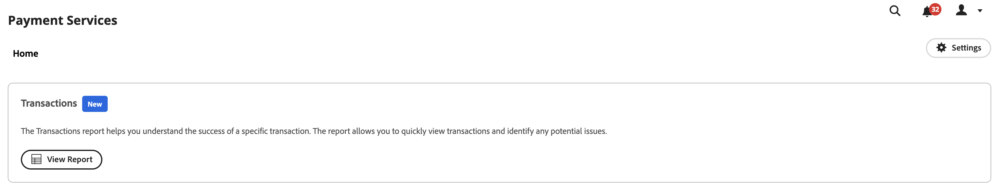

# Rapportering

[!DNL Payment Services] för [!DNL Adobe Commerce] och [!DNL Magento Open Source] erbjuder omfattande rapportering så att du kan få en tydlig bild av butikens transaktioner, order och betalningar.

{width="700" zoomable="yes"}

Transaktionsrapporten ger insyn i transaktionsauktoriseringsnivåer och negativa trender för transaktioner så att du effektivt kan övervaka butikens status och i förväg identifiera och åtgärda eventuella transaktionsproblem.

Se enskilda transaktioner för order som lagts i butiken och deras betalningsmetoder, resultat, svarskoder för betalningar med mera.

Informationen i transaktionsrapporten är endast avsedd för försäljning. Dela inte denna information med kunder eller andra potentiella bedragare. Transaktionsinformation kan användas för att kringgå säkerhetskontroller eller placera order som resulterar i återbetalningar.

Du kan hämta Transactions-rapporten i ett CSV-filformat och använda den i befintligt redovisnings- eller orderhanteringsprogram.

>[!NOTE]
>
>Du kan inte visa ekonomiska rapporter om du inte har [registrerat och aktiverat Live-läge](production.md#enable-live-payments) för [!DNL Payment Services].

## Rapportvy för transaktioner

Rapportvyn Transaktioner är tillgänglig i vyn Transaktioner för Betalningstjänster. Den innehåller all tillgänglig information om transaktioner för din butik.

På sidofältet _Admin_ går du till **[!UICONTROL Sales]** > **[!UICONTROL Payment Services]** > _[!UICONTROL Transactions]_>**[!UICONTROL View Report]**&#x200B;för att visa rapportvyn i tabellform för transaktioner.

{width="800" zoomable="yes"}

Du kan konfigurera den här vyn, per avsnitt i det här avsnittet, så att du på bästa sätt kan presentera de data du vill se.

Se länkad Commerce-order och PayPal-transaktions-ID:n, transaktionsbelopp, betalningsmetod per transaktion med mera i den här rapporten.

Alla betalningsmetoder har inte samma detaljerade information. Kreditkortstransaktioner ger t.ex. svars-, AVS- och CCV-koder och de fyra sista siffrorna i kortet i transaktionsrapporten. Betalningsknapparna för PayPal gör det inte.

Du kan [hämta transaktioner](#download-transactions) i ett CSV-filformat och använda det i befintliga redovisnings- eller orderhanteringsprogram.

>[!WARNING]
>
> Transaktionsrapporten kommer inte att innehålla någon fångst som gjorts utanför [!DNL Payment Services].

### Välj datakälla

I rapportvyn Transaktioner kan du välja datakälla -**[!UICONTROL Live]** eller **[!UICONTROL Sandbox]** - som du vill visa rapportresultat för.

{width="300" zoomable="yes"}

Om _[!UICONTROL Live]_&#x200B;är den valda datakällan kan du visa rapportinformation för dina butiker som använder [!DNL Payment Services] i produktionsläge. Om&#x200B;_[!UICONTROL Sandbox]_ är den valda datakällan kan du visa rapportinformation för sandlådeläget.

Datakällmarkeringar fungerar så här:

* Om du inte har några arkiv som använder [!DNL Payment Services] i produktionsläge är datakällans val som standard _[!UICONTROL Sandbox]_.
* Om du har några arkiv (en eller flera) som använder [!DNL Payment Services] i produktionsläge är datakällans val som standard _[!UICONTROL Live]_.
* Vid export av rapporter respekteras alltid valet av datakälla.

Så här väljer du datakälla för din [!UICONTROL Transactions]-rapport:

1. Gå till **[!UICONTROL Sales]** > **[!UICONTROL [!DNL Payment Services]]** > _[!UICONTROL Transactions]_>**[!UICONTROL View Report]**&#x200B;på sidofältet_ Admin _.
1. Klicka på **[!UICONTROL Data source]** och välj **[!UICONTROL Live]** eller **[!UICONTROL Sandbox]**.

   Rapportresultaten genereras om baserat på den valda datakällan.

### Anpassa tidsram för datum

I rapportvyn Transaktioner kan du anpassa tidsramen för de transaktioner som du vill visa genom att välja specifika datum. Som standard visas 30 dagars transaktioner i rutnätet.

1. Gå till **[!UICONTROL Sales]** > **[!UICONTROL [!DNL Payment Services]]** > _[!UICONTROL Transactions]_>**[!UICONTROL View Report]**&#x200B;på sidofältet_ Admin _.
1. Klicka på kalenderväljarfiltret **[!UICONTROL Transaction dates]**.
1. Välj tillämpligt datumintervall.
1. Visa transaktionerna för de angivna datumen i rutnätet.

### Filtrera rapportinformation

I rapportvyn Transaktioner kan du filtrera de statusresultat du vill visa genom att välja filtervillkor.

1. Gå till **[!UICONTROL Sales]** > **[!UICONTROL [!DNL Payment Services]]** > _[!UICONTROL Transactions]_>**[!UICONTROL View Report]**&#x200B;på sidofältet_ Admin _.
1. Klicka på väljaren **[!UICONTROL Filter]**.
1. Växla _[!UICONTROL Transaction Result]_-alternativen för att visa rapportresultat för endast valda ordertransaktioner.
1. Växla _[!UICONTROL Payment Method]_-alternativen för att visa rapportresultat för den typ av betalning som används för transaktionen.
1. Växla mellan alternativen för _[!UICONTROL Payment Detail]_&#x200B;om du vill se ytterligare information om vilken typ av betalning som används, när det är tillgängligt.
1. Ange ett _minimiorderbelopp_ eller _Max orderbelopp_ om du vill visa rapportresultat inom det orderbeloppsintervallet.
1. Ange en _[!UICONTROL Order ID]_&#x200B;om du vill söka efter en specifik transaktion.
1. Introducera _[!UICONTROL Card Last Four]_&#x200B;om du vill söka efter ett visst kredit- eller betalkort.
1. Ange en _[!UICONTROL Customer ID]_&#x200B;om du vill visa alla transaktioner för en viss kund.
1. Ange _[!UICONTROL Customer Email]_&#x200B;om du vill filtrera transaktioner för det e-postmeddelandet.
1. Klicka på **[!UICONTROL Hide filters]** om du vill dölja filtret.

### Visa och dölja kolumner

I rapporten Transaktioner visas alla tillgängliga informationskolumner som standard. Du kan dock anpassa vilka kolumner som visas i rapporten.

1. Gå till **[!UICONTROL Sales]** > **[!UICONTROL [!DNL Payment Services]]** > _[!UICONTROL Transactions]_>**[!UICONTROL View Report]**&#x200B;på sidofältet_ Admin _.
1. Klicka på ikonen **[!UICONTROL Column settings]** {width="20" zoomable="yes"}.
1. Om du vill anpassa vilka kolumner som visas i rapporten markerar eller avmarkerar du kolumnerna i listan.

   Transaktionsrapporten visar omedelbart de ändringar du har gjort på menyn Kolumninställningar. Kolumninställningarna sparas och gäller även om du navigerar bort från rapportvyn.

### Uppdatera rapportdata

I rapportvyn Transaktioner visas en _[!UICONTROL Last updated]_-tidsstämpel som visar senaste gången rapportinformationen uppdaterades. Som standard uppdateras rapportdata för transaktioner automatiskt var tredje timme.

Du kan även framtvinga en uppdatering av rapportdata manuellt för att se den senaste rapportinformationen.

1. Gå till **[!UICONTROL Sales]** > **[!UICONTROL [!DNL Payment Services]]** > _[!UICONTROL Transactions]_>**[!UICONTROL View Report]**&#x200B;på sidofältet_ Admin _.
1. Klicka på ikonen _Uppdatera_ ({width="20" zoomable="yes"}).

   Transaktionsrapportens data uppdateras, en *[!UICONTROL Update complete]*-bekräftelse visas och den senaste informationen finns i rutnätet.

### Hämta transaktioner

Du kan hämta en CSV-fil med alla transaktioner synliga i rutnätet i transaktionsvyn, oavsett om du visar 30 dagars standardtransaktioner eller en anpassad tidsram.

1. Gå till **[!UICONTROL Sales]** > **[!UICONTROL [!DNL Payment Services]]** > **[!UICONTROL Transactions]** på sidofältet _Admin_.
1. Om du vill se transaktioner för en annan tidsram än de senaste 30 dagarna [anpassar du tidsramen för datumintervallet för statusvärdena](#customize-dates-timeframe).
1. Klicka på ikonen _Hämta_ {width="20" zoomable="yes"} .

Transaktionerna hämtas i CSV-format.

### Kolumnbeskrivningar

Transaktionsrapporter innehåller följande information.

| Kolumn | Beskrivning |
| ------------ | -------------------- |
| [!UICONTROL Order ID] | Commerce order-ID (innehåller endast värden för slutförda transaktioner och är tomt för avvisade transaktioner)   Om du vill visa relaterad [orderinformation](https://experienceleague.adobe.com/sv/docs/commerce-admin/stores-sales/order-management/orders/orders){target="_blank"} klickar du på ID:t. |
| [!UICONTROL PayPal Transaction ID] | Transaktions-ID som tillhandahålls av betalningsförmedlaren. Innehåller endast värden för genomförda transaktioner och innehåller ett bindestreck för avvisade transaktioner. Du kan klicka på det här ID:t för att komma åt sidan PayPals transaktionsinformation. |
| [!UICONTROL Customer ID] | Commerce kund-ID för en order    Mer information finns i avsnittet [Kundinformation](https://experienceleague.adobe.com/sv/docs/commerce-admin/customers/customer-accounts/account-create){target="_blank"}. |
| [!UICONTROL Transaction Date] | Tidsstämpel för transaktionsdatum |
| [!UICONTROL Payment Method] | Typ av betalning som används för transaktionen med information om varumärke och korttyp. Se [korttyper](https://developer.paypal.com/docs/api/orders/v2/#definition-card_type) för mer information, tillgänglig för Payment Services version 1.6.0 och senare |
| [!UICONTROL Payment Detail] | Tillhandahåller ytterligare information om vilken typ av betalning som används för transaktionen, om sådan finns. |
| [!UICONTROL Card Last Four] | De fyra sista siffrorna i de kredit- eller debetkort som används för transaktionen |
| [!UICONTROL Result] | Resultatet av transaktionen -*[!UICONTROL OK]* (slutförd transaktion), *[!UICONTROL Rejected by Payment Provider]* (avvisad av PayPal), *[!UICONTROL Rejected by Bank]* (avvisad av den bank som utfärdade kortet) |
| [!UICONTROL Response Code] | Felkod som anger avvisandeorsak från betalningsleverantör eller bank. Se en lista över möjliga svarskoder och beskrivningar för [`Rejected by Bank` status &#x200B;](https://developer.paypal.com/docs/api/orders/v2/#definition-processor_response) och [`Rejected by Payment Provider` status &#x200B;](https://developer.paypal.com/api/rest/reference/orders/v2/errors/). |
| [!UICONTROL AVS Code] | Adress Verification Service code; the processor response information for payment requests. Se [lista över möjliga koder och beskrivningar](https://developer.paypal.com/docs/api/orders/v2/#definition-processor_response) för mer information. |
| [!UICONTROL CVV Code] | Kod för kortverifieringsvärde för kredit- och betalkort. Se [lista över möjliga koder och beskrivningar](https://developer.paypal.com/docs/api/orders/v2/#definition-processor_response) för mer information. |
| [!UICONTROL Amount] | Orderbelopp för transaktion |
| [!UICONTROL Currency] | Valuta som används för order i transaktion |
| [!UICONTROL Type] | [Betalningsåtgärd](../payment-services/production.md#set-payment-services-as-payment-method) för transaktion -`Authorize` eller `Authorize and Capture` |

### Felsvarskoder

Kolumnen _Svarskod_ visar en specifik felkod eller kod som relaterar till transaktionen. Några vanliga felkoder som du kan se är:

* `PAYMENT_DENIED` - Transaktionen nekades av PayPal eftersom den misstänktes vara bedrägeri.
* `INTERNAL_SERVER_ERROR` - Transaktionen nekades av PayPal och orsakade ett PayPal-serverfel. Transaktionen kan provas igen.
* `INSTRUMENT_DECLINED` - Kunden nekades av PayPal per vald betalningsmetod. Transaktionen kan provas igen med en annan betalningsmetod.
* `9500` - Transaktionen nekades av den associerade banken eftersom den misstänktes vara bedrägeri.
* `5120` - Transaktionen avvisades av den associerade banken eftersom kunden inte hade tillräckliga medel för betalningen.
* `5650` - Transaktionen nekades av den associerade banken eftersom banken kräver stark kundautentisering ([3DS](security.md#3ds)).

Detaljerade felsvarskoder för misslyckade transaktioner är tillgängliga för transaktioner som är nyare än 1 juni 2023. Delvisa rapportdata kommer att visas för transaktioner som inträffade före den 1 juni 2023.
