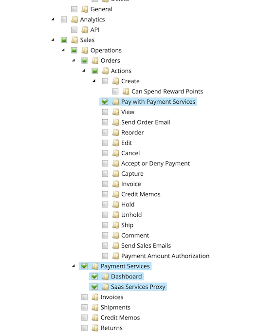

# Inställningar

Du kan anpassa [!DNL Payment Services] efter dina behov med användbara inställningar på startsidan för [!DNL Payment Services].

Konfigurera [!DNL Payment Services] för [!DNL Adobe Commerce] och [!DNL Magento Open Source] genom att klicka på **[!UICONTROL Settings]**. Dessa konfigurationsalternativ gäller bara för miljön som är inställd i fältet _[!UICONTROL Payment mode]_&#x200B;i[_ Allmänna _konfigurationsalternativ](#configure-general-settings).

Mer information om konfiguration för flera lager eller äldre finns i [Konfigurera i administratören](configure-admin.md).

## Konfigurera allmänna inställningar

Inställningarna för [!UICONTROL General] ger dig möjlighet att aktivera eller inaktivera Betalningstjänster som betalningsmetod och lägga till information i kundtransaktioner för att markera eller prefix en webbplats eller butiksvy med anpassad information.

### Aktivera betaltjänster

Du kan aktivera [!DNL Payment Services] för din webbplats och aktivera antingen sandlådetestning eller direktbetalningar.

1. Gå till **[!UICONTROL Sales]** > **[!UICONTROL Payment Services]** på sidofältet _Admin_.

1. Klicka på **[!UICONTROL Settings]**. Mer information finns i [Introduktion till [!DNL Payment Services] Hem](payments-home.md).

   {width="500" zoomable="yes"}

   Avsnittet _[!UICONTROL General]_&#x200B;innehåller inställningar som används för att aktivera [!DNL Payment Services] som betalningsmetod.

1. Om du vill aktivera [!DNL Payment Services] som betalningsmetod för din butik växlar du **[!UICONTROL Enable Payment Services as payment method]** till `Yes` i avsnittet _[!UICONTROL General]_.

1. Om du fortfarande testar [!DNL Payment Services] för din butik anger du **Betalningsläge** till `Sandbox`. Om du är redo att aktivera livebetalningar anger du det till `Production`.

1. Dina **[!UICONTROL Payment Services Sandbox ID]**- och **[!UICONTROL Payment Services Production ID]**-värden fylls i automatiskt när du har konfigurerat [Commerce Services Connector](https://experienceleague.adobe.com/sv/docs/commerce-merchant-services/user-guides/integration-services/saas){target=_blank} och går till [!DNL Payment Services]-instrumentpanelen för första gången. Gör detta för att slutföra introduktionen av din sandlåda och/eller produktionsmiljö. Dessa värden kopplar ditt SaaS-ID till [!DNL Payment Services].

   >[!WARNING]
   >
   > Om du återställer dina [!DNL Payment Services] ID:n måste du registrera dig igen.

1. Klicka på **[!UICONTROL Save]**.

   Om du försöker navigera bort från den här vyn utan att spara dina ändringar visas en modal som uppmanar dig att ignorera ändringar, fortsätta redigera eller spara ändringar.

1. Navigera till **[!UICONTROL System]** > **[!UICONTROL Cache Management]** och klicka på **[!UICONTROL Flush Cache]** för att uppdatera alla ogiltiga cacheminnen.

Du kan nu fortsätta att ändra standardinställningarna för [betalningsalternativ](#configure-payment-options)-funktioner och butiksvisning.

### Lägg till mjuk beskrivning

Du kan lägga till en [!UICONTROL Soft Descriptor] till din eller dina webbplatser eller enskilda butiksvyer. Mjuka beskrivningar visas på kontoutdrag för kundtransaktioner. Om du till exempel har flera butiker/varumärken/kataloger kan du enkelt skilja mellan dem genom att lägga till egen text i fältet [!UICONTROL Soft Descriptor].

1. Gå till **[!UICONTROL Sales]** > **[!UICONTROL Payment Services]** på sidofältet _Admin_.
1. Klicka på **[!UICONTROL Settings]**. Mer information finns i [Introduktion till [!DNL Payment Services] Hem](payments-home.md).
1. Välj webbplatsen eller butiksvyn på den nedrullningsbara menyn **[!UICONTROL Scope]** som du vill skapa en mjuk beskrivning för. För den inledande konfigurationen låter du det här vara **[!UICONTROL Default]** för att ange standardvärdet.
1. Lägg till din anpassade text (upp till 22 tecken) i textfältet och ersätt `Soft descriptor`.
1. Klicka på **[!UICONTROL Save]**.
1. Så här skapar du en annan mjuk beskrivning än den som är konfigurerad som standard för en webbplats- eller butiksvy:
   1. Välj webbplatsen eller butiksvyn på den nedrullningsbara menyn **[!UICONTROL Scope]** som du vill skapa en mjuk beskrivning för.
   1. Växla _av_ **[!UICONTROL Use website]** (eller **[!UICONTROL Use default]**, beroende på vilket omfång du har valt).
   1. Lägg till egen text i textfältet.
   1. Klicka på **[!UICONTROL Save]**.
1. Om du vill aktivera för en webbplats eller butik kan du visa den förvalda mjuka beskrivningen _eller_ för den överordnade webbplatsen:
   1. Välj webbplatsen eller butiksvyn på den nedrullningsbara menyn **[!UICONTROL Scope]** som du vill aktivera en befintlig programbeskrivare för.
   1. Växla _på_ **[!UICONTROL Use website]** (eller **[!UICONTROL Use default]**, beroende på vilket omfång du har valt).
   1. Klicka på **[!UICONTROL Save]**.

   Om du försöker navigera bort från den här vyn utan att spara dina ändringar visas en modal som uppmanar dig att ignorera ändringar, fortsätta redigera eller spara ändringar.

### Konfigurationsalternativ

| Fält | Omfång | Beskrivning |
|---|---|---|
| [!UICONTROL Enable] | webbplats | Aktivera eller inaktivera [!DNL Payment Services] för webbplatsen. Alternativ: [!UICONTROL Off] / [!UICONTROL On] |
| [!UICONTROL Payment mode] | butiksvy | Ange metod, eller miljö, för din butik. Alternativ: [!UICONTROL Sandbox] / [!UICONTROL Production] |
| [!UICONTROL Payment Services Sandbox ID] | butiksvy | Ditt handlar-ID för sandlådan, som genereras automatiskt vid introduktion av sandlådor. |
| [!UICONTROL Payment Services Production ID] | butiksvy | Ditt handlar-ID för produktion, som genereras automatiskt under introduktionen av produktionen (live). |
| [!UICONTROL Soft Descriptor] | webbplats eller butiksvy | Lägg till en mjuk beskrivning till webbplatserna och butiksvyn för att lägga till information till kundtransaktioner som avgränsar varumärken, butiker eller produktrader. [!UICONTROL Use website]-växeln använder alla mjuka beskrivningar som har lagts till på webbplatsnivå. [!UICONTROL Use default]-växeln använder valfri mjuk beskrivning som lagts till som standard. |

## Konfigurera betalningsalternativ

Nu när du har aktiverat [!UICONTROL Payment Services] för webbplatsen kan du ändra standardinställningarna för betalningsfunktioner och butiksvisning.

1. Gå till **[!UICONTROL Sales]** > **[!UICONTROL Payment Services]** på sidofältet _Admin_.
1. Klicka på **[!UICONTROL Settings]**. Mer information finns i [Introduktion till [!DNL Payment Services] Hem](payments-home.md).
1. Konfigurera betalningsalternativ för [kreditkort](#credit-card-fields), [betalningsknappar](#payment-buttons) och [knappformat](#button-style) enligt följande avsnitt.

### Kreditkortsfält

Inställningarna för _[!UICONTROL Credit Card Fields]_&#x200B;erbjuder ett enkelt och säkert utcheckningsalternativ för betalningsmetoder med kreditkort eller betalkort.

Mer information finns i [Betalningsalternativ](payments-options.md#credit-card-fields).

1. Gå till **[!UICONTROL Sales]** > **[!UICONTROL Payment Services]** på sidofältet _Admin_.
1. Välj butiksvyn på den nedrullningsbara menyn **[!UICONTROL Scope]** som du vill aktivera en betalningsmetod för.
1. I avsnittet **[!UICONTROL Credit card fields]** redigerar du värdet i fältet **[!UICONTROL Checkout title]** för att ändra namnet på betalningsmetoden som visas vid utcheckning.
1. Om du vill [ange betalningsåtgärden](production.md#set-payment-services-as-payment-method) växlar du **[!UICONTROL Payment action]** till `Authorize` eller `Authorize and Capture`.
1. Om du vill prioritera en betalningsmetod på utcheckningssidan anger du ett `Numeric Only`-värde i fältet **[!UICONTROL Sort order]**.
1. Om du vill aktivera [3DS-säker autentisering](security.md#3ds) (`Off` som standard) växlar du **[!UICONTROL 3DS Secure authentication]**-väljaren till `Always` eller `When required`.
1. Om du vill aktivera eller inaktivera kreditkortsfält på utcheckningssidan växlar du **[!UICONTROL Show on checkout page]**-väljaren.
1. Om du vill aktivera eller inaktivera [kortvalv](#card-vaulting) växlar du **[!UICONTROL Vault enabled]**-väljaren.
1. Om du vill aktivera eller inaktivera [betalningsmetoder i säkerhet i Admin](#card-vaulting) (för handlare att slutföra beställningar för kunder i Admin med hjälp av deras betalningsmetod) växlar du **[!UICONTROL Show vaulted methods in Admin]**-väljaren.
1. Om du vill aktivera eller inaktivera felsökningsläget växlar du **[!UICONTROL Debug Mode]**-väljaren.
1. Klicka på **[!UICONTROL Save]**.

   Om du försöker navigera bort från den här vyn utan att spara dina ändringar visas en modal som uppmanar dig att ignorera ändringar, fortsätta redigera eller spara ändringar.

1. [Töm cachen](#flush-the-cache).

#### Konfigurationsalternativ

| Fält | Omfång | Beskrivning |
|---|---|---|
| [!UICONTROL Title] | butiksvy | Lägg till texten som ska visas som rubrik för det här betalningsalternativet i vyn Betalningsmetod vid utcheckning. Alternativ: [!UICONTROL text field] |
| [!UICONTROL Payment Action] | webbplats | [betalningsåtgärden](https://experienceleague.adobe.com/sv/docs/commerce-admin/config/sales/payment-methods/payment-methods#payment-actions){target="_blank"} för den angivna betalningsmetoden. Alternativ: [!UICONTROL Authorize] / [!UICONTROL Authorize and Capture] |
| [!UICONTROL Sort order] | butiksvy | Sorteringsordningen för den angivna betalningsmetoden på utcheckningssidan. `Numeric Only` värde |
| [!UICONTROL 3DS Secure authentication] | webbplats | Aktivera eller inaktivera [3DS-säker autentisering](security.md#3ds). Alternativ: [!UICONTROL Always] / [!UICONTROL When Required] / [!UICONTROL Off] |
| [!UICONTROL Show on checkout page] | webbplats | Aktivera eller inaktivera kreditkortsfält som ska visas på utcheckningssidan. Alternativ: [!UICONTROL Off] / [!UICONTROL On] |
| [!UICONTROL Vault enabled] | butiksvy | Aktivera eller inaktivera [kreditkortssäkringen](vaulting.md). Alternativ: [!UICONTROL Off] / [!UICONTROL On] |
| [!UICONTROL Show vaulted payment methods in Admin] | butiksvy | Aktivera eller inaktivera möjligheten för handlare att slutföra beställningar för kunder i administratören [med en betalningsmetod som är skyddad](vaulting.md). Alternativ: [!UICONTROL Off] / [!UICONTROL On] |
| [!UICONTROL Debug Mode] | webbplats | Aktivera eller inaktivera felsökningsläget. Alternativ: [!UICONTROL Off] / [!UICONTROL On] |

### Apple Pay

Med knappbetalningsalternativet [!UICONTROL Apple Pay] kan du tillhandahålla en [!UICONTROL Apple Pay]-betalningsknapp i butikens utcheckning från webbläsaren Safari (för upp till 99 domäner per handlarkonto).

Du kan bara använda Apple Pay om du slutför [Apple Pay self-registrering via Paypal](https://developer.paypal.com/docs/checkout/apm/apple-pay/#register-your-live-domain) och sedan [konfigurerar Apple Pay](settings.md/#payment-buttons) för dina butiker. Mer information finns i [Betalningsalternativ](payments-options.md#apple-pay-button).

Du kan aktivera och konfigurera betalningsalternativet för knappen [!UICONTROL Apple Pay]:

1. Gå till **[!UICONTROL Sales]** > **[!UICONTROL Payment Services]** på sidofältet _Admin_.
1. Välj butiksvyn på den nedrullningsbara menyn **[!UICONTROL Scope]** som du vill aktivera en betalningsmetod för.
1. I avsnittet **[!UICONTROL Apple Pay]** redigerar du värdet i fältet _[!UICONTROL Checkout title]_&#x200B;för att ändra namnet på betalningsmetoden som visas vid utcheckning.
1. Om du vill [ange betalningsåtgärden](production.md#set-payment-services-as-payment-method) växlar du **[!UICONTROL Payment action]** till `Authorize` eller `Authorize and Capture`.
1. Om du vill aktivera eller inaktivera Apple Pay på utcheckningssidan växlar du **[!UICONTROL Show Apple Pay on checkout page]**-väljaren.
1. Om du vill aktivera eller inaktivera Apple Pay på produktinformationssidan växlar du **[!UICONTROL Show Apple Pay on product detail page]**-väljaren.
1. Om du vill aktivera eller inaktivera Apple Pay i minikundvagnsförhandsvisningen växlar du **[!UICONTROL Show Apple Pay on the mini cart preview]**-väljaren.
1. Om du vill aktivera eller inaktivera Apple Pay på kundvagnssidan växlar du **[!UICONTROL Show Apple Pay on cart page]**-väljaren.
1. Om du vill aktivera eller inaktivera felsökningsläget växlar du **[!UICONTROL Debug Mode]**-väljaren.
1. Klicka på **[!UICONTROL Save]**.

   Om du försöker navigera bort från den här vyn utan att spara dina ändringar visas en modal som uppmanar dig att ignorera ändringar, fortsätta redigera eller spara ändringar.

1. [Töm cachen](#flush-the-cache).

#### Konfigurationsalternativ

| Fält | Omfång | Beskrivning |
|---|---|---|
| [!UICONTROL Checkout title] | butiksvy | Lägg till texten som ska visas som rubrik för det här betalningsalternativet i vyn Betalningsmetod vid utcheckning. Alternativ: [!UICONTROL text field] |
| [!UICONTROL Payment Action] | webbplats | [betalningsåtgärden](https://experienceleague.adobe.com/sv/docs/commerce-admin/config/sales/payment-methods/payment-methods#payment-actions) för den angivna betalningsmetoden. Alternativ: [!UICONTROL Authorize] / [!UICONTROL Authorize and Capture] |
| [!UICONTROL Show on checkout page] | webbplats | Aktivera eller inaktivera Apple Pay-knappen för att visa på utcheckningssidan. Alternativ: [!UICONTROL Off] / [!UICONTROL On] |
| [!UICONTROL Show on checkout page] | webbplats | Aktivera eller inaktivera Apple Pay-knappen så att den visas på produktinformationssidan. Alternativ: [!UICONTROL Off] / [!UICONTROL On] |
| [!UICONTROL Show on mini cart preview] | webbplats | Aktivera eller inaktivera Apple Pay-knappen för att visa i minikundvagnen. Alternativ: [!UICONTROL Off] / [!UICONTROL On] |
| [!UICONTROL Show on cart page] | webbplats | Aktivera eller inaktivera Apple Pay-knappen för att visa i kundvagnen. Alternativ: [!UICONTROL Off] / [!UICONTROL On] |
| [!UICONTROL Debug Mode] | webbplats | Aktivera eller inaktivera felsökningsläget. Alternativ: [!UICONTROL Off] / [!UICONTROL On] |

### Betalningsknappar

Betalningsalternativen för [!DNL PayPal payment buttons] erbjuder en enkel, snabb och säker utcheckningsprocess för din kund. Mer information finns i [Betalningsalternativ](payments-options.md#paypal-smart-buttons).

Du kan aktivera och konfigurera betalningsalternativen för betalningsknapparna i PayPal:

1. Välj butiksvyn på den nedrullningsbara menyn **[!UICONTROL Scope]** som du vill aktivera en betalningsmetod för.
1. Om du vill ändra namnet på betalningsmetoden så som visas vid utcheckning redigerar du värdet i fältet **[!UICONTROL Checkout Title]**.
1. Om du vill [ange betalningsåtgärden](production.md#set-payment-services-as-payment-method) växlar du **[!UICONTROL Payment action]** till `Authorize` eller `Authorize and Capture`.
1. Om du vill prioritera en betalningsmetod på utcheckningssidan anger du ett `Numeric Only`-värde i fältet **[!UICONTROL Sort order]**.
1. Använd växlingsväljarna för att aktivera eller inaktivera visningsfunktioner för [!DNL PayPal smart button]:

   - **[!UICONTROL Show PayPal buttons on product checkout page]**
   - **[!UICONTROL Show PayPal buttons on product detail page]**
   - **[!UICONTROL Show PayPal buttons in mini-cart preview]**
   - **[!UICONTROL Show PayPal buttons on cart page]**
   - **[!UICONTROL Show PayPal Pay Later button]**
   - **[!UICONTROL Show PayPal Pay Later message]**
   - **[!UICONTROL Show Venmo button]**
   - **[!UICONTROL Show Apple Pay button]**
   - **[!UICONTROL Show PayPal Credit and Debit Card button]**

     >[!NOTE]
     >
     > Om du vill använda Apple Pay [måste du ha ett Apple sandlådeprovningskonto](https://developer.apple.com/apple-pay/sandbox-testing/#create-a-sandbox-tester-account) (komplett med falska kreditkort och faktureringsinformation) för att testa det. När du är redo att använda Apple Pay i produktionsläget sandbox _eller_ slutför du en [testning och validering](test-validate.md#test-in-sandbox-environment), slutför [självregistrering med [!DNL Apple Pay]](https://developer.paypal.com/docs/checkout/apm/apple-pay/#register-your-live-domain) (_Registrera din livdomän_ endast) och [konfigurerar den för dina butiker i [!DNL Payment Services]](settings.md#payment-buttons).

     När du aktiverar/inaktiverar synlighet för betalningsknappar eller meddelandet PayPal Pay Later (Betala senare) visas en visuell förhandsvisning av den konfigurationen längst ned på sidan Inställningar.

1. Aktivera felsökningsläget genom att växla **[!UICONTROL Debug Mode]**-väljaren.
1. Klicka på **[!UICONTROL Save]**.

   Om du försöker navigera bort från den här vyn utan att spara dina ändringar visas en modal som uppmanar dig att ignorera ändringar, fortsätta redigera eller spara ändringar.

1. [Töm cachen](#flush-the-cache).

#### Konfigurationsalternativ

| Fält | Omfång | Beskrivning |
|---|---|---|
| [!UICONTROL Title] | butiksvy | Lägg till texten som ska visas som rubrik för det här betalningsalternativet i vyn Betalningsmetod vid utcheckning. Alternativ: textfält |
| [!UICONTROL Payment Action] | webbplats | [betalningsåtgärden](https://experienceleague.adobe.com/sv/docs/commerce-admin/config/sales/payment-methods/payment-methods#payment-actions){target="_blank"} för den angivna betalningsmetoden. Alternativ: [!UICONTROL Authorize] / [!UICONTROL Authorize and Capture] |
| [!UICONTROL Sort order] | butiksvy | Sorteringsordningen för den angivna betalningsmetoden på utcheckningssidan. `Numeric Only` värde |
| [!UICONTROL Show PayPal buttons on checkout page] | butiksvy | Aktivera eller inaktivera [!DNL PayPal payment buttons] på utcheckningssidan. Alternativ: [!UICONTROL &#x200B; Yes] / [!UICONTROL No] |
| [!UICONTROL Show PayPal buttons on product detail page] | butiksvy | Aktivera eller inaktivera [!DNL PayPal payment buttons] på produktinformationssidan. Alternativ: [!UICONTROL &#x200B; Yes] / [!UICONTROL No] |
| [!UICONTROL Show PayPal buttons in mini-cart preview] | butiksvy | Aktivera eller inaktivera [!DNL PayPal payment buttons] i förhandsvisningen av minikundvagnen. Alternativ: [!UICONTROL Off] / [!UICONTROL On] |
| [!UICONTROL Show PayPal buttons on cart page] | butiksvy | Aktivera eller inaktivera [!DNL PayPal payment buttons] på kundvagnssidan. Alternativ: [!UICONTROL Off] / [!UICONTROL On] |
| [!UICONTROL Show PayPal Pay Later button] | butiksvy | Aktivera eller inaktivera utseendet på betalningsalternativ vid ett senare tillfälle där betalningsknappar visas. Alternativ: [!UICONTROL Off] / [!UICONTROL On] |
| [!UICONTROL Show PayPal Pay Later Message] | webbplats | Aktivera eller inaktivera meddelandet Betala senare i kundvagnen, på produktsidan, i minikundvagnen och under kassaflödet. Alternativ: [!UICONTROL Off] / [!UICONTROL On] |
| [!UICONTROL Show Venmo button] | butiksvy | Aktivera eller inaktivera betalalternativet Venmo där betalningsknappar visas. Alternativ: [!UICONTROL Off] / [!UICONTROL On] |
| [!UICONTROL Show Apple Pay button] | butiksvy | Aktivera eller inaktivera betalningsalternativet Apple Pay där betalningsknappar visas. Alternativ: [!UICONTROL Off] / [!UICONTROL On] |
| [!UICONTROL Show PayPal Credit and Debit card button] | butiksvy | Aktivera eller inaktivera alternativet för kredit- och betalkortsbetalning där betalningsknappar visas. Alternativ: [!UICONTROL Off] / [!UICONTROL On] |
| [!UICONTROL Debug Mode] | webbplats | Aktivera eller inaktivera felsökningsläget. Alternativ: [!UICONTROL Off] / [!UICONTROL On] |

### Knappformat

Du kan också konfigurera alternativen för _[!UICONTROL Button style]_&#x200B;för betalningsknapparna:

1. Om du vill ändra **[!UICONTROL Layout]** väljer du `Vertical` eller `Horizontal`.

   >[!NOTE]
   >
   > Om knappstilen är konfigurerad som `Horizontal` och din butik är konfigurerad att visa flera betalningsknappar, kan du bara se två knappar som visas på produktsidan, utcheckningssidan och minikorgen, och en knapp visas i kundvagnen.

1. Om du vill aktivera tagline i en vågrät layout växlar du **[!UICONTROL Show tagline]**-väljaren.
1. Om du vill ändra **[!UICONTROL Color]** väljer du önskat färgalternativ.
1. Om du vill ändra **[!UICONTROL Shape]** väljer du `Pill` eller `Rectangle`.
1. Växla **[!UICONTROL Responsive button height]**-väljaren om du vill aktivera knapphöjdsväljaren.
1. Om du vill ändra **[!UICONTROL Label]** markerar du önskat etikettalternativ.

   När du ändrar konfigurationsalternativen för layout, färg, form, höjd och etikett visas en visuell förhandsvisning av konfigurationen längst ned på sidan Inställningar. I bilden nedan är **[!UICONTROL Shape]** inställd på _Rectangle_ och **[!UICONTROL Label]** är inställd på _PayPal (rekommenderas)_.

   ![[!DNL PayPal payment buttons] alternativ](assets/payment-buttons.png){width="400" zoomable="yes"}

1. Klicka på **[!UICONTROL Save]**.

   Om du försöker navigera bort från den här vyn utan att spara dina ändringar visas en modal som uppmanar dig att ignorera ändringar, fortsätta redigera eller spara ändringar.

1. [Töm cachen](#flush-the-cache).

Du kan konfigurera betalningsknappsformatet [ i den äldre konfigurationen i Admin](configure-admin.md#configure-paypal-smart-buttons) eller här i [!DNL Payment Services Home]. Mer information om hur du formaterar PayPals betalningsknappar finns i [PayPals knappstilguide](https://developer.paypal.com/docs/checkout/standard/customize/buttons-style-guide/).

#### Konfigurationsalternativ

| Fält | Omfång | Beskrivning |
|--- |--- |--- |
| [!UICONTROL Layout] | Butiksvy | Definiera layoutformat för betalningsknappar. Alternativ: [!UICONTROL Vertical] / [!UICONTROL Horizontal] |
| [!UICONTROL Tagline] | Butiksvy | Aktivera/inaktivera tagline. Alternativ: [!UICONTROL Off] / [!UICONTROL On] |
| [!UICONTROL Color] | Butiksvy | Definiera färg på betalningsknapparna. Alternativ: [!UICONTROL Blue] / [!UICONTROL Gold] / [!UICONTROL Silver] / [!UICONTROL White] / [!UICONTROL Black] |
| [!UICONTROL Shape] | Butiksvy | Definiera formen på betalningsknapparna. Alternativ: [!UICONTROL Rectangular] / [!UICONTROL Pill] |
| [!UICONTROL Responsive Button Height] | Butiksvy | Definierar om betalningsknappar använder en standardhöjd. Alternativ: [!UICONTROL Off] / [!UICONTROL On] |
| [!UICONTROL Height] | Butiksvy | Definiera höjden på betalningsknapparna. Standardvärde: ingen |
| [!UICONTROL Label] | Butiksvy | Definiera etikett som visas i betalningsknapparna. Alternativ: [!UICONTROL PayPal] / [!UICONTROL Checkout] / [!UICONTROL Buynow] / [!UICONTROL Pay] / [!UICONTROL Installment] |

## Konfigurera roller

Om du vill vara säker på att administratörsanvändare kan skapa och hantera order i Commerce Admin aktiverar du [!DNL Payment Services]-specifika resurser för användarroller.

Mer information om hur du hanterar roller finns i [Användarroller](https://experienceleague.adobe.com/docs/commerce-admin/systems/user-accounts/permissions-user-roles.html?lang=sv-SE).

När du tilldelar resurser till rollen måste du välja:

- **Betala med[!DNL Payment Services]** - Den här resursen ser till att [!DNL Payment Services] kreditkort är tillgängliga som betalningsmetod när du skapar en order i Admin. Om du väljer den överordnade resursen **Åtgärder** markeras även den här resursen.
- **[!DNL Payment Services]** - Den här resursen innehåller resurserna **Dashboard** och **SaaS Services Proxy** som också måste väljas. De ser till att [!DNL Payment Services] visas på menyn _Försäljning_.

  {width="400" zoomable="yes"}

## Töm cachen

Om du ändrar konfigurationen i _Inställningar_, till exempel genom att växla knapparna Apple Pay, Venmo eller PayPal PayLater, måste du manuellt tömma cachen så att butiken visar de senaste konfigurationerna.

1. Gå till **[!UICONTROL System]** > **[!UICONTROL Cache Management]** på sidofältet _Admin_.
1. Klicka på **[!UICONTROL Flush Cache]** om du vill uppdatera alla ogiltiga cacheminnen.

Om en cachetyp i cacheminneshanteringstabellen har statusen `INVALIDATED` kanske arkivet inte visar den senaste konfigurationen för det objektet. Töm cacheminnet för att uppdatera butiken så att den senaste konfigurationen visas.

Om du vill vara säker på att rätt konfiguration visas på din butik [tömmer du cachen](https://experienceleague.adobe.com/sv/docs/commerce-admin/systems/tools/cache-management) med jämna mellanrum.

## Kortsäkring

Du kan aktivera funktioner som gör att dina kunder kan vault - eller&quot;save&quot; - sina kreditkortsuppgifter i Mitt konto och använda dem för framtida inköp.

Du kan också använda kortvalsfunktionen i Admin för att slutföra efterföljande beställningar för befintliga kunder.

Aktivera eller inaktivera kortvalsning i [inställningarna för kreditkortsfältet](#credit-card-fields).

Mer information finns i [Kreditkortssäkringar](vaulting.md).

## 3DS

3DS skyddar kunder och handlare från bedräglig verksamhet i deras butiker och möjliggör efterlevnad av EU:s standarder.

Aktivera eller inaktivera 3DS i [Inställningar för kreditkortsfält](#credit-card-fields).

Mer information finns i [3DS i säkerhet](security.md#3ds).

## Använd flera PayPal-konton

I [!UICONTROL Payment Services] kan du använda flera PayPal-konton i **one**-handelskontot på webbplatsnivå. Om du till exempel har butik(er) i flera länder (som använder olika [valutor](https://experienceleague.adobe.com/sv/docs/commerce-admin/stores-sales/site-store/currency/currency)) eller vill använda Adobe Commerce för vissa delar av din verksamhet, men inte _alla_, kan du konfigurera ditt handlarkonto så att du använder flera PayPal-konton.

Mer information om hierarkin för webbplatser, butiker och vyer [&#128279;](https://experienceleague.adobe.com/docs/commerce-admin/start/setup/websites-stores-views.html?lang=sv-SE) finns i Webbplats, Lagra och Vyområde.

Mer information om hur du konfigurerar scope för flera PayPal-konton via CLI finns i [Kommandoradskonfiguration](configure-cli.md#configure-scope-via-cli).

Säljaren kan skapa ett nytt [scope](https://experienceleague.adobe.com/docs/commerce-admin/start/setup/websites-stores-views.html?lang=sv-SE#scope-settings) för ditt handlarkonto och lägga till ytterligare en webbplats med PayPal så att alla PayPal-knappar som du konfigurerar visas på din webbplats. Kontakta din säljare för att få hjälp med att använda flera PayPal-konton för dina webbplatser.
