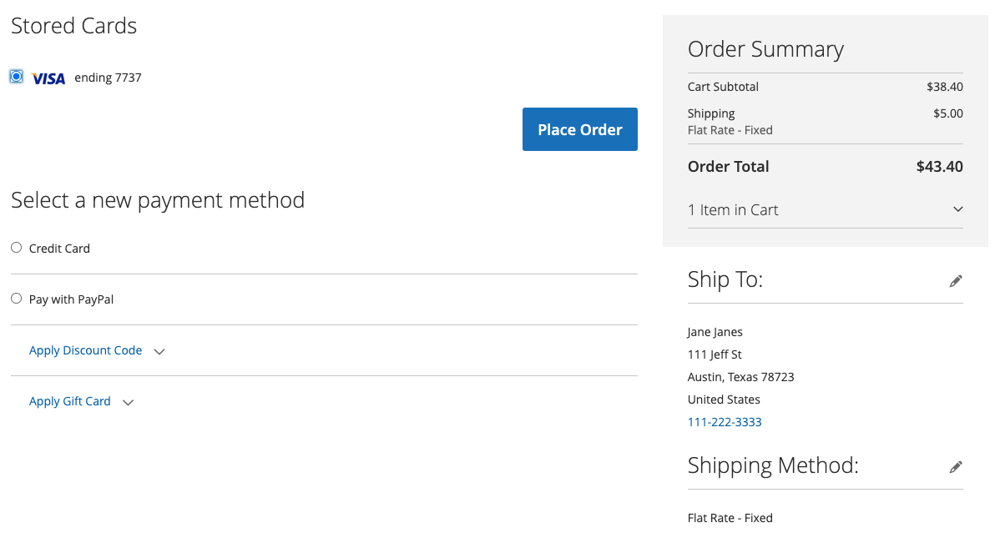

# Kreditkortsvarning

Konvertera engångskunder till lojala kunder med kreditkortsbetalning. Inloggade kunder kan spara, eller vault, sina kreditkortsuppgifter och använda dem vid ett senare köp för samma eller ett annat handlarkonto.

## Aktivera vault

Handlare kan aktivera kreditkortsvalv för sina butiker i [!DNL Payment Services] [Inställningar](configure-admin.md#card-vaulting).

1. Gå till _>_ på sidofältet **[!UICONTROL Sales]** Admin **[!UICONTROL Payment Services]**.

1. Klicka på **[!UICONTROL Settings]**.

1. Växla **[!UICONTROL Vault enabled]**-väljaren. Mer information finns i [Aktivera [!DNL Payment Services]](configure-admin.md#enable-payment-services).

## Vaulting without purchase

Inloggade kunder kan välja en betalningsmetod på kontrollpanelen **Mitt konto** genom att:

1. Loggar in på deras **Mitt konto** i butiken.

1. Navigerar till **[!UICONTROL Stored Payment Methods]** i den vänstra navigeringen för att se alla deras lagrade betalningsmetoder.

   Mer information finns i [Lagrade betalningsmetoder](https://experienceleague.adobe.com/en/docs/commerce-admin/stores-sales/payments/stored-payment-methods).

1. Kunden klickar på **[!UICONTROL Add New Card]** för att lagra ett nytt kort.

   {width="400" zoomable="yes"}

   Kunden måste tillhandahålla alla nödvändiga uppgifter, t.ex. kort- och faktureringsinformation, för att kunna välja betalningsmetod.
Alla betalningsmetoder i vaulten använder den angivna faktureringsadressen när kortet säkras, som finns i kundens PayPal-konto. Kunden kan se en annan faktureringsadress än den som visas i Commerce.

1. Klicka på **[!UICONTROL Save New Card]**

   {width="400" zoomable="yes"}

Lagrade kort kan användas vid beställning:

{width="400" zoomable="yes"}

### Ta bort en lagrad betalningsmetod

Kunder kan enkelt ta bort kreditkort som är i säkerhet från **lagringsmetoder** i **Mitt konto** genom att klicka på **Ta bort** för ett specifikt kort.

## Validera en betalningsmetod under utcheckning

Inloggade kunder kan avvisa ett kreditkort vid utcheckning och använda det vid senare köp i den aktuella butiken eller i andra butiker i samma handlarkonto:

{width="400" zoomable="yes"}

Commerce lagrar en token som hjälper kunderna att slutföra framtida utcheckningar genom att hämta sparad kreditkortsinformation. Om du validerar ett kort från kundkontot eller vid utcheckning kommer det att resultera i olika betalningstoken.

>[!WARNING]
>
> PayPal kan för närvarande lagra maximalt fem vaultade kort.

## Använd valv i administratören

Om en kund har ett kreditkort med tidigare säkerhet kan en handlare skapa en efterföljande order för kunden i administratören med någon av dessa betalningsmetoder.

Du kan bara använda kort i säkert läge i administratören om kunden har både ett befintligt konto och en giltig token lagrad i systemet från en tidigare slutförd betalning.

Så här skapar du en beställning i Admin för en kund som använder sitt kreditkort som säkerhet:

1. [Skapa en beställning och lägg till produkter](https://experienceleague.adobe.com/docs/commerce-admin/stores-sales/point-of-purchase/assist/customer-account-create-order.html).
1. I _[!UICONTROL Payment & Shipping Information]_&#x200B;väljer du **[!UICONTROL Stored Cards]**&#x200B;som betalningsmetod.
1. Välj önskad betalningsmetod för bankkort.
1. När du har slutfört eventuella andra nödvändiga steg för beställningen [skickar du den](https://experienceleague.adobe.com/docs/commerce-admin/stores-sales/point-of-purchase/assist/customer-account-create-order.html?lang=en#step-3%3A-submit-the-order).

   {width="600" zoomable="yes"}

## Säkerhet

Minimal kreditkortsinformation delas med kunden; de ser bara de fyra sista siffrorna, utgångsdatumet och varumärket för sitt kreditkort. Kreditkortsinformation lagras hos betalningsförmedlaren för att uppfylla [PCI](security.md#PCI-compliance)-kompatibilitetsstandarder.
