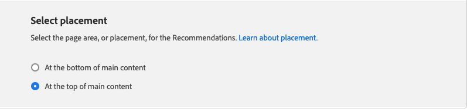
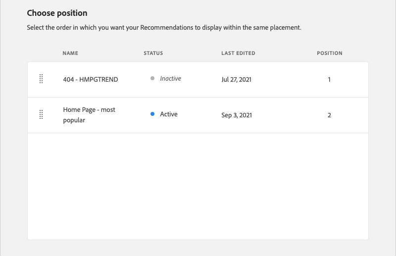
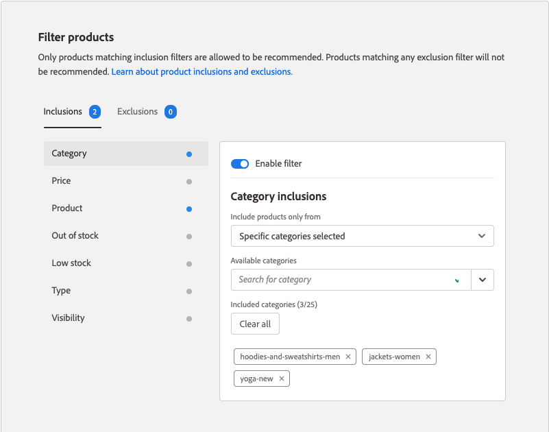

# Redigera rekommendation

På sidan Redigera rekommendation kan du justera de enskilda inställningarna som utgör rekommendationen. Alla inställningar kan redigeras förutom sidtypen och rekommendationstypen. Följande inställningar kan redigeras:

- [Rekommendationsnamn](#name)
- [Etikett för butiken](#label)
- [Antal produkter](#number)
- [Placering och placering](#placement)
- [Filtrera produkter](#filters)

Förhandsgranskningen till höger på sidan visar hur rekommendationen med de aktuella inställningarna kan visas i butiken. _Förhandsgranskningen av rekommenderade produkter_ visas som referens när du rullar nedåt på sidan. I förhandsgranskningen visas en miniatyrbild av produkten, produktnamn, SKU, pris och resultattyp för varje returnerad produkt. Resultattypen anger om det finns tillräckligt med primära beteendedata för att generera rekommendationen, eller om den använder beteendedata för säkerhetskopiering.

## Redigera en rekommendation

1. Gå till **Marknadsföring** > _Kampanjer_ > **Produktrekommendationer** på sidofältet _Admin_.

1. Markera den rekommendation som du vill redigera.

1. Klicka på **Redigera**. Följ sedan instruktionerna nedan för att göra de ändringar du behöver.

1. När du är klar klickar du på **Spara ändringar**.

### Rekommendationsnamn {#name}

Välj ett beskrivande namn som anger syftet med rekommendationen. Namnet är för intern referens och visas inte i butiken.

### Etikett för butiken {#label}

Ange den text som du vill använda som etikett för rekommendationsenheten i butiken.

### Antal produkter {#number}

Justera skjutreglaget för att visa upp till 20 produkter i rekommendationsenheten.

### Placering och placering {#placement}

1. Välj den plats på sidan där rekommendationsenheten ska visas i butiken.

   - Längst ned i huvudinnehållet
   - Överst i huvudinnehållet

   

1. Om du vill ändra ordningen på rekommendationerna som ingår i enheten använder du kontrollen **Flytta**  för att dra rekommendationerna till rätt plats.

   

### Filtrera produkter {#filters}

Alla ändringar som görs i produkten [filters](filters.md) återspeglas i _Förhandsgranskningen av rekommenderade produkter_. Endast produkter som matchar inkluderingsfilter tillåts att rekommenderas. Produkter som matchar eventuella exkluderingsfilter rekommenderas inte.

Flikarna _Inkluderingar_ och _Uteslutningar_ visar tillgängliga filter för varje typ. I listan markeras varje aktivt filter med en blå punkt.

- Om du vill visa information om varje filter klickar du på filternamnet.
- Om du vill ändra filterstatus anger du **Aktivera filter** till `on`- eller `off`-positionen.

Filterinställningarna beskriver de produkter som ska inkluderas eller exkluderas i rekommendationsenheten. Inkluderingsinställningarna för filtret _Kategori_ talar till exempel om för systemet att endast inkludera produkter från de valda kategorierna.

