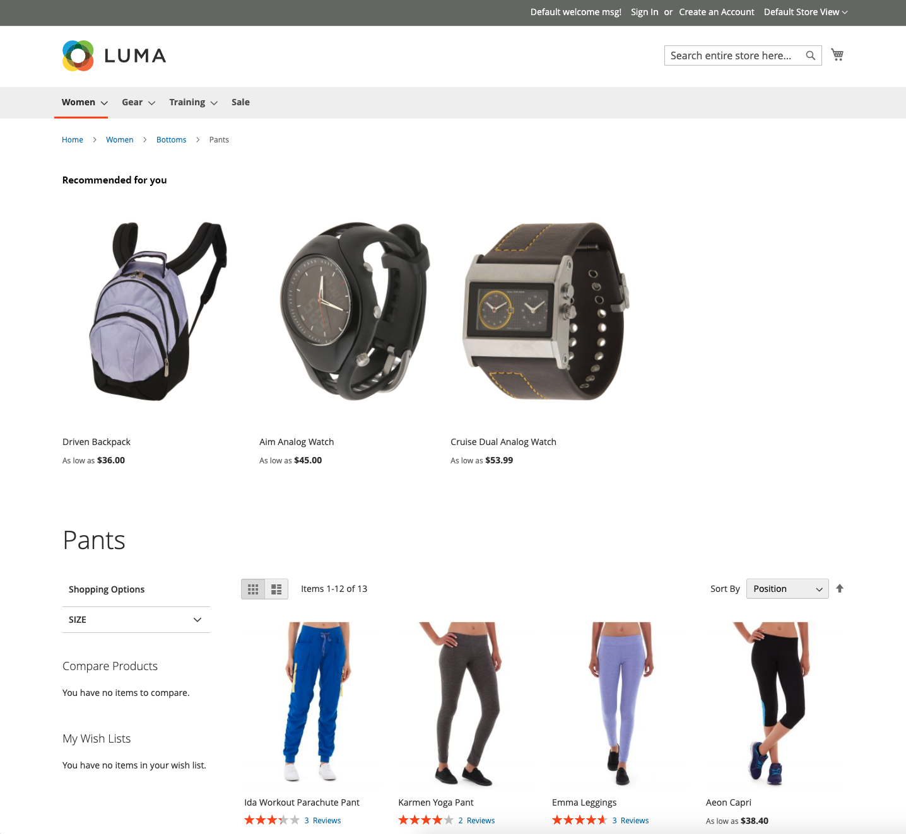

# Placering och etiketter

Med så många rekommendationstyper att välja mellan, vilka ska du använda på varje sida? Om du är osäker på var du ska börja kan du prova följande:

| Sida | Rekommendationstyp |
|---|---|
| Startsida | `Recommended for you` |
| Produktsida | `Viewed this, viewed that` |
| Kundvagn | `Bought this, bought that` |

Du kan spåra [måtten](workspace.md) och justera om det behövs. Kom ihåg att experimenterande är avgörande.

Vissa butikssidor begränsar var du kan placera rekommendationerna. Du kan placera rekommendationerna på någon av följande sidplatser. Se tabellen nedan för mer information.

- Högst upp i huvudinnehållet - Rekommendationer visas ovanför huvudinnehållsområdet precis nedanför det övre navigeringsfältet.
- Längst ned i huvudinnehållet (standard) - Rekommendationer visas under huvudinnehållsområdet och före andra innehållsblock på sidan, till exempel _Relaterade produkter_.

_Rekommendation överst på startsidan_

## Rekommendationsetiketter

Etiketten som tilldelas en rekommendation i butiken påverkar hur kunderna tolkar dess relevans för dem. Följande etiketter används ofta för varje typ av rekommendation.

_Rekommendation överst i sökresultatet_

| Rekommendationstyp | Rekommenderade etiketter |
|---|---|
| Mest visade  Mest tillagda i kundvagn Mest köpta Konvertering (visa i kundvagn) Konvertering (visa för köp) | Mest populära Populära objekt Trending Populära just nu Nyligen populära Populära objekt inspirerade av det här objektet (PDP) Populära säljare Du kanske är intresserad av |
| Rekommenderas för dig | Bara för dig Rekommenderas för dig Inspirerad av dina shoppingtrender |
| Visade det här | Kunder som visade det här objektet visade även Kunder visade Relaterade artiklar |
| Visad den här, köpt den där | Kunder som tittade på det här köpet till slut  Kunder som till slut köpte Vad köper andra efter att ha tittat på det här objektet? |
| Köpte den här, köpte den där | Få allt du behöver Glöm inte dessa Köps ofta tillsammans |
| Mer som detta | Fler objekt som denna Liknar detta |
| Allmän | Du kanske också gillar  Shoppare som också gillar Liknande alternativ Relaterade artiklar |
| Trender | Trending Trending now Recent trending Hot items Trending related products (PDP) |
| Nyligen visade | Nyligen visade Ta en annan titt |

## Rekommendationer som stöds per sida

I följande tabell visas de butikssidor där du kan placera rekommendationer och de rekommendationstyper som är tillåtna på varje sida.

| Sida | Placeringsrekommendationer | Typer |
|---|---|---|
| Startsida | Högst upp i huvudinnehållet Längst ned i huvudinnehållet (standard) | Mest visade Mest köpta Mest tillagda i kundvagnen Rekommenderas för dig Trending |
| Kategori | Högst upp i huvudinnehållet Längst ned i huvudinnehållet (standard) | Mest visade Mest köpta Mest tillagda i kundvagnen Rekommenderas för dig Trending |
| Produktinformation | Längst ned i huvudinnehållet (standard) | De mest visade Mest köpta Mest tillagda i kundvagnen Visade det här och Visade det här, köpte det köpta programmet och köpte  Mer som den här Trending Visuell likhet |
| Kundvagn | Längst ned i huvudinnehållet (standard) | De mest visade Mest köpta Mest tillagda i kundvagnen Visade detta och Visade det här, köpte Köpta det här och köpte  Mer som den här trenderingen |
| Bekräftelse | Längst ned i huvudinnehållet (standard) | De mest visade Mest köpta Mest tillagda i kundvagnen Visade detta och Visade det här, köpte Köpta det här och köpte  Mer som den här trenderingen |
| Page Builder | [Dra och släpp](https://experienceleague.adobe.com/docs/commerce-admin/page-builder/add-content/recommendations.html?lang=sv-SE) för att placera innehållstypen | Mest visade Mest köpta Mest tillagda i kundvagnen Rekommenderas för dig Trending |
