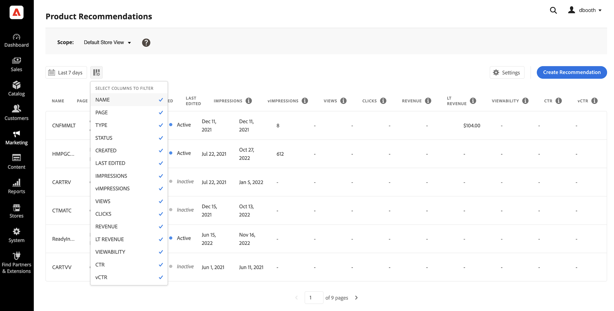

# [!DNL Product Recommendations] Workspace

Arbetsytan [!DNL Product Recommendations] visar en lista med tidigare konfigurerade rekommendationer med mätvärden som hjälper dig att spåra hur bra varje rekommendation har lyckats. Listan kan konfigureras för att beräkna mätvärden för den sista dagen, veckan eller månaden. Du kan använda mätvärdena för att skapa användbara insikter baserat på hur ofta en rekommendationsenhet visas eller klickas, eller för att analysera hur bra dina rekommendationer fungerar.

>[!INFO]
>
>En rekommendationsenhet är en widget som innehåller den rekommenderade produkten _items_.

_Rekommendationer Workspace_

## Ange omfånget

Till att börja med är [scope](https://experienceleague.adobe.com/docs/commerce-admin/start/setup/websites-stores-views.html) för alla rekommendationsinställningar inställda på `Default Store View`. Om din Commerce-installation innehåller flera butiksvyer anger du **Scope** till [butiksvyn](https://experienceleague.adobe.com/docs/commerce-admin/start/setup/websites-stores-views.html#scope-settings) där dina rekommendationer gäller.

## Ange datumintervall för mätvärden

1. Klicka på kontrollen **Kalender**  .

1. Välj något av följande:

   - De senaste 24 timmarna
   - De senaste 7 dagarna
   - De senaste 30 dagarna

   De beräknade värdena i måttkolumnerna ändras för att återspegla det aktuella datumintervallet.

   >[!NOTE]
   >
   >Produktrekommendationsstatistik är optimerad för Luma storefront. Om din storefront inte är Luma-baserad beror mätspårningsdata på hur du [implementerar händelsesamlingen](events.md).

## Visa/dölj kolumner

1. Klicka på **Visa/dölj**  i det övre vänstra hörnet.

   De synliga kolumnerna har en blå bockmarkering.

1. Gör något av följande på menyn:

   - Om du vill visa en dold kolumn klickar du på ett kolumnnamn utan bockmarkering.
   - Om du vill dölja en synlig kolumn klickar du på ett kolumnnamn med en bock.

   Tabellen uppdateras så att den endast innehåller de markerade kolumnerna.

   
   _Visa/dölj kolumner_

## Inställningar

Inställningarna bestämmer det SaaS-datautrymme som innehåller data för rekommendationer och beteenden.

- Om du vill ändra var rekommendationsbeteendedata kommer från väljer du ett annat SaaS-datautrymme.

- Om du vill konfigurera ett nytt SaaS-dataområde klickar du på **Redigera konfiguration**. Mer information finns i [Inställningar](settings.md).

_Rekommendationsinställningar_

## Visa detaljer

1. Klicka i tabellen på den rekommendation som du vill granska.

   
   _Information om konverteringsgrad för startsida_

1. Om du vill ändra rekommendationens status klickar du på **Aktivera** eller **Inaktivera**.

## Redigera rekommendation

Klicka på **Redigera** på sidan med rekommendationsinformation. Gå till [Redigera rekommendationer](edit.md) om du vill veta mer.

## Skapa rekommendation

Klicka på **Skapa** på sidan med rekommendationsinformation. Om du vill veta mer går du till [Skapa rekommendationer](create.md).

## Workspace Controls

| Kontroll | Beskrivning |
|---|---|
|  | Anger det tidsintervall som används för måttberäkningar. Alternativ: 24 timmar/7 dagar/30 dagar |
|  | Bestämmer vilka kolumner som visas i tabellen [!DNL Product Recommendations]. |
| Inställningar | Avgör det SaaS-datautrymme där rekommendationsbeteendedata hämtas, och aktiverar även rekommenderad typ för visuell likhet. |
| Skapa rekommendation | Öppnar sidan [Skapa ny rekommendation](create.md). |

## Kolumnbeskrivningar

| Kolumn | Beskrivning |
|---|---|
| Namn | Rekommendationens namn. |
| Sida | Sidan där rekommendationen visas. |
| Typ | Rekommendationstypen. |
| Status | Rekommendationsstatus. Alternativ: Inaktiv/aktiv/Utkast |
| Skapad | Det datum då rekommendationen skapades. |
| Senast redigerad | Det datum då rekommendationen senast redigerades. |
| Impressions | Antalet gånger som en rekommendationsenhet läses in och återges på en sida. En rekommendationsenhet som ligger under förskjutningen av webbläsarens visningsruta återges på sidan, även om den inte visas av användaren. I det här fallet räknas den återgivna enheten som ett intryck, men en vy räknas bara om kunden rullar enheten så att den syns. |
| vImpressions | (Synliga exponeringar) Antal rekommendationsenheter som registrerar minst en vy. Om rekommendationsenheten till exempel har två rader, var och en med två produkter, och de sista två produkterna inte ses av kunden, men de första två är, kommer aktiviteten fortfarande att räknas som ett intryck. |
| Vyer | Antalet rekommendationsenheter som visas i visningsrutan i kundens webbläsare. Om användaren rullar sidan uppåt eller nedåt flera gånger utlöses händelsen flera gånger, varje gång enheten visas. |
| Klickningar | Summan av antalet gånger en kund klickar på ett objekt i rekommendationsenheten och antalet gånger som användaren klickar på knappen **Lägg till i kundvagnen** i rekommendationsenheten |
| Intäkter | Den intäkt som rekommenderas för det aktuella tidsintervallet. |
| Intäkt | (Livstidsintäkt) Den livstidsintäkt som drivs av en rekommendation. |
| Synlighet | Procentandel av rekommendationsenheter som registreras för vyn. |
| CTR | (Genomklickningsfrekvens) Procentandel av enhetsvisningar för den rekommendation som registrerar ett klick. CTR räknar alla exponeringar även om enheten inte kommer in i kundens vy. Om rekommendationsenheten inte visas är det osannolikt att någon klickar på den. De exponeringar som inte visas räknas emellertid av mot CTR-poängen och minskar den totala procentandelen för CTR. |
| vCTR | (Genomklickningsfrekvens som kan ses) mäter klickningar enbart utifrån visningar (rekommendationer som faktiskt visas i den synliga delen av kundens skärm), vilket ger en mer korrekt bild av kundernas engagemang. |
