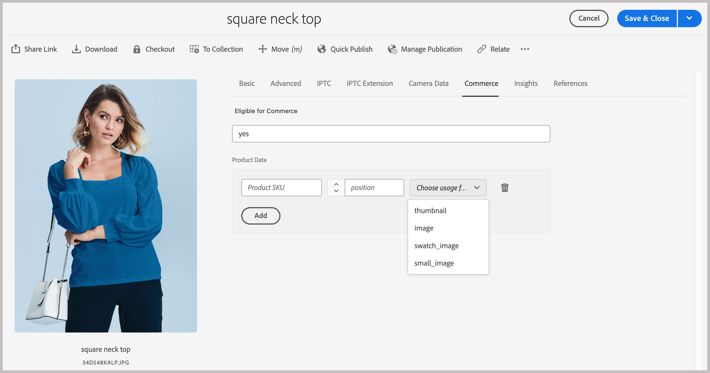
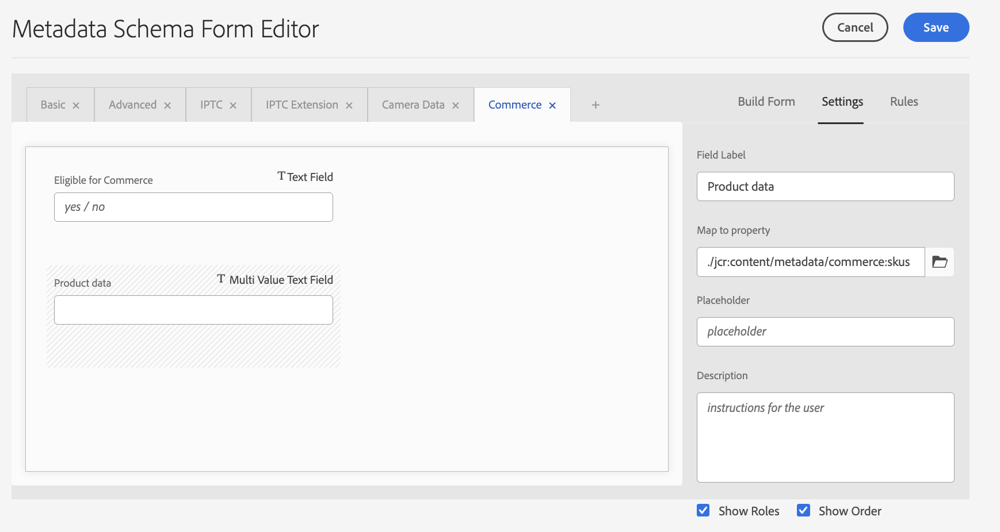

# Konfigurera AEM Assets-projektet som stöder Commerce-metadata

Om du vill använda produktvisuellt för att hantera Commerce-resursfiler i AEM Assets följer du de här stegen för att konfigurera AEM Assets-projektet med den standardkod och de metadata som krävs för att hantera Commerce-mediefiler från AEM redigeringsmiljö.

* **Steg 1:** Installera en AEM-projektmall med standardkoden för att lägga till Commerce namnområde och metadatarappresurser i Experience Manager Assets as a Cloud Service-miljökonfigurationen.
* **Steg 2:** Konfigurera metadataprofilen som ska användas för Commerce-resursfiler

## Lägg till standardkoden i ditt AEM-projekt

Adobe tillhandahåller en AEM Commerce-mall, `assets-commerce`, som du kan använda för att lägga till Commerce-namnområdes- och metadataresurser i Experience Manager Assets as a Cloud Service-miljökonfigurationen. Distribuera den här koden till din miljö som ett **Maven**-paket. Konfigurera sedan Commerce-metadata i AEM Assets redigeringsmiljö för att slutföra installationen.

Mallen lägger till följande resurser i AEM Assets redigeringsmiljö:

* Ett [anpassat namnområde](https://github.com/ankumalh/assets-commerce/blob/main/ui.config/jcr_root/apps/commerce/config/org.apache.sling.jcr.repoinit.RepositoryInitializer~commerce-namespaces.cfg.json), `Commerce` som identifierar Commerce-relaterade egenskaper.

   * En anpassad metadatatyp `commerce:isCommerce` med etiketten `Eligible for Commerce` som taggar Commerce-resurser som är associerade med ett Adobe Commerce-projekt.

   * En anpassad metadatatyp `commerce:skus` och en motsvarande UI-komponent som lägger till en **[!UICONTROL Product Data]**-egenskap. Produktdata innehåller metadataegenskaper som associerar en Commerce-resurs med produkt-SKU:er.

     {width="600" zoomable="yes"}

   * En anpassad metadatatyp `commerce:roles` och `commerce:positions` för att visa hur resursen visualiseras i Commerce.

* Ett metadatamatchemaformulär med en Commerce-flik som innehåller fälten `Eligible for Commerce` och `Product Data` för taggning av Commerce-resurser. Formuläret innehåller även alternativ för att visa eller dölja fälten `roles` och `position` från AEM Assets användargränssnitt.

  {width="600" zoomable="yes"}

* Ett [exempel på taggad och godkänd Commerce-resurs](https://github.com/ankumalh/assets-commerce/blob/main/ui.content/src/main/content/jcr_root/content/dam/wknd/en/activities/hiking/equipment_6.jpg/.content.xml) `equipment_6.jpg` som har stöd för inledande resurssynkronisering. Endast godkända Commerce-resurser kan synkroniseras från AEM Assets till Adobe Commerce.

>[!NOTE]
>
> På sidan [Viktigt](https://github.com/ankumalh/assets-commerce) finns mer information om **AEM Commerce-standardmallen**.

### Förutsättningar

Du behöver följande resurser och behörigheter för att distribuera `commerce-assets`-paketet till AEM Assets as a Cloud Service AEM-miljön:

* [Åtkomst till AEM Assets Cloud Manager program och miljöer](https://experienceleague.adobe.com/en/docs/experience-manager-cloud-service/content/onboarding/journey/cloud-manager#access-sysadmin-bo) med rollerna Program och Distributionshanteraren.

* En [lokal AEM-utvecklingsmiljö](https://experienceleague.adobe.com/en/docs/experience-manager-learn/cloud-service/local-development-environment-set-up/overview) som är bekant med AEM lokala utvecklingsprocess.

* Förstå [AEM projektstruktur](https://experienceleague.adobe.com/en/docs/experience-manager-cloud-service/content/implementing/developing/aem-project-content-package-structure) och hur du distribuerar anpassade innehållspaket med Cloud Manager.

### Installera paketet `commerce-assets`

1. Från AEM Cloud Manager kan du vid behov skapa produktions- och stagingmiljöer för ditt AEM Assets-projekt.

1. Konfigurera vid behov en distributionspipeline.

1. Hämta koden från [AEM Commerce-standardmallen](https://github.com/ankumalh/assets-commerce) från GitHub.

1. Från din [lokala AEM-utvecklingsmiljö](https://experienceleague.adobe.com/en/docs/experience-manager-learn/cloud-service/local-development-environment-set-up/overview) installerar du den anpassade koden i din AEM Assets-miljökonfiguration som ett Maven-paket, eller genom att manuellt kopiera koden till den befintliga projektkonfigurationen.

1. Genomför ändringarna och skicka din lokala utvecklingsgren till Cloud Manager Git-databasen.

1. [Distribuera din kod från AEM Cloud Manager för att uppdatera AEM-miljön](https://experienceleague.adobe.com/en/docs/experience-manager-cloud-service/content/implementing/using-cloud-manager/deploy-code#deploying-code-with-cloud-manager).

## Valfritt. Konfigurera en metadataprofil

I AEM Assets redigeringsmiljö anger du standardvärden för Commerce-objektmetadata genom att skapa en metadataprofil. Använd sedan den nya profilen i AEM Resursmappar för att automatiskt använda dessa standardvärden. Den här konfigurationen effektiviserar tillgångsbearbetning genom att minska antalet manuella steg.

När du konfigurerar metadataprofilen behöver du bara konfigurera följande komponenter:

* Lägg till en Commerce-flik. På den här fliken aktiveras Commerce-specifika konfigurationsinställningar som läggs till av mallen
* Lägg till fältet `Eligible for Commerce` på fliken Commerce.

Gränssnittskomponenten för produktdata läggs till automatiskt baserat på mallen.

### Definiera metadataprofilen

1. Logga in i Adobe Experience Manager redigeringsmiljö.

1. Gå till arbetsytan för innehållsadministration för AEM Assets på Adobe Experience Manager-arbetsytan genom att klicka på ikonen Adobe Experience Manager.

   {width="600" zoomable="yes"}

1. Öppna administratörsverktygen genom att välja hammikonen.

   {width="600" zoomable="yes"}

1. Öppna profilkonfigurationssidan genom att klicka på **[!UICONTROL Metadata Profiles]**.

1. **[!UICONTROL Create]** en metadataprofil för Commerce-integreringen.

   {width="600" zoomable="yes"}

1. Lägg till en flik för Commerce-metadata.

   1. Klicka på **[!UICONTROL Settings]** till vänster.

   1. Klicka på **[!UICONTROL +]** i flikavsnittet och ange sedan **[!UICONTROL Tab Name]**, `Commerce`.

1. Lägg till fältet `Eligible for Commerce` i formuläret.

   {width="600" zoomable="yes"}

   * Klicka på **[!UICONTROL Build form]**.

   * Dra fältet `Single Line text` till formuläret.

   * Lägg till texten `Eligible for Commerce` för etiketten genom att klicka på **[!UICONTROL Field Label]**.

   * Lägg till etikettexten i **Fältetikett** på fliken Inställningar.

   * Ange platshållartexten till `yes`.

   * Kopiera och klistra in följande värde i fältet **[!UICONTROL Map to Property]**

     ```terminal
     ./jcr:content/metadata/commerce:isCommerce
     ```

1. Valfritt. Om du automatiskt vill synkronisera godkända Commerce-resurser när de överförs till AEM Assets-miljön anger du standardvärdet för fältet _[!UICONTROL Review Status]_på fliken `Basic` till `approved`.

1. Spara uppdateringen.

#### Använda metadataprofilen i Commerce resurskällmapp

1. På sidan [!UICONTROL  Metadata Profiles] väljer du Commerce integreringsprofil.

1. Välj **[!UICONTROL Apply Metadata Profiles to Folders]** på åtgärdsmenyn.

1. Markera den mapp som innehåller Commerce-resurser.

   Skapa en Commerce-mapp om den inte finns.

1. Klicka på **[!UICONTROL Apply]**.

## Nästa steg

[!BADGE Endast PaaS]{type=Informative tooltip="Gäller endast Adobe Commerce i molnprojekt (Adobe-hanterad PaaS-infrastruktur)."} [Installera Adobe Commerce-paket](configure-commerce.md)
